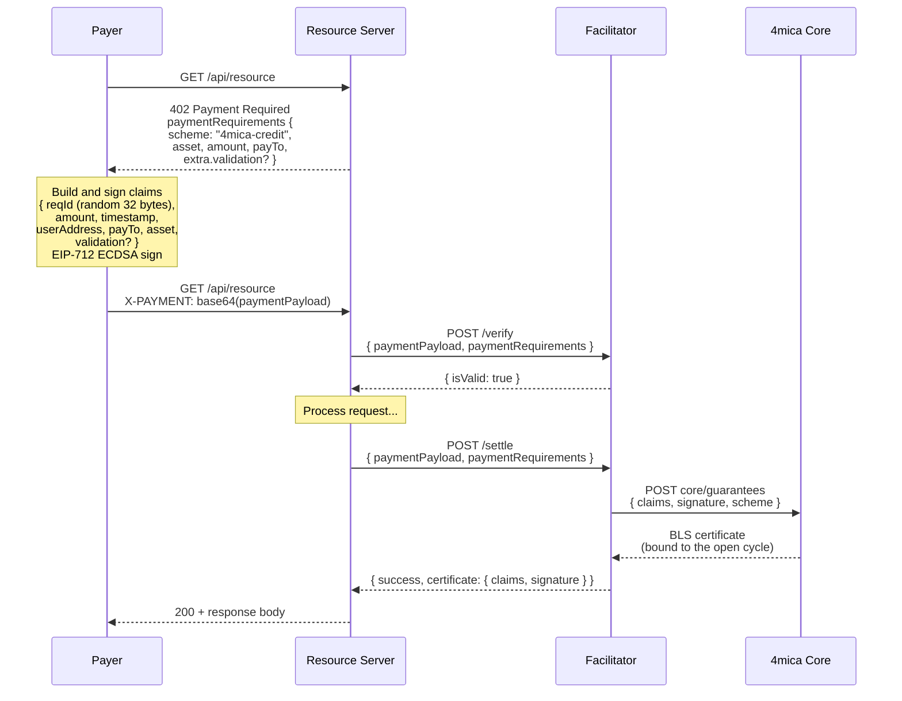
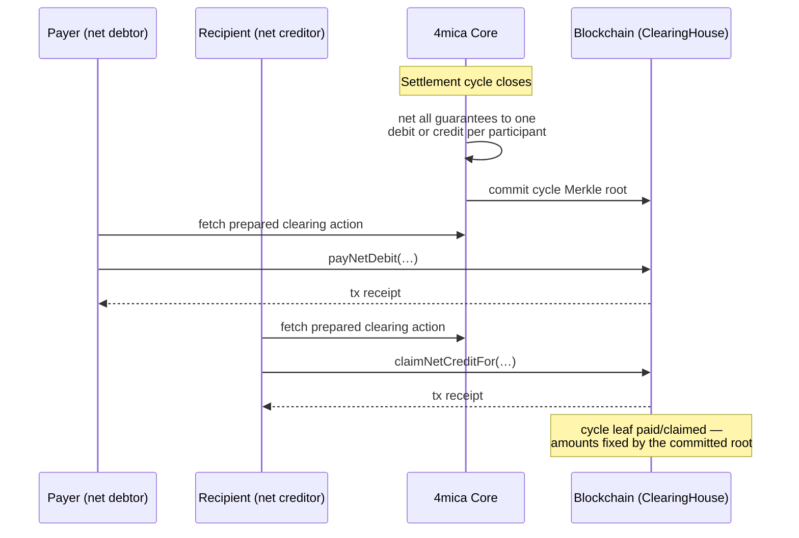

# x402-4mica Facilitator

<p align="center">
  <a href="https://github.com/4mica-network/x402-4mica/actions/workflows/ci.yml">
    
  </a>
  <a href="LICENSE">
    
  </a>
</p>

A facilitator for the x402 protocol that runs the 4mica credit flow. Resource servers call it to
validate payment payloads against their `paymentRequirements` and settle by returning the BLS
certificate to the recipient.


**Contents**
- [How to use the system](#how-to-use-the-system)
- [Gasless deposits](#gasless-deposits)
- [Integrate from x402](#integrate-from-x402)
- [Run your own facilitator](#run-your-own-facilitator)

## How to use the system

### Quick integration (resource servers)

- Configure the 4mica facilitator (for example `https://x402.4mica.xyz/`). Your `402 Payment Required` responses should advertise `scheme = "4mica-credit"`, a supported `network`, and set `payTo` / `asset` / `maxAmountRequired` (v1) or `amount` (v2). To gate the payment on a validation outcome, also advertise `paymentRequirements.extra.validation = { validator, subject, deadline?, params? }`.
- Clients sign a payment guarantee claim straight from your `paymentRequirements` — no round-trip to you or the facilitator first — producing the x402 `paymentPayload` that they send on the retried request for the protected resource. You never construct this payload yourself; you only need to validate and consume it.
- When a request arrives with a payment payload, send it together with the original `paymentRequirements` to the facilitator's `/verify` and `/settle` endpoints. Use `/verify` as an optional preflight check before doing work, and `/settle` once you are ready to accept credit: it issues the BLS guarantee certificate via 4mica core, which binds it to the open settlement cycle for that asset. That is the whole integration — there are no endpoints for you to implement.

### Quick integration (clients)

- Python SDK:

  ```bash
  pip install sdk-4mica
  ```

  ```python
  import asyncio
  from fourmica_sdk import Client, ConfigBuilder, PaymentRequirementsV1, X402Flow

  payer_key = "0x..."    # wallet private key
  user_address = "0x..." # address to embed in the claims

  async def main():
      cfg = ConfigBuilder().wallet_private_key(payer_key).rpc_url("https://api.4mica.xyz/").build()
      client = await Client.connect(cfg)
      flow = X402Flow.from_client(client)

      # Fetch the recipient's paymentRequirements from its 402 response
      req_raw = fetch_requirements_somehow()[0]
      requirements = PaymentRequirementsV1.from_raw(req_raw)

      payment = await flow.sign_payment(requirements, user_address)
      headers = {"X-PAYMENT": payment.header}  # client retry header (decode to paymentPayload for /verify)
      await client.aclose()

  asyncio.run(main())
  ```

- TypeScript SDK:

  ```bash
  npm install @4mica/sdk
  ```

  ```ts
  import { Client, ConfigBuilder, X402Flow } from "@4mica/sdk";

  async function run() {
    const cfg = new ConfigBuilder().walletPrivateKey("0x...").build();
    const client = await Client.connect(cfg);
    const flow = X402Flow.fromClient(client);

    // Raw requirement objects from the 402 response are accepted directly —
    // they are parsed and validated by the flow.
    const reqRaw = fetchRequirementsSomehow()[0];

    const payment = await flow.signPayment(reqRaw, client.signerAddress);
    const headers = { "X-PAYMENT": payment.header }; // decode to paymentPayload for /verify
    await client.aclose();
  }

  run();
  ```

- Rust SDK: `cargo add sdk-4mica` and call
  `X402Flow::sign_payment(requirements, user_address)` to obtain the same `payment.header` for the
  retry request.

### Demo example

You can pair the client with `examples/server/mock_paid_api.py`, a FastAPI server that simulates a
paywalled endpoint. Start it with `python examples/server/mock_paid_api.py` (set `PORT` to override
the default `9000`). The mock resource will call the facilitator's `/verify` endpoint (defaulting to
`https://x402.4mica.xyz/`; override with `FACILITATOR_URL`) whenever it receives a payment payload
(for example decoded from an `X-PAYMENT` header).

The bundled Rust example shows how to sign a payment
header with `sdk-4mica`:

```bash
# requires PAYER_KEY, USER_ADDRESS, RESOURCE_URL and ASSET_ADDRESS
cargo run --example rust_client
```

The example will read environment variables from `examples/.env` (or a root `.env`) if present. A
Python counterpart lives in `examples/python_client/client.py` (install deps with `pip install -r
examples/python_client/requirements.txt`). A TypeScript version lives in `examples/ts_client`
(`npm install && npm start`).

### Payment payload schema (v1)

`paymentPayload` is a JSON envelope, sent base64-encoded in the `X-PAYMENT` header:

```json
{
  "x402Version": 1,
  "scheme": "4mica-credit",
  "network": "eip155:80002",
  "payload": {
    "claims": {
      "version": "v1",
      "user_address": "<0x-prefixed checksum string>",
      "recipient_address": "<0x-prefixed checksum string>",
      "req_id": "<0x-prefixed 32-byte value>",
      "amount": "<0x-prefixed u256 value>",
      "asset_address": "<0x-prefixed checksum string>",
      "timestamp": 1716500000
    },
    "signature": "<0x-prefixed wallet signature>",
    "scheme": "eip712"
  }
}
```

`req_id` is a random 32-byte value the client mints locally — uniqueness is all core asks, so no
server round-trip is needed before signing. When the requirements carry `extra.validation`, the
claims additionally embed the same requirement as a nested `validation` object
(`{ "validator", "subject", "deadline"?, "params"? }`), and the facilitator cross-checks both
sides.

### Payment payload schema (v2)

x402 V2 changes only the envelope, not the claims: the requirements entry the payer accepted moves
under `accepted`, an optional `resource` block may accompany it, and the header is
`PAYMENT-SIGNATURE` instead of `X-PAYMENT`. The claims inside stay `"version": "v1"` — the x402
protocol version is decoupled from the guarantee claims version. Validation gating travels as
`extra.validation` on the requirements and as the nested `validation` object inside the signed
claims. The facilitator derives the expected chain id from the CAIP-2 payment network.

`paymentPayload` for x402 V2, base64-encoded in the `PAYMENT-SIGNATURE` header:

```json
{
  "x402Version": 2,
  "accepted": {
    "scheme": "4mica-credit",
    "network": "eip155:80002",
    "amount": "<decimal or 0x value>",
    "payTo": "<0x-prefixed checksum string>",
    "asset": "<0x-prefixed checksum string>",
    "extra": {
      "validation": {
        "validator": "<0x-prefixed checksum string>",
        "subject": "<subject identifier>",
        "deadline": 1716503600
      }
    }
  },
  "payload": {
    "claims": {
      "version": "v1",
      "user_address": "<0x-prefixed checksum string>",
      "recipient_address": "<0x-prefixed checksum string>",
      "req_id": "<0x-prefixed 32-byte value>",
      "amount": "<0x-prefixed u256 value>",
      "asset_address": "<0x-prefixed checksum string>",
      "timestamp": 1716500000,
      "validation": {
        "validator": "<0x-prefixed checksum string>",
        "subject": "<subject identifier>",
        "deadline": 1716503600
      }
    },
    "signature": "<0x-prefixed wallet signature>",
    "scheme": "eip712"
  },
  "resource": { "url": "/your/resource" }
}
```

The facilitator enforces that:

- `scheme` / `network` match both `/supported` and the resource server's requirements.
- `payTo` equals the `recipient_address` present inside the claim.
- `asset` must match the signed `amount` claim's asset exactly.
- For V1, `maxAmountRequired` must match the signed `amount` exactly.
- For V2, `amount` must match the signed `amount` exactly.
- When `paymentRequirements.extra.validation` is present, the signed claims must carry the same
  `validation` requirement (`validator`, `subject`, optional `deadline` and `params`) — the
  facilitator cross-checks both sides.
- By default, the facilitator verifies certificates against the active guarantee domain advertised
  by core. If `X402_GUARANTEE_DOMAIN` is set (legacy `FOUR_MICA_GUARANTEE_DOMAIN` /
  `4MICA_GUARANTEE_DOMAIN` are also honored), that value overrides the core-provided domain.

### HTTP API

- `GET /supported` – returns all `(scheme, network)` tuples the facilitator can service (4mica and,
  if configured, any additional `exact` flows).
- `GET /health` – liveness probe. Returns `{ "status": "ok" }`, plus relayer and deposit detail
  when gas sponsorship is configured:
  ```json
  {
    "status": "ok",
    "relayers": [
      { "network": "eip155:84532", "address": "0x…", "balanceWei": "…", "belowFloor": false }
    ],
    "deposits": { "sponsored": 12, "rejected": 3, "throttled": 1 },
    "withdrawals": { "sponsored": 4, "rejected": 0, "throttled": 0 }
  }
  ```
  Counters are per sponsored action, so a rising `rejected` names which one is being abused.
  `status` is `degraded` when any relayer is at or below `X402_DEPOSIT_MIN_RELAYER_BALANCE_WEI`, or
  when its balance cannot be read — so a plain HTTP check is enough to alert on. A rising
  `throttled` distinguishes an abuse attempt from a merely misconfigured client. Balances are
  cached for 15s, so polling this endpoint does not amplify into RPC load.
- `POST /verify`
  - Request: `{ "x402Version": 1|2, "paymentPayload": { ... }, "paymentRequirements": { ... } }`.
  - Response: `{ "isValid": true|false, "invalidReason"?, "certificate": null }`.
- `POST /settle`
  - Request: same shape as `/verify`.
  - Response: for 4mica, `{ "success": true, "networkId": "<network>", "certificate": { "claims", "signature" } }`.
    When delegating to the `exact` facilitator the structure mirrors upstream x402 responses and may
    include `txHash`.
    If `X402_DEBIT_URL` is set, debit requests are proxied to the configured x402-rs
    facilitator, allowing clients to follow the x402 debit flow unchanged.
- `POST /deposit` and `POST /deposit/verify` – gasless deposits; see below. Available only when a
  relayer is configured, otherwise every request returns `errorCode: "NO_RELAYER"`.
- `POST /withdraw` and `POST /withdraw/verify` – gasless withdrawals; see below. Same availability
  rule as `/deposit`.
- `POST /clearing/claim` and `POST /clearing/claim/verify` – sponsored net-credit claims; see
  below. Same availability rule as `/deposit`.
- `POST /clearing/pay` and `POST /clearing/pay/verify` – sponsored net-debit payments; see below.
  Same availability rule as `/deposit`.

### Sponsored net-credit claims

A net creditor in a committed clearing cycle is owed money on-chain, but collecting it costs a
transaction — and a creditor who never held native gas cannot send one. These endpoints let the
facilitator's relayer submit `claimNetCreditFor` for them:

```jsonc
{
  "cycleId": "eth:1800000000",   // as core names it: text id or the 0x-prefixed on-chain hash
  "creditor": "0x…",
  "network": "eip155:…"          // optional; defaults to the first configured network
}
```

`/clearing/claim` answers with `{ "success": true, "txHash", "network", "creditor", "cycleId",
"amount" }` or `{ "success": false, "error", "errorCode", "retryable" }`; `/clearing/claim/verify`
answers with `{ "isValid", "invalidReason"?, "errorCode"?, "retryable"? }` and spends no gas. The
error codes reuse `/withdraw`'s strings wherever the meaning is the same.

The request carries no signature and needs none: the ClearingHouse pays the address the cycle's
committed Merkle leaf names, for the amount that leaf fixes, so a submitter can neither redirect
nor inflate the payout. Everything the transaction depends on — the ClearingHouse address, the
amount, the proof — is resolved from core (which is why the facilitator's auth wallet must be able
to read clearing actions), never taken from the request; the caller only names *which* claim to
submit. `amount` echoes the committed net credit — in a `Shortfall` cycle the on-chain payout is a
pro-rata fraction of it.

Throttling is configured separately (`X402_CLAIM_*`), and concurrent submissions for the same
cycle are deduplicated so only one pays gas — the other would revert as `AlreadyClaimed`.

### Sponsored net-debit payments

The debtor's side of the same cycle. Paying a net debit pulls money *out of* the debtor's wallet,
so unlike a claim it carries the debtor's signature — an EIP-3009 `receiveWithAuthorization` the
facilitator submits via `payNetDebitWithAuthorization`, or, for tokens without EIP-3009, a Permit2
`PermitTransferFrom` submitted via `payNetDebitWithPermit2` — the facilitator paying the gas
either way. The debtor needs no native balance and no prior allowance (EIP-3009), or only the
one-time `approve(PERMIT2, …)` (Permit2, sponsorable via `eip2612Permit` exactly as on
`/deposit`). ERC-20 cycles only: a native-asset debit cannot be pulled by signature.

The scheme travels under the same `assetTransferMethod` tag as `/deposit`, and exactly one of
`authorization` or `permit2Authorization` must be present:

```jsonc
{
  "cycleId": "eth:1800000000",   // as core names it: text id or the 0x-prefixed on-chain hash
  "network": "eip155:…",         // optional; defaults to the first configured network
  "assetTransferMethod": "eip3009",  // optional; the authorization's shape already says
  "authorization": {
    "from": "0x…",               // the debtor; the funds only ever leave this account
    "validAfter": "0x0",
    "validBefore": "0x…",
    "nonce": "0x…",              // MUST equal the cycle's on-chain (0x…) id — binds the payment to it
    "v": 27, "r": "0x…", "s": "0x…"
  }
  // — or —
  // "assetTransferMethod": "permit2",
  // "permit2Authorization": {
  //   "from": "0x…",
  //   "nonce": "0x…",           // MUST equal uint256(cycle's on-chain id)
  //   "deadline": "0x…",
  //   "signature": "0x…"
  // },
  // "eip2612Permit": { "value", "deadline", "v", "r", "s" }   // optional sponsored approval
}
```

`/clearing/pay` answers with `{ "success": true, "txHash", "network", "debtor", "cycleId",
"amount" }` or `{ "success": false, "error", "errorCode", "retryable" }`; `/clearing/pay/verify`
answers with `{ "isValid", "invalidReason"?, "errorCode"?, "retryable"? }` and spends no gas. The
error codes reuse `/deposit`'s and `/clearing/claim`'s strings wherever the meaning is the same —
including `PERMIT2_ALLOWANCE_REQUIRED` with the same `permit2Allowance` detail (and `eip2612Nonce`
escape hatch) as `/deposit`.

The signature is what makes this safe to relay: it binds the receiver/spender (the ClearingHouse),
the exact amount, and — through the nonce — the cycle it settles, so a submitter can change none
of them. As with claims, the contract address, the amount and the proof are resolved from core,
never taken from the request; the digest is built from *those* terms, so a signature over anything
else simply mismatches.

Throttling is configured separately (`X402_PAY_*`), and concurrent submissions for the same cycle
are deduplicated so only one pays gas — the other would revert as `AlreadyPaid`.

### Gasless withdrawals

A user who deposited gaslessly still has no native gas to withdraw with. These endpoints close that
loop: the user signs an EIP-712 authorization against Core4Mica's own domain and the facilitator
broadcasts the matching call.

One endpoint covers all three steps, selected by `action`:

```jsonc
// Open a withdrawal request, starting its grace period.
{
  "action": "request",
  "authorization": {
    "user": "0x…",          // the signer; collateral is only ever released to them
    "asset": "0x…",         // 0x0000…0000 for ETH
    "amount": "1000000",
    "validAfter": "0x0",
    "validBefore": "0x…",
    "nonce": "0x…",         // random 32 bytes, burned on use
    "signature": "0x…"      // 65-byte ECDSA, or any EIP-1271 blob for a smart account
  }
}

// Clear a pending request. Same shape without `amount`.
{ "action": "cancel", "authorization": { … } }

// Pay out an elapsed request. No authorization — see below.
{ "action": "finalize", "user": "0x…", "asset": "0x…" }
```

Both endpoints answer with `{ "success": true, "txHash", "network", "user", "asset", "amount"? }`,
or `{ "success": false, "error", "errorCode", "retryable" }`. `/withdraw/verify` answers with
`{ "isValid", "invalidReason"?, "errorCode"?, "retryable"? }` and spends no gas. The error codes are
the same strings `/deposit` uses wherever the meaning is the same, so client handling of
`RATE_LIMITED` or `SIGNATURE_MISMATCH` does not depend on which endpoint produced it.

Unlike a deposit, this works for **native ETH** too — Core4Mica verifies the signature itself rather
than relying on what the asset implements.

`finalize` deliberately carries no signature. `finalizeWithdrawalFor` pays the user whoever submits
it and the amount was fixed at request time, so a submitter gains nothing; requiring a signature
would instead mean the user has to be around to produce one a grace period (weeks) after
requesting. The trade-off is that anyone may finalize the moment the period elapses, ending Aave
yield accrual slightly earlier than the user might have chosen — cancel before then to avoid that.

Throttling is configured separately from deposits (`X402_WITHDRAW_*`), so a burst of one cannot
exhaust the budget the other needs.

### Gasless deposits

A payer with tokens but no native gas cannot post collateral. These endpoints let them sign an
EIP-3009 `receiveWithAuthorization` off-chain while the facilitator broadcasts
`depositStablecoinWithAuthorization` and pays the gas.

Two asset transfer methods, named as in x402's `scheme_exact_evm`. Send **exactly one** of
`authorization` or `permit2Authorization`; the shape identifies the scheme, and
`assetTransferMethod` is an optional cross-check that is rejected if it contradicts the payload.

| | `eip3009` | `permit2` |
| --- | --- | --- |
| Tokens | those implementing EIP-3009 (USDC and similar) | any ERC-20 |
| Payer pays gas | never | **once**, for `approve(PERMIT2, …)` |
| Prerequisite | none | that approval, or `PERMIT2_ALLOWANCE_REQUIRED` |

```jsonc
{
  "network": "eip155:84532",       // optional; defaults to the first configured network
  "asset": "0x…",
  "amount": "1000000",             // decimal or 0x-hex, in the token's own decimals
  "assetTransferMethod": "eip3009",

  // EIP-3009 — exactly as sdk-4mica serialises ReceiveAuthorization
  "authorization": {
    "from": "0x…", "validAfter": "0x0", "validBefore": "0x…",
    "nonce": "0x…", "v": 28, "r": "0x…", "s": "0x…"
  }

  // …or Permit2 — as sdk-4mica serialises Permit2Authorization
  // "permit2Authorization": { "from": "0x…", "nonce": "0x…", "deadline": "0x…", "signature": "0x…" }
}
```

Permit2 alone is not gasless: it needs a one-time on-chain `approve(PERMIT2, …)`, and
`/deposit/verify` reports `PERMIT2_ALLOWANCE_REQUIRED` when the payer has not made it — mirroring
x402's precondition of the same name. That response carries everything needed to fix it:

```jsonc
{
  "isValid": false,
  "errorCode": "PERMIT2_ALLOWANCE_REQUIRED",
  "permit2Allowance": {
    "spender": "0x000000000022d473030f116ddee9f6b43ac78ba3",
    "allowance": "0",
    "required": "1000",
    "eip2612Nonce": "7"        // omitted when the token has no EIP-2612 surface
  }
}
```

`eip2612Nonce` is the only value a chain-free client cannot derive for itself — the token's domain
separator already comes from core's `/core/tokens`, and the spender is the canonical Permit2. Its
**presence means the approval can be sponsored**: sign an `eip2612Permit` and retry. Its **absence
means it cannot**, and the payer must submit `approve(PERMIT2, …)` themselves.

So a client with no Ethereum RPC can attempt a Permit2 deposit, be told exactly what is missing,
and complete it on the retry.

#### Sponsored approvals (`eip2612Permit`)

When the token also implements **EIP-2612**, the payer can sign that approval instead of paying for
it, and the facilitator submits it. This is x402's `eip2612GasSponsoring` extension, and it makes
Permit2 deposits gasless for the payer end to end:

```jsonc
{
  "asset": "0x…",
  "amount": "1000",
  "assetTransferMethod": "permit2",
  "permit2Authorization": { … },
  "eip2612Permit": {
    "value": "115792089237316195423570985008687907853269984665640564039457584007913129639935",
    "deadline": "4000000000",
    "v": 28, "r": "0x…", "s": "0x…"
  }
}
```

`owner` and `spender` are implied — the payer and the canonical Permit2 — so only the signed values
travel. The permit is verified against the token's own domain and *current* nonce before the
relayer pays to submit it, so a stale or forged signature costs nothing. It is only submitted when
the allowance is actually short, re-checked immediately before sending in case the payer approved
in the meantime.

The sweet spot is tokens with EIP-2612 but **not** EIP-3009. A token with both (real USDC) should
use `eip3009`, which needs one transaction rather than two.

Unlike x402's other sponsoring extension (`erc20ApprovalGasSponsoring`), this needs no atomic
batch. That one has the facilitator send ETH to the payer's wallet, which a front-runner could
steal between funding and settlement. Here the permit only grants an allowance to Permit2, and
Permit2 moves nothing without a `PermitTransferFrom` signature naming Core4Mica as spender — so a
dangling allowance is not exploitable and the two transactions need not be atomic.

Note this facilitator does **not** use x402's `x402ExactPermit2Proxy` or its `Witness`. Those exist
because `exact` pays an arbitrary payee and Permit2's signature binds `spender` but not the
destination. A deposit has no free destination — Core4Mica pulls into itself and credits the signer
— so binding `spender` to Core4Mica already constrains it completely.

`POST /deposit/verify` is a preflight that spends no gas: it checks expiry, recovers the signature,
confirms the nonce is unused and the balance sufficient, then simulates the deposit and rejects it
if the estimated gas exceeds `X402_DEPOSIT_MAX_GAS`. It returns
`{ "isValid": true }` or `{ "isValid": false, "invalidReason", "errorCode", "retryable" }`.

`POST /deposit` re-runs every check — the two are separate requests and state can change between
them — then broadcasts and waits for the receipt:

```json
{ "success": true, "txHash": "0x…", "network": "eip155:84532",
  "from": "0x…", "asset": "0x…", "amount": "1000000" }
```

On failure it returns `{ "success": false, "error", "errorCode", "retryable" }`. Branch on
`errorCode`, not on the message. `retryable` is true only for transient conditions (throttling,
chain errors); a bad signature or an expired authorization will never become valid.

| `errorCode` | Meaning |
| --- | --- |
| `NO_RELAYER_CONFIGURED` | Gas sponsorship is not enabled on this facilitator |
| `NO_RELAYER` | No relayer configured for the requested network |
| `INVALID_REQUEST` | Malformed address, amount, or signature `v` |
| `UNSUPPORTED_TRANSFER_METHOD` | `assetTransferMethod` is neither `eip3009` nor `permit2` |
| `PERMIT2_ALLOWANCE_REQUIRED` | Payer must submit a one-time `approve(PERMIT2, …)` first |
| `EXPIRED` / `NOT_YET_VALID` | Outside the authorization's validity window |
| `SIGNATURE_MISMATCH` | Signature does not recover to the declared `from` |
| `MALFORMED_SIGNATURE` | Signature is structurally invalid (bad `v`, unrecoverable) |
| `NONCE_ALREADY_USED` | Authorization already redeemed |
| `INSUFFICIENT_BALANCE` | Payer does not hold `amount` |
| `GAS_CEILING_EXCEEDED` | Estimated gas above `X402_DEPOSIT_MAX_GAS` |
| `SIMULATION_REVERTED` | Deposit would revert; carries the decoded Core4Mica error |
| `RECEIPT_UNAVAILABLE` | Broadcast, outcome unknown — poll `txHash`, do **not** retry |
| `REVERTED_ON_CHAIN` | Mined and reverted, so gas was spent |
| `RATE_LIMITED` / `ADDRESS_RATE_LIMITED` / `TOO_MANY_IN_FLIGHT` / `DUPLICATE_IN_FLIGHT` | Throttled |
| `RELAYER_BALANCE_TOO_LOW` | Relayer at or below its configured floor |

#### Trust model

The signed EIP-3009 digest binds both `to` (the Core4Mica contract) and `value`, and Core4Mica
credits collateral to `authorization.from` rather than `msg.sender`. A facilitator that altered the
amount or the destination would produce a signature that no longer recovers, and the transaction
would revert. **The worst a malicious facilitator can do is refuse to submit.**

Verification is therefore a gas optimisation, not a security boundary — it exists so the facilitator
does not pay for transactions that were always going to revert. Every check is re-enforced on-chain.

#### Operating one

`/deposit` spends your ETH on behalf of the caller. Nobody can steal a deposit, but a stream of
legitimate, worthless deposits will burn gas. The built-in limits below bound the rate and the
per-transaction cost; they do not make griefing uneconomic.

**Authenticate `/deposit` at your gateway before exposing it publicly.** Rate limiting is a floor,
not a fix — an attacker with one funded address can still drain the relayer slowly. Set
`X402_DEPOSIT_MIN_RELAYER_BALANCE_WEI` so the loss is bounded, and alert on `status: "degraded"`.

### End-to-end credit flow

The sequence below covers the full lifecycle: guarantee issuance, and how the resulting credit is
ultimately settled on-chain.

#### 1. Payment signing and guarantee issuance

The payer signs a payment guarantee claim straight from the `paymentRequirements` in the
`402 Payment Required` response — there is no round-trip to the resource server or the facilitator
before signing. The claims carry a random client-minted 32-byte `req_id`; uniqueness is all core
asks. When the resource server calls `/settle`, the facilitator submits the signed guarantee to
4mica core, which issues the BLS certificate and binds it to the open settlement cycle for that
asset.



Every payment mints a fresh random `reqId`; core rejects duplicates, preventing replay attacks.

#### 2. Cycle settlement on-chain

Settlement is cycle-based: guarantees are not paid one by one on-chain. When the open settlement
cycle for an asset closes, core nets every guarantee issued during it down to a single net-debit or
net-credit per participant and commits the result to an on-chain Merkle root. Debtors then pay
their net debit through the ClearingHouse's `payNetDebit`; creditors collect theirs through
`claimNetCreditFor`. Both sides fetch their prepared clearing action (contract address, amount,
Merkle proof) from core — or skip holding gas entirely by using the facilitator's sponsored
`/clearing/pay` and `/clearing/claim` endpoints described above, which resolve the same prepared
actions from core and relay the transaction.



The committed Merkle leaf fixes both the counterparty and the amount, so neither side can redirect
or inflate a settlement — which is also what makes the sponsored `/clearing/*` relays safe.

## Integrate from x402

The facilitator can transparently replace the EIP-3009/x402 debit flow. The key is to swap the old
`exact` scheme for the 4mica credit primitives described below.

### Changes resource servers must make

1. **Point at the credit facilitator** – set `X402_FACILITATOR_URL=https://x402.4mica.xyz`
   (or the TypeScript `CC_FACILITATOR_URL`). This host validates guarantee envelopes and returns BLS
   certificates instead of ERC-3009 receipts.
2. **Emit credit-flavoured `paymentRequirements`** – switch the identifying strings and, if the
   payment should be gated on a validation outcome, advertise it under `extra.validation`:

   ```jsonc
   {
     "scheme": "4mica-credit",
     "network": "eip155:80002",
     "maxAmountRequired": "<decimal or 0x amount>",
     "resource": "/your/resource",
     "description": "Describe the protected work",
     "mimeType": "application/json",
     "payTo": "<recipientAddress>",
     "maxTimeoutSeconds": 300,
     "asset": "<assetAddress>",
     "extra": {
       "validation": { "validator": "0x…", "subject": "…", "deadline": 1716503600 },  // optional
       "...other metadata you already add..."
     }
   }
   ```

   The facilitator enforces that `scheme`, `network`, `payTo`, `asset` — and, when present,
   `extra.validation` — match the signed claims exactly, so keep them synchronized.

3. **Expect credit certificates during settlement** – `/verify` still performs structural checks and
   `/settle` now returns `{ success, networkId: "eip155:80002", certificate: { claims, signature } }`.
   Core binds each issued certificate to the open settlement cycle for its asset; when the cycle
   commits, your net credit becomes claimable on-chain. Persist the certificate if you want an
   audit trail of what the cycle netted.

### Changes clients (payers) must make

Payers sign guarantees instead of EIP-3009 transfers. Use the official SDK `sdk-4mica` to manage collateral and produce signatures.

1. **Install the SDK** – inside your agent crate run

   ```bash
   cargo add sdk-4mica
   ```

   or add the same entry manually to `Cargo.toml`.

2. **Configure the client** – create a `Client` with the payer's signing key. The SDK pulls the
   remaining parameters (domain separator, operator key, etc.) from the configured core RPC URL.

   ```rust
   use alloy::signers::local::PrivateKeySigner;
   use sdk_4mica::{Client, ConfigBuilder};

   let signer: PrivateKeySigner = std::env::var("PAYER_KEY")?.parse()?;
   let config = ConfigBuilder::default().signer(signer).build()?;
   let client = Client::new(config).await?;
   ```

3. **Post collateral** – before requesting credit, ensure the payer has collateral using
   `client.user.deposit(...)` (or `approve_erc20` + `deposit` for tokens). Refer to the SDK README
   for concrete examples.
4. **Sign guarantee claims** – hand the recipient's `paymentRequirements` from the 402 response
   straight to `X402Flow::sign_payment`. The flow derives the claims (`userAddress`, `payTo`,
   `asset`, `amount`, a timestamp, the `validation` requirement when the requirements carry one),
   mints a random 32-byte `req_id`, and signs — no server round-trip first.

   ```rust
   use sdk_4mica::X402Flow;

   let flow = X402Flow::new(client)?;
   let payment = flow
       .sign_payment(payment_requirements, user_address)
       .await?;
   ```

5. **Send the payment payload** – `payment.header` is the finished
   `{ x402Version: 1, scheme: "4mica-credit", network: "eip155:80002", payload: { claims,
   signature, scheme: "eip712" } }` envelope, base64-encoded and ready for the `X-PAYMENT` header
   of the retried HTTP request (see `examples/rust_client/main.rs` or
   `examples/python_client/client.py`).
6. **Settle through the cycle** – recipients call `/settle` to obtain the BLS certificate, which
   core binds to the open settlement cycle for the asset. There is no per-payment on-chain
   repayment: when the cycle closes, core nets every guarantee down to one net-debit or net-credit
   per participant and commits a Merkle root on-chain. If you end the cycle a net debtor, pay via
   the ClearingHouse's `payNetDebit` (or gaslessly through the facilitator's `/clearing/pay`);
   recipients with a net credit claim via `claimNetCreditFor` (or `/clearing/claim`). The prepared
   clearing actions — contract address, amount, Merkle proof — come from core.

## Run your own facilitator

### Configuration

Environment variables (defaults shown):

```bash
export HOST=0.0.0.0
export PORT=8080
export X402_SCHEME=4mica-credit
# List of supported networks (JSON). Each entry must include
# `{ "network", "coreApiUrl", "authWalletPrivateKey" }` where `network` is a
# CAIP-2 identifier (e.g., `eip155:80002`).
export X402_NETWORKS='[{"network":"eip155:80002","coreApiUrl":"https://api.4mica.xyz/","authWalletPrivateKey":"0x..."}]'
# Legacy single-network fallback if X402_NETWORKS is unset
export X402_NETWORK=eip155:80002

# 4mica public API – used to fetch operator parameters. REQUIRED: there is no
# default, so an unconfigured facilitator refuses to start rather than pointing
# itself at a live core API.
export X402_CORE_API_URL=https://api.4mica.xyz/
# SIWE key used to authenticate against the core API. REQUIRED, per network.
export X402_AUTH_WALLET_PRIVATE_KEY=0x...
# Optional: defaults to the network's own coreApiUrl, and 60s respectively.
export X402_AUTH_URL=https://api.4mica.xyz/
export X402_AUTH_REFRESH_MARGIN_SECS=60

# Gasless deposits (optional). Without a relayer key, /deposit returns NO_RELAYER and the rest of
# the facilitator is unaffected. Keep this key separate from the auth wallet above: that one is an
# identity and needs no balance, this one pays gas and must be funded.
export X402_RELAYER_PRIVATE_KEY=0x...
# Defaults to the ethereum_http_rpc_url core advertises.
export X402_RELAYER_RPC_URL=http://127.0.0.1:8545

# Deposit throttling (all optional; defaults shown). See "Operating one" above — these bound the
# damage from abuse, they do not prevent it.
export X402_DEPOSIT_MAX_IN_FLIGHT=16        # concurrent submissions across all callers
export X402_DEPOSIT_PER_ADDRESS_LIMIT=5     # per verified signer, per window
export X402_DEPOSIT_GLOBAL_LIMIT=60         # per window, pre-verification
export X402_DEPOSIT_WINDOW_SECS=60
export X402_DEPOSIT_MAX_GAS=600000          # ceiling on estimate AND explicit tx gas limit
# Strongly recommended: refuse deposits below this, so a drain cannot run to zero. Unset = disabled.
export X402_DEPOSIT_MIN_RELAYER_BALANCE_WEI=100000000000000000

# Withdrawal throttling. Same knobs, same defaults, its own budget — so a burst of deposits cannot
# strand withdrawals. Finalization is the expensive step (it unwinds an Aave position), so raise
# X402_WITHDRAW_MAX_GAS rather than the deposit one if you see GAS_CEILING_EXCEEDED there.
export X402_WITHDRAW_MAX_IN_FLIGHT=16
export X402_WITHDRAW_PER_ADDRESS_LIMIT=5
export X402_WITHDRAW_GLOBAL_LIMIT=60
export X402_WITHDRAW_WINDOW_SECS=60
export X402_WITHDRAW_MAX_GAS=600000
export X402_WITHDRAW_MIN_RELAYER_BALANCE_WEI=100000000000000000

# Optional: pin the expected domain separator (32-byte hex, 0x-prefixed)
export X402_GUARANTEE_DOMAIN=0x...
# legacy: FOUR_MICA_GUARANTEE_DOMAIN / 4MICA_GUARANTEE_DOMAIN

# Optional: proxy x402 debit flows to an existing x402-rs facilitator
export X402_DEBIT_URL=https://x402.example.com/

# Optional: enable standard x402 settlement for EVM networks
export SIGNER_TYPE=private-key
export EVM_PRIVATE_KEY=0x...
export RPC_URL_BASE=https://mainnet.base.org
export RPC_URL_BASE_SEPOLIA=https://sepolia.base.org
```

When `X402_NETWORKS` is present it overrides the legacy `X402_NETWORK` / `X402_CORE_API_URL`
environment variables and enables multi-network support. Each configured network gets its own 4mica
Core API base URL so the facilitator can fetch operator parameters and issue guarantees for that
network independently.

The core API URL and the auth wallet private key are both **required**, whichever form you use —
there are no defaults for either. A missing value fails configuration loading with a message naming
the variable, so a misconfigured deployment cannot start up pointed at production or running
unauthenticated. Note that startup is all-or-nothing across networks: if any configured network
fails to load its parameters, the process exits rather than serving the remaining ones.

On startup the facilitator loads the public parameters described above and, if the optional x402
variables are present, initialises the upstream `exact` ERC-3009 facilitator as well. Any schemes
that fail to initialise are omitted from `/supported`.
When `X402_DEBIT_URL` is provided, `/supported` also includes the debit schemes advertised by
the referenced x402-rs facilitator, and `/verify` / `/settle` proxy those requests to it.

### Running

```bash
cargo run
```

The bound address is logged on start-up. Use `GET /supported` to read the `(scheme, network)` pair
that resource servers should use inside their `402 Payment Required` responses.

### Testing

```bash
cargo test
```

Integration-style tests use a mock verifier to exercise `/verify`, `/settle`, and the discovery
endpoints without contacting 4mica.

Point your x402 resource server at this facilitator to outsource 4mica guarantee verification while
keeping custody and settlement under your own infrastructure.

### How the facilitator moves data

- **Startup** – the process loads configuration from the environment, then calls
  `X402_CORE_API_URL/core/public-params` (or the first `coreApiUrl` listed inside `X402_NETWORKS`) to
  fetch the operator's BLS public key, active guarantee domain, accepted guarantee versions, and
  related metadata. Those values are kept in memory and reused for later requests.
- **Gasless deposit (`POST /deposit`)** – the only path where the facilitator acts on-chain. It
  verifies the payer's EIP-3009 authorization, then signs and broadcasts
  `depositStablecoinWithAuthorization` with its relayer key, paying the gas. Collateral is credited
  to the signer. `POST /deposit/verify` runs the same checks without broadcasting.
- **Gasless withdrawal (`POST /withdraw`)** – the same shape for the other direction: the user signs
  an EIP-712 authorization against Core4Mica's domain, the facilitator verifies it, then broadcasts
  `requestWithdrawalWithAuthorization`, `cancelWithdrawalWithAuthorization` or
  `finalizeWithdrawalFor`. Collateral is only ever released to the signer.
- **Verification (`POST /verify`)** – recipients send the `paymentPayload` plus the
  `paymentRequirements` they issued to the client. The facilitator validates the claims against the
  requirements and mirrors the upstream x402 error semantics. No 4mica network call is made in this
  path.
- **Settlement (`POST /settle`)** – recipients replay the same payload once they are ready to accept
  credit. The facilitator re-runs validation, submits the signed guarantee to
  `core/guarantees`, receives the BLS certificate, verifies it against the cached operator public
  key (and optional domain), and returns the certificate to the caller.

If EVM settlement variables are present the facilitator also instantiates the upstream `exact`
facilitator from `x402-rs`, exposing those `(scheme, network)` pairs on `/supported`.
