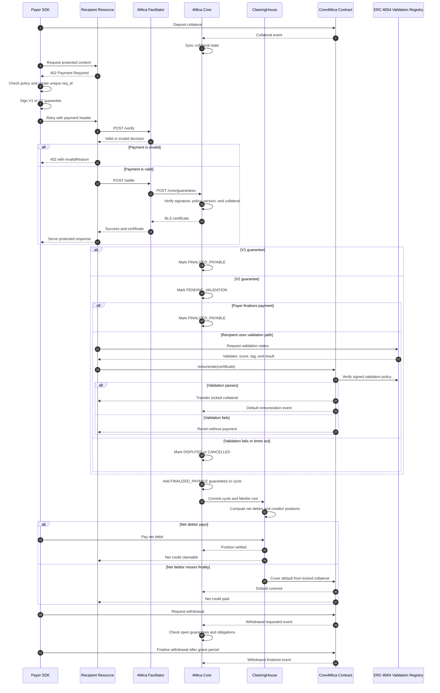

The 4Mica payment flow keeps HTTP simple while moving settlement complexity into signed guarantees, facilitator calls, clearing cycles, and protocol enforcement.

## Sequence

1. A payer deposits ETH or a supported ERC-20 into the Core4Mica vault.
2. A seller protects an HTTP route with x402 payment requirements.
3. The buyer receives HTTP 402, signs a guarantee with a unique request ID, and retries the request.
4. The seller verifies and settles the payment through the facilitator, then serves the protected response.
5. Payable guarantees enter a clearing cycle. Net debtors pay their positions, while defaults are covered from locked collateral according to protocol rules.

## Protocol flow

The synchronous HTTP flow ends when the resource returns the protected response.
Validation, clearing, net settlement, default coverage, and withdrawal handling
continue asynchronously.

## Headers

- V1 payment payloads commonly travel as X-PAYMENT.
- V2 payment payloads commonly travel as PAYMENT-SIGNATURE.
- Both bind claims such as request ID, amount, recipient, asset, timestamp, and version.
- The server should verify and settle before serving protected content.

## Actors

| Actor | Responsibility |
| --- | --- |
| Payer SDK | Applies spending policy, creates `req_id`, signs guarantees, and pays net debit positions. |
| Recipient resource | Publishes payment requirements, verifies and settles payment, and delivers protected work. |
| Facilitator | Validates x402 payloads and submits accepted guarantees to Core. |
| 4Mica Core | Verifies guarantees, locks collateral, tracks lifecycle state, and builds clearing cycles. |
| ClearingHouse | Commits cycles, computes net positions, accepts debtor payments, and handles defaults. |
| Core4Mica contract | Holds collateral and enforces deposits, withdrawals, and default coverage. |
| Validation registry | Publishes the outcome evidence required by a V2 validation policy. |

## Guards and guarantees

- `/verify` performs preflight validation without issuing a guarantee.
- `/settle` submits the signed request to Core and returns a BLS certificate.
- Every guarantee uses a unique `req_id`; Core rejects a duplicate identity.
- V1 guarantees become `FINALIZED_PAYABLE` after issuance.
- V2 guarantees remain `PENDING_VALIDATION` until finalized, disputed,
  cancelled, or resolved through the validation path.
- Only `FINALIZED_PAYABLE` guarantees enter clearing-cycle netting.
- Settlement and finality timing are deployment configuration values.
- Withdrawals remain subject to open guarantees, clearing obligations, and the
  configured grace period.

## Settlement Outcomes

- Settled: the guarantee is included in a clearing cycle and its net position is paid.
- Default remunerated: locked collateral covers an unpaid net position.
- Cancelled or disputed: the guarantee stays out of netting and collateral follows the applicable resolution path.
- Invalid: verification or validation failed and the resource should not be served as paid.

See [transaction lifecycle](/core-concepts/transaction-lifecycle) for the full
V1 and V2 state model.
