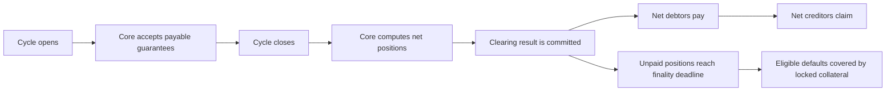
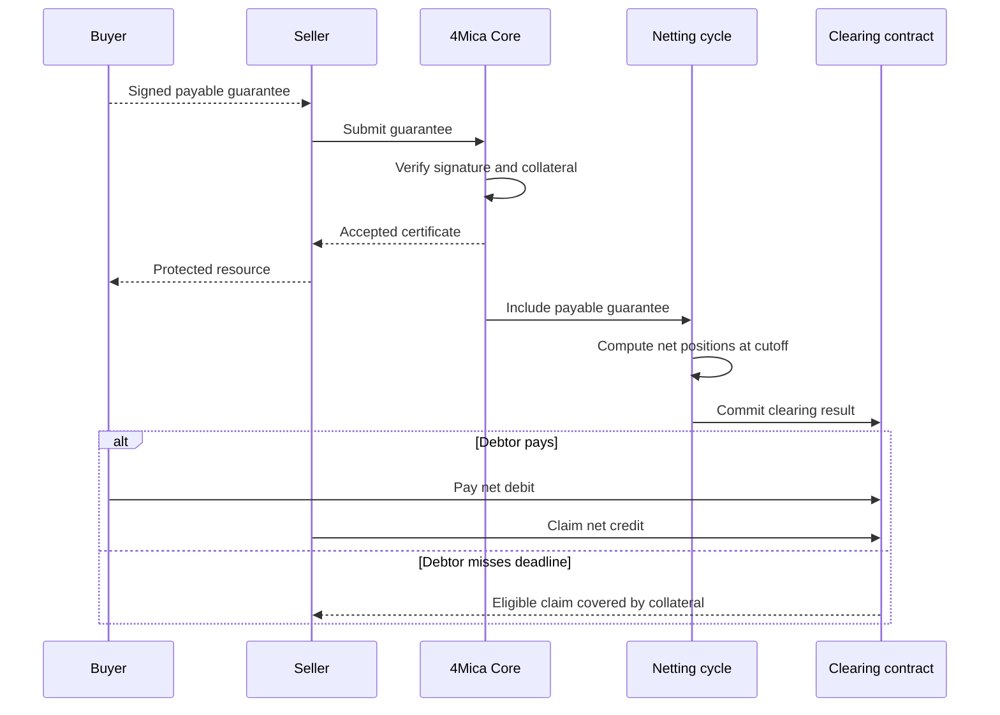
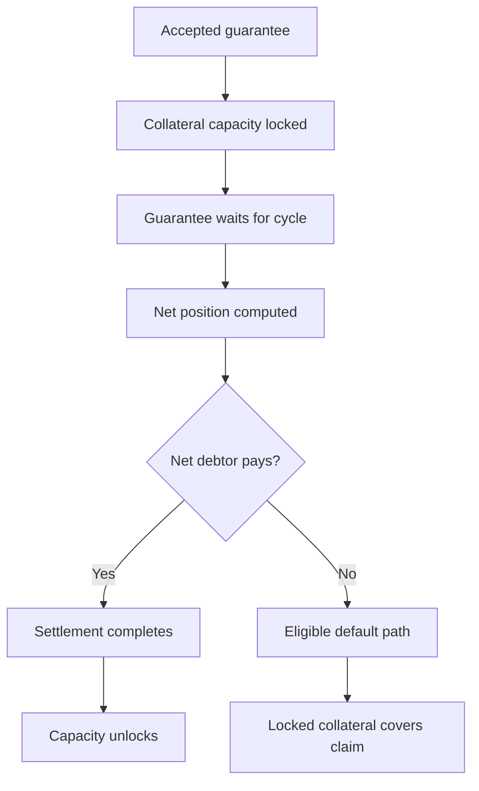
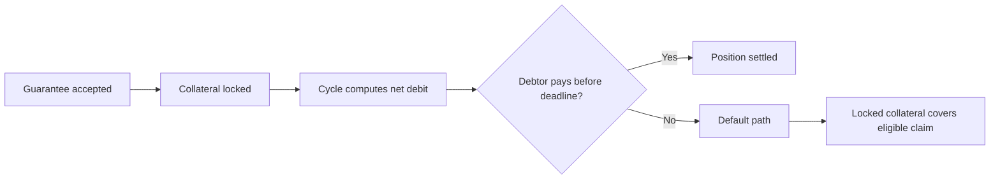

A netting cycle is the accounting window where many accepted payment
guarantees are grouped together and reduced into the amounts participants
actually need to settle.

Without netting, every paid API call, agent-to-agent request, model invocation,
or data purchase would need its own final settlement action. That works poorly
for machine-speed commerce. Agents may create many small obligations in both
directions during the same task, and settling every one independently would add
cost, latency, and operational noise.

4Mica uses cycles so the HTTP payment experience can stay fast while settlement
happens in larger, more efficient batches.

The core idea is simple:

> Track every accepted payable guarantee, then settle the difference instead of
> settling every request one by one.

## Why netting exists

Agent payments are often small, frequent, and bidirectional.

One agent may buy data, sell analysis, call another model, provide a result to a
third service, and receive payment back during the same operating period. If all
of those obligations settled separately, the system would inherit the worst
parts of blockchain settlement: many transactions, repeated gas costs, more
reconciliation work, and more chances for delays to interrupt the user
experience.

Netting separates two moments:

| Moment | What happens |
| --- | --- |
| Request time | The buyer signs a guarantee, Core verifies collateral, and the seller can serve the resource. |
| Settlement time | Payable guarantees are grouped, net positions are computed, and only net obligations settle. |

This is what lets 4Mica support instant-feeling x402 payments without requiring
an on-chain transfer for every HTTP request.

## What “bilateral” means

Bilateral netting looks at obligations between two counterparties and collapses
opposite-direction claims into one net result.

If Alice owes Bob for several requests, and Bob also owes Alice during the same
cycle, those obligations can offset each other. The side that owes more becomes
the net debtor for that relationship. The other side becomes the net creditor.

```text
Alice owes Bob: 70
Bob owes Alice: 40
Net result: Alice owes Bob 30
```

The original guarantees still matter. They prove how the net result was
calculated. Netting does not erase payment history; it reduces settlement
movement.

<Note>
This page explains the concept of bilateral netting. A deployment may also
aggregate positions across many participants and assets during a cycle. The
important user-facing idea is that accepted guarantees become auditable inputs
to a net settlement result.
</Note>

## The cycle model

A cycle is a bounded period of time. During the open part of the cycle, Core
accepts payable guarantees into the batch. When the cycle closes, the batch is
fixed. Core then computes debtor and creditor positions and commits the result
for settlement.



The cycle is the bridge between individual HTTP payments and final economic
settlement. A seller does not need to wait for the cycle to complete before
serving a request, because Core has already verified the guarantee and locked
capacity. But final settlement still waits for the cycle process.

## Which guarantees enter a cycle

Only payable guarantees enter netting.

V1 guarantees usually become payable immediately after Core verifies the
signature, accepted version, and collateral. V2 guarantees begin in
`PENDING_VALIDATION` and enter netting only after they become
`FINALIZED_PAYABLE`.

| Guarantee state | Enters cycle netting? | Why |
| --- | --- | --- |
| `FINALIZED_PAYABLE` | Yes | The payment obligation is ready to be included in settlement. |
| `PENDING_VALIDATION` | No | The validation condition has not resolved yet. |
| `DISPUTED` | No | The obligation should not be treated as payable while disputed. |
| `CANCELLED` | No | The payment obligation has been cancelled. |
| `SETTLED` | No | It has already completed settlement. |
| `DEFAULT_REMUNERATED` | No | The default path has already covered the claim. |

This distinction is critical for V2. A V2 guarantee can lock collateral before
it becomes payable, but it should not affect a clearing cycle until the
validation lifecycle says it is ready.

Read [transaction lifecycle](./transaction-lifecycle) for the full V1 and V2
state model.

## A simple example

Suppose two agents exchange several payable guarantees during the same cycle:

| Direction | Payment reason | Amount |
| --- | --- | ---: |
| Alice → Bob | Data request | 20 |
| Alice → Bob | Model call | 15 |
| Alice → Bob | Search result | 10 |
| Bob → Alice | Analysis result | 18 |
| Bob → Alice | File conversion | 7 |

Before netting, there are five payable guarantees:

```text
Alice owes Bob: 20 + 15 + 10 = 45
Bob owes Alice: 18 + 7 = 25
Net result: Alice owes Bob 20
```

Instead of settling five separate payments, the cycle can settle the net
position. Alice is the net debtor for 20, and Bob is the net creditor for 20.

The seller still has records for every individual paid request. Netting changes
how value moves at settlement time, not what was bought or which guarantee
authorized it.

## How a guarantee moves through a cycle

The seller-facing request can complete long before final settlement.



The accepted certificate is what lets the seller serve the resource before the
cycle finishes. Settlement later determines whether the obligation is paid
through the net debit path or covered through the eligible default path.

## Cycle phases

Cycle timing is deployment-specific, but the lifecycle has a consistent shape:

| Phase | What happens |
| --- | --- |
| Cycle open | Core accepts `FINALIZED_PAYABLE` guarantees into the active batch. |
| Cycle closes | No new guarantees enter that batch. Later payable guarantees wait for a later cycle. |
| Resolution cutoff | Core builds debtor and creditor positions from the fixed batch. |
| Clearing commit | The clearing result is committed so participants can settle against it. |
| Payment window | Net debtors submit payment for their net debit positions. |
| Finality deadline | Unpaid eligible positions can move to default handling and collateral coverage. |

The transaction lifecycle page documents one default schedule:

| Phase | Example timing |
| --- | --- |
| Cycle open | `0 – 24 h` |
| Cycle closes | `24 h` |
| Resolution cutoff | `+6 h after close` |
| Clearing commit | `+15 min after cutoff` |
| Payment window | `+2 h after commit` |
| Finality deadline | `+2 h after payment open` |

<Note>
Treat these timings as deployment parameters, not universal constants. A buyer
or seller should rely on the active operator configuration and observed cycle
state rather than assuming every network uses the same schedule.
</Note>

## Netting and collateral

Netting reduces settlement movement, but it does not remove the need for
collateral.

When Core accepts a guarantee, it locks enough capacity to back that obligation.
The guarantee may not settle until a later cycle, but the seller has already
served the resource. Collateral keeps that delayed settlement promise credible.



The relationship is:

- netting makes settlement more efficient;
- collateral makes delayed settlement safe enough to accept;
- collateral ratios decide how much unresolved exposure a wallet can create.

See [collateral ratios](./collateral-ratios) for how deposited collateral turns
into usable payment capacity.

## Netting and withdrawals

Collateral that secures open cycle obligations cannot be treated as freely
withdrawable.

A wallet may have deposited funds and still be unable to withdraw all of them
because some capacity is locked behind guarantees in an open cycle, a committed
clearing result, a payment window, a pending validation path, or a possible
default claim.

Withdrawal becomes safer after the relevant obligations resolve:

| State | Withdrawal effect |
| --- | --- |
| Payable guarantee waiting for cycle | Capacity remains locked. |
| Net debit not yet paid | Collateral may still be needed to protect creditors. |
| Net credit claim pending | Recipient still needs access to settlement or default coverage. |
| Settled position | Capacity can unlock according to protocol rules. |
| Default remunerated | Locked collateral has covered the eligible claim. |

This is why withdrawals are not purely about wallet ownership. They are about
ownership after accepted obligations have been respected.

Read [deposits and withdrawals](./deposits-and-withdrawals) for the complete
withdrawal lifecycle.

## Buyer view

For a buyer, netting means a signed payment may not cause an immediate transfer.
The buyer authorizes a guarantee, Core locks capacity, and the final amount owed
can be resolved later through the cycle.

This gives buyers operational efficiency, especially when they both buy and
sell during the same cycle. Incoming credits can offset outgoing debits before
final settlement.

It also creates responsibilities:

<AccordionGroup>
  <Accordion title="Capacity can remain locked after the HTTP request finishes">
    The buyer should not assume a completed API response means collateral is
    immediately reusable or withdrawable. The guarantee may still be waiting for
    cycle settlement.
  </Accordion>
  <Accordion title="Budgets should account for pending obligations">
    Application budgets should include guarantees that have been accepted but
    not yet settled, cancelled, or default-resolved.
  </Accordion>
  <Accordion title="Payment operations need monitoring">
    A buyer with a net debit must be able to pay during the payment window.
    Missing the deadline can trigger default handling.
  </Accordion>
  <Accordion title="Network and asset choices still matter">
    Netting does not merge incompatible assets or networks into one settlement
    pool. The payment terms still define the asset and network.
  </Accordion>
</AccordionGroup>

The buyer experience is fast, but the accounting lifecycle continues in the
background.

## Seller view

For a seller, the important event is not the final cycle close. It is Core
accepting the guarantee and returning verifiable payment evidence.

Once Core accepts the guarantee, the seller can serve according to its own risk
policy because the obligation is now part of the protocol lifecycle. Later, the
seller's payable guarantees contribute to a net creditor position, offset
against any obligations the seller owes in the same cycle.

Sellers should keep records that connect:

| Record | Why it matters |
| --- | --- |
| Protected route or job | Explains what was sold. |
| Payer wallet | Identifies who authorized the guarantee. |
| Recipient wallet | Identifies who should receive value. |
| Guarantee ID or request ID | Connects the HTTP request to the lifecycle record. |
| Amount and asset | Defines the settlement obligation. |
| Cycle ID | Shows which clearing batch included the guarantee. |
| Settlement outcome | Confirms whether it settled or used default coverage. |

Netting makes settlement efficient, but it does not replace seller-side
observability. Sellers still need payment records for reconciliation, support,
abuse handling, and audit.

## What happens if a debtor does not pay

Cycles include a finality deadline so settlement does not remain ambiguous
forever.

If a net debtor pays during the payment window, creditors can claim according
to the committed clearing result. If the debtor misses the deadline, the
uncovered eligible position can move to default handling. Locked collateral can
then be used to cover the claim according to protocol rules.

This is where collateral, ratios, and netting meet:



Default handling is not a normal payment path to optimize for. It is the safety
mechanism that makes delayed settlement credible when the expected debtor
payment does not arrive.

Read [settlements](./settlements) for the settlement and default outcome model.

## What netting does not do

Netting is an accounting and settlement mechanism. It does not change the
meaning of the original payment instructions.

It does not:

- let a payer change the amount or recipient after signing;
- make non-payable V2 guarantees payable without validation;
- merge different assets into one obligation unless the deployment explicitly
  supports that accounting model;
- remove the need for collateral while settlement is pending;
- replace seller access controls, buyer budgets, or application policy;
- erase the audit trail of individual guarantees.

The signed guarantee remains the source of truth for the individual payment.
The cycle explains how many signed guarantees are settled efficiently together.

## Common questions

<AccordionGroup>
  <Accordion title="Does the seller need to wait for the cycle to close?">
    Usually no. The seller can serve after Core accepts the guarantee and the
    seller's own risk checks pass. The cycle handles final settlement later.
  </Accordion>
  <Accordion title="Can two obligations fully cancel out?">
    Yes. If two counterparties owe each other the same amount in the same asset
    and cycle context, the net amount can be zero. The individual records still
    remain for audit.
  </Accordion>
  <Accordion title="Can a guarantee miss the current cycle?">
    Yes. If it becomes payable after the cycle closes, it waits for a later
    eligible cycle. V2 guarantees can also wait while validation is pending.
  </Accordion>
  <Accordion title="Does netting reduce what the seller earned?">
    No. Netting reduces settlement movement. It does not discount the accepted
    payment amount or erase the seller's claim.
  </Accordion>
  <Accordion title="Why keep collateral locked if the net amount may be smaller?">
    The final net result is not known until the cycle resolves. Collateral stays
    locked so sellers remain protected during that uncertainty.
  </Accordion>
</AccordionGroup>

## Practical mental model

Think of a netting cycle as the protocol's accounting day.

During the day, agents make many small payments. Sellers can serve as soon as
Core accepts each guarantee. At the end of the accounting window, the protocol
adds up who owes whom, offsets opposite-direction obligations, commits the
result, and lets only the net amounts settle.

<Columns cols={3}>
  <Card title="Fast requests" icon="zap">
    The HTTP interaction completes when the guarantee is accepted, not when the
    final settlement batch finishes.
  </Card>
  <Card title="Fewer settlements" icon="merge">
    Many payable guarantees can collapse into a smaller set of net debtor and
    creditor positions.
  </Card>
  <Card title="Protected delay" icon="shield-check">
    Collateral stays locked while the cycle runs so delayed settlement does not
    become an unsecured promise.
  </Card>
</Columns>

Netting is what makes high-volume agent commerce practical. Collateral is what
makes the wait safe. Settlement is what turns the net result into final economic
movement.
