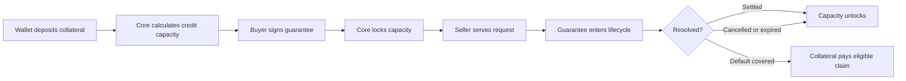
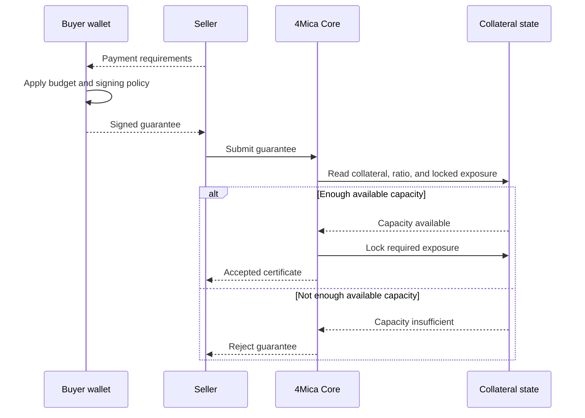
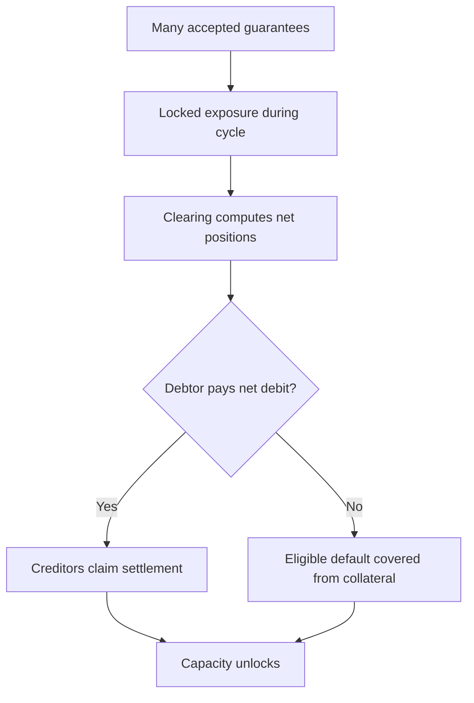

A collateral ratio is the rule that converts deposited collateral into usable
payment capacity.

If a wallet deposits \$1,000 of eligible collateral, it should not automatically
be able to promise unlimited payments. 4Mica needs to account for asset risk,
settlement timing, open guarantees, pending validation, withdrawal requests,
and the possibility that a debtor does not settle on time.

The collateral ratio is the buffer between those facts. It answers one practical
question:

> How much value can this wallet safely guarantee before the protocol should
> stop accepting more exposure?

That answer matters to both sides of a payment. Buyers want as much usable
capacity as possible from their collateral. Sellers want confidence that an
accepted guarantee is backed by enough value to survive the clearing and
settlement window.

## The basic idea

Collateral ratios are easier to understand if you separate three numbers:

| Number | Meaning |
| --- | --- |
| Deposited collateral | The finalized asset value attributed to a wallet. |
| Credit capacity | The maximum value the protocol allows the wallet to guarantee from that collateral. |
| Locked exposure | The portion of capacity already reserved for unresolved guarantees or obligations. |

Available capacity is what remains after policy and existing obligations are
applied:

```text
available capacity = credit capacity - locked exposure
```

The credit capacity is usually lower than the raw deposit value:

```text
credit capacity = eligible collateral value × collateral factor
```

For example, if a deployment gives a supported stablecoin a 90% collateral
factor, \$1,000 of eligible collateral can support up to \$900 of guarantees
before other limits are considered. The remaining \$100 is not a fee. It is a
safety buffer.

<Note>
Exact collateral factors are deployment-specific. Integrations should discover
active configuration from the operator and should treat the examples on this
page as mental models, not fixed production parameters.
</Note>

## Why 4Mica needs a buffer

4Mica payments are designed to feel instant at the HTTP layer. A seller can
serve a protected resource after Core accepts a signed guarantee, even though
the final movement of funds may happen later through clearing, settlement, or a
default path.

That delay is what makes collateral policy important.



If every dollar of collateral could be promised immediately, even a small delay
or accounting mismatch could make sellers underprotected. A ratio keeps some
margin inside the system so guarantees can remain credible while payments move
through their lifecycle.

The buffer protects against several ordinary conditions:

- prices, decimals, and asset values being interpreted incorrectly;
- guarantees that remain open until a clearing cycle closes;
- V2 guarantees waiting on validation;
- pending withdrawals reducing future capacity;
- settlement windows where a debtor has not paid yet;
- defaults that must be covered from locked collateral;
- operational delays in event indexing or finality.

The purpose is not to make every risk disappear. It is to make exposure explicit
and bounded.

## Ratio, collateral factor, and overcollateralization

Different teams describe collateral policy in different ways. The same policy
can be expressed as a collateral factor or as an overcollateralization ratio.

| Expression | Example | Meaning |
| --- | --- | --- |
| Collateral factor | `90%` | Each \$1 of collateral supports up to \$0.90 of guarantees. |
| Overcollateralization ratio | `111.11%` | Each \$1 of guarantees requires about \$1.11 of collateral. |
| Required buffer | `10%` | A portion of the deposit remains outside usable capacity. |

These are just different views of the same constraint.

```text
collateral factor = guarantee capacity / collateral value
overcollateralization ratio = collateral value / guarantee capacity
```

If the collateral factor is 80%, the system is more conservative. A \$1,000
deposit supports \$800 of guarantees. If the collateral factor is 95%, the system
is more capital efficient, but there is less room for unexpected movement or
delay.

Neither number is automatically “better.” The right ratio depends on asset
quality, settlement rules, risk tolerance, and how much uncertainty the protocol
needs to absorb.

## What counts as eligible collateral

Not every token balance in a wallet counts toward 4Mica payment capacity.

To become eligible, collateral must be deposited through the supported
collateral flow, recognized on the correct network, and accepted by the active
deployment. A token in the wallet, an allowance, or a pending transaction is not
enough.

For a deposited asset to contribute to capacity, Core needs to know:

| Requirement | Why it matters |
| --- | --- |
| Network | Collateral on one chain cannot automatically back guarantees on another chain. |
| Asset address | Symbols like USDC or ETH are not enough to identify the asset safely. |
| Decimal precision | Amounts are accounted in base units, not human-formatted decimals. |
| Finality | The deposit event must be reliable enough for Core to use. |
| Deployment policy | The operator must support the asset and assign risk parameters. |
| Existing obligations | Already accepted guarantees reduce remaining capacity. |

See [deposits and withdrawals](./deposits-and-withdrawals) for the full
collateral lifecycle and [supported networks](/getting-started/supported-networks)
for network guidance.

## How ratios affect a payment

When a payer signs a guarantee, Core checks more than the signature. It also
checks whether the wallet has enough available capacity after the collateral
ratio and existing locks are applied.



The seller should treat Core acceptance as the important signal. A buyer may
claim to have funds, but the guarantee is not useful until Core verifies the
signed fields, policy, accepted version, and collateral.

Read [transaction lifecycle](./transaction-lifecycle) for how guarantees move
from issuance through validation, netting, settlement, and default coverage.

## Locked exposure is not the same as spent money

When Core accepts a guarantee, it reserves capacity. That reservation is called
locked exposure. It prevents the same collateral from backing too many payments
at once.

Locked exposure can resolve in different ways:

| Outcome | What happens to capacity |
| --- | --- |
| Guarantee settles normally | The obligation is paid through settlement and capacity unlocks. |
| Guarantee is cancelled or expires under protocol rules | The reserved capacity can unlock. |
| V2 validation remains pending | Capacity stays reserved until the validation lifecycle resolves. |
| Debtor defaults | Locked collateral can be used to cover the eligible claim. |

This distinction is subtle but important. A wallet may still own the collateral
economically while capacity is locked. The wallet simply cannot reuse that same
capacity for another guarantee or withdraw it as if nothing depended on it.

## Ratios and withdrawals

Withdrawals are constrained by the same capacity math.

A wallet can only withdraw collateral that is not needed for accepted
guarantees, pending settlement, validation-gated obligations, active withdrawal
delays, or default coverage. If removing collateral would make the remaining
position undercollateralized, the withdrawal should not be finalized.

```text
remaining eligible collateral × collateral factor
must be greater than or equal to
remaining locked exposure
```

For example, suppose a wallet has \$1,000 in eligible collateral with a 90%
collateral factor. Its maximum credit capacity is \$900. If \$600 is locked, the
wallet has \$300 of available capacity.

If the wallet tries to withdraw \$500, the remaining collateral would be \$500,
which supports only \$450 of capacity at the same factor. That would be less
than the \$600 already locked, so the withdrawal would make the position unsafe.

This is why a withdrawal may need to wait until obligations settle or unlock.
The user still has a withdrawal path, but the protocol cannot allow collateral
to leave while sellers are relying on it.

See [no custodial risk](./no-custodial-risk) for how withdrawal ownership works
without turning 4Mica into a custodial balance provider.

## Ratios and yield

4Mica can use yield-bearing infrastructure such as Aave for supported
stablecoin collateral. That makes collateral productive while it backs payment
capacity, but it does not remove the need for conservative ratios.

Yield and collateral capacity answer different questions:

| Concept | Question |
| --- | --- |
| Yield | Can idle or locked collateral earn while it remains deposited? |
| Collateral ratio | How much payment exposure can that collateral safely support? |

Yield may improve the economics of keeping collateral deposited, but the
collateral still sits inside a risk system. The ratio must consider the asset,
the protocol path, liquidity, timing, and default coverage. More yield does not
automatically mean more safe credit capacity.

Read [earning yield](./earning-yield) for the economic purpose of keeping
collateral productive.

## Asset quality changes the ratio

A stable, liquid, widely supported asset can usually support a higher collateral
factor than a volatile or thinly traded asset. Even among stablecoins, different
assets can carry different risks.

The ratio may account for:

| Risk input | Why it affects capacity |
| --- | --- |
| Price stability | Volatile assets need a larger buffer before settlement completes. |
| Liquidity | Collateral is less protective if it cannot be converted or claimed reliably. |
| Smart-contract path | Depositing through another protocol adds dependency risk. |
| Network finality | Slower or less reliable finality increases timing risk. |
| Token behavior | Pausable, upgradeable, rebasing, or non-standard tokens may need stricter treatment. |
| Oracle or valuation method | Any external pricing dependency can introduce stale or incorrect values. |
| Concentration | Too much exposure to one asset, wallet, or counterparty can raise systemic risk. |

The safest integration posture is to assume ratios can vary by asset and
deployment. Do not build product logic that depends on one universal number.

## Netting makes ratios more efficient

Collateral ratios exist because individual guarantees create exposure. Netting
reduces how much value ultimately has to move.

If two participants owe each other throughout a cycle, the clearing system can
settle only the net amount instead of moving value for every individual request.
This is one reason 4Mica can support many small agent payments without forcing a
blockchain transaction for each request.

Netting does not eliminate collateral requirements. Sellers still need
protection during the period before the net result is known and settled. The
ratio defines how much unresolved exposure the protocol is willing to accept
while waiting for that result.



For more detail, read [bilateral netting cycles](./bilateral-netting-cycles) and
[settlements](./settlements).

## Buyer view: capacity is not a spending budget

Available capacity tells a buyer what the protocol may accept. It does not tell
the agent what it should buy.

A wallet might have enough capacity to sign a payment, while the buyer's own
policy rejects it because the seller is unknown, the task is low value, the
price is too high, the route is suspicious, or the daily budget has already
been used.

Keep these two layers separate:

| Layer | Decision |
| --- | --- |
| Protocol capacity | Can this wallet back the guarantee under current collateral rules? |
| Buyer policy | Should this agent authorize the payment for this task? |

The wallet and collateral system make payment possible. Policy makes it
intentional. See [wallet](./wallet) for the relationship between agent, signer,
policy, and collateral.

## Seller view: accepted capacity is the signal

A seller does not need to inspect the buyer's raw deposit and calculate every
internal policy rule itself. The seller needs a verifiable indication that the
payment was accepted under the active protocol rules.

In a 4Mica flow, that signal is Core accepting the guarantee and returning a
certificate. The certificate means Core verified the signed payment fields and
locked the required capacity for that obligation.

This still leaves normal seller decisions outside the collateral ratio:

- whether the buyer is allowed to access the resource;
- whether the requested work is legal and safe to serve;
- whether the payment amount matches the protected route;
- whether the seller accepts the facilitator and network;
- whether additional application-level authentication is required.

Collateral ratios protect economic settlement. They do not replace product,
abuse, or compliance controls.

## When capacity is insufficient

If a guarantee is rejected because capacity is insufficient, it does not always
mean the wallet has no money. It may mean the deposit is pending, the asset is
unsupported, too much capacity is already locked, a withdrawal is in progress,
or the requested amount would exceed the ratio.

Common causes include:

<AccordionGroup>
  <Accordion title="The deposit is not finalized or synchronized">
    A transaction receipt is not always enough. Core must observe a finalized
    deposit event and update the wallet's collateral state before the collateral
    can support guarantees.
  </Accordion>
  <Accordion title="The wallet is using the wrong network">
    Collateral on Base Sepolia does not automatically support a guarantee
    advertised for Base mainnet, and vice versa.
  </Accordion>
  <Accordion title="The asset does not match the seller's terms">
    A wallet may have deposited one token while the seller requires another.
    Asset address and chain are the identifiers that matter.
  </Accordion>
  <Accordion title="Existing guarantees are still open">
    Capacity can remain locked until settlement, validation, cancellation, or
    default handling finishes.
  </Accordion>
  <Accordion title="The requested payment is too large">
    Even with enough total collateral, the guarantee may exceed the wallet's
    available capacity after the collateral factor is applied.
  </Accordion>
  <Accordion title="A withdrawal reduced usable collateral">
    Pending or finalized withdrawals can reduce the collateral available to
    back new guarantees.
  </Accordion>
</AccordionGroup>

The right response depends on the cause. The wallet may need to deposit more
collateral, wait for obligations to resolve, switch networks, use the correct
asset, or reduce the requested payment amount.

## Reading ratio information

Applications should avoid hard-coding collateral rules. The active deployment
may change supported assets, accepted versions, validation registries, contract
addresses, or other public parameters over time.

At minimum, integrations should use:

- [`GET /core/public-params`](/api-reference/operator/public-params) for public
  contract, signing, guarantee, and validation configuration;
- [`GET /core/tokens`](/api-reference/operator/tokens) for supported token
  addresses, chains, and decimals;
- the facilitator verification and settlement responses for whether a specific
  payment was accepted.

Where a deployment exposes additional collateral or account-state endpoints,
use them as the source of truth for current capacity. If there is any mismatch
between a local estimate and Core's response, Core's response wins.

## Practical mental model

Think of collateral ratios as the protocol's “speed limit” for deferred
payment. Deposits put value into the system, but the ratio decides how quickly
that value can be promised before settlement catches up.

Good collateral policy balances three goals:

<Columns cols={3}>
  <Card title="Buyer efficiency" icon="gauge">
    The wallet should get useful payment capacity from deposited collateral
    instead of keeping excessive value idle.
  </Card>
  <Card title="Seller safety" icon="shield-check">
    Accepted guarantees should remain credible until they are settled,
    cancelled, or covered.
  </Card>
  <Card title="System resilience" icon="globe">
    One wallet, asset, or delayed settlement path should not create exposure the
    protocol cannot absorb.
  </Card>
</Columns>

The ratio is where those goals meet. It is not just a configuration number. It
is the economic boundary that lets agents make fast payments without pretending
delayed settlement has no risk.
