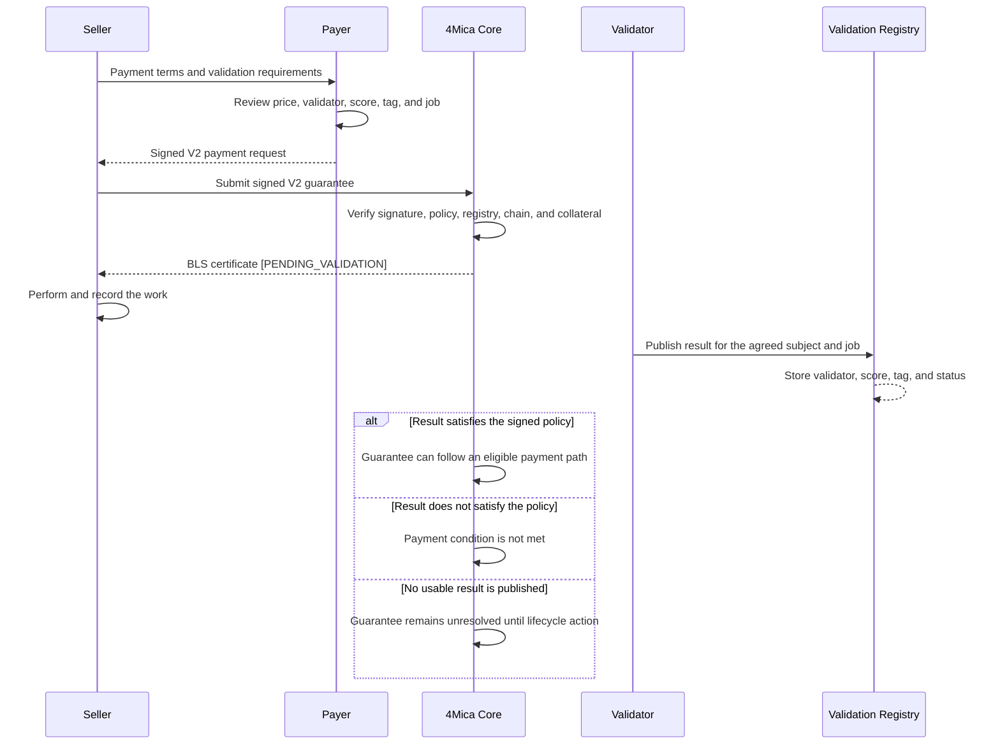
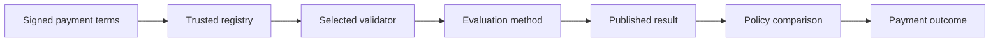

A service-level agreement, or SLA, defines what must be true for work to count
as successful. In 4Mica, a configurable SLA can be attached to a V2 payment
guarantee so payment depends on validation evidence rather than delivery alone.

The payer does not merely sign an amount and recipient. The payer also signs the
validation policy that identifies:

- where the validation result must be published
- who is allowed to validate the work
- which job and payment the result belongs to
- which score and result tag are acceptable

Core checks this policy before issuing the guarantee. The guarantee begins in
`PENDING_VALIDATION`, and the signed conditions cannot be changed afterward
without invalidating the payer's authorization.

<Note>
A configurable SLA is strongest when success can be described objectively and
checked by software. It does not make every subjective promise automatically
enforceable.
</Note>

## Why payment needs an outcome layer

A normal payment authorization answers a narrow question:

> Did this payer authorize this amount, asset, and recipient?

That is sufficient when the parties agree that the obligation should become
payable immediately. It is not always sufficient for autonomous work.

An agent may be buying a dataset, generated artifact, completed workflow,
verified computation, model evaluation, or time-sensitive response. In those
cases, the buyer may want the payment decision to depend on evidence about the
result.

Without a validation policy, the payment system can prove authorization and
settlement but cannot determine whether:

- the requested job was completed
- the output belongs to the correct request
- a required evaluator approved it
- a measurable quality threshold was reached
- a required result category was published

V2 adds that outcome layer. It connects a payment guarantee to a specific
validation result while preserving the signed payment terms.

## V1 payment versus a V2 SLA

V1 and V2 guarantees use the same collateral-backed payment foundation. The
difference is when the obligation becomes payable.

| Question | V1 guarantee | V2 guarantee with an SLA |
| --- | --- | --- |
| What does the payer sign? | Payment terms | Payment terms and validation policy |
| State after Core accepts it | `FINALIZED_PAYABLE` | `PENDING_VALIDATION` |
| External validation required | No | Yes |
| Enters netting immediately | Yes, if the cycle is open | No |
| Best fit | Agreed or immediately payable work | Work with an objective acceptance condition |

Use V1 when payment acceptance should not depend on an external result. Use V2
when a validator must confirm the agreed outcome before the validation-gated
payment path can succeed.

The complete state model is described in
[transaction lifecycle](./transaction-lifecycle).

## How a configurable SLA works

The SLA is agreed before the payer signs. This prevents either side from
changing the success criteria after work has started.

The validation registry does not rewrite the agreement. It publishes evidence.
The protocol compares that evidence with the policy the payer already signed.

## The validation policy

A V2 policy contains several independent checks. Together, they answer where
the evidence comes from, who produced it, what it refers to, and what result is
good enough.

| Field | What it binds |
| --- | --- |
| `validation_registry_address` | Registry contract that must contain the result |
| `validation_chain_id` | Network on which that registry must exist |
| `validator_address` | Wallet expected to publish or own the validation result |
| `validator_agent_id` | Expected validator agent identity |
| `validation_subject_hash` | Payment or work subject being evaluated |
| `validation_request_hash` | Canonical commitment to the validation request |
| `job_hash` | Specific job, task, or artifact covered by the SLA |
| `min_validation_score` | Lowest acceptable score from 1 through 100 |
| `required_validation_tag` | Required result category or policy label |

Every field has a different purpose. A high score alone is not enough if it was
published by the wrong validator, for the wrong job, on the wrong network, or
with the wrong result tag.

### Registry and network

`validation_registry_address` identifies the contract that acts as the source
of validation evidence. Core accepts only registries trusted by the active
deployment.

`validation_chain_id` prevents evidence from a similarly addressed contract on
another network from satisfying the policy. It must match the Core deployment's
chain.

The active network and registry allowlist are available from
[`GET /core/public-params`](/api-reference/operator/public-params). A proposed
registry that is not in `trusted_validation_registries` is rejected before
collateral is locked.

<Warning>
Do not assume that a registry accepted on one 4Mica deployment is accepted on
another. Read the public parameters for the exact network and operator you use.
</Warning>

### Validator identity

`validator_address` and `validator_agent_id` identify the evaluator whose
result the payer accepts.

This matters because two validators can inspect the same work and reach
different conclusions. Selecting the validator is therefore part of the
economic agreement, not an implementation detail.

A validator may be:

- an independent evaluation agent
- a deterministic verification service
- an application-specific assessor
- a registry-recognized reviewer
- a system that checks an on-chain or cryptographic outcome

The payer should understand the validator's methodology and trust assumptions
before signing. An allowlisted registry proves where a result came from; it
does not guarantee that every validator is equally reliable.

### Subject, request, and job binding

Hashes connect validation evidence to the exact work covered by the payment.
They prevent a successful result for one task from being reused for another.

| Binding | Purpose |
| --- | --- |
| `validation_subject_hash` | Identifies the subject whose result can affect payment |
| `validation_request_hash` | Commits to the canonical validation request |
| `job_hash` | Connects the SLA to a particular job or artifact |

The application should construct these values deterministically. Both sides
must derive the same hashes from the same inputs, and the validator must
evaluate that same subject.

Useful job inputs can include a request identifier, normalized task
description, input commitment, output commitment, seller identity, model or
agent version, and completion criteria. Avoid including secrets directly in a
public hash input when the original value has low entropy and could be guessed.

### Score threshold

`min_validation_score` defines the lowest acceptable score from 1 through 100.
The meaning of that score comes from the validator's published methodology.

A score of 90 is useful only when everyone knows what is being measured. It
might represent accuracy, policy compliance, completeness, similarity,
confidence, or a composite evaluation. The number alone does not define the
metric.

Good score policies state:

- which evaluator produces the score
- which rubric and version are used
- whether the score is deterministic
- how invalid or missing outputs are scored
- whether the threshold is inclusive
- whether evaluation can be reproduced

If a binary pass or fail is sufficient, use a clear result tag rather than
inventing unnecessary numerical precision.

### Required result tag

`required_validation_tag` identifies an acceptable result category. Examples
might include `completed`, `verified`, `policy-compliant`, or an
application-defined versioned label.

Tags should have stable, documented meanings. Prefer values such as
`schema-valid-v2` over a generic value such as `good`. Versioning a tag is
helpful when the evaluation rubric changes over time.

The registry result must match both the required tag and the other signed
conditions. A matching tag from the wrong validator does not satisfy the SLA.

## What can be expressed as an SLA

The best SLA conditions can be reduced to observable evidence.

<Columns cols={2}>
  <Card title="Strong candidates" icon="check">
    Schema validity, required fields, cryptographic proofs, deterministic test
    results, completion status, measurable accuracy, signed attestations, and
    machine-observable delivery conditions.
  </Card>
  <Card title="Weak candidates" icon="triangle-exclamation">
    Taste, usefulness, creativity, fairness, business value, or vague promises
    such as "high quality" without an agreed evaluator and rubric.
  </Card>
</Columns>

Some real-world promises can become machine-verifiable only after an
application defines how they are measured.

| Human promise | Possible objective representation |
| --- | --- |
| "Return valid JSON" | Validator parses the output against a versioned schema |
| "Complete the workflow" | Validator checks all required workflow states |
| "Respond within the target" | Trusted observer evaluates signed timestamps |
| "Reach acceptable accuracy" | Named evaluator scores a fixed test set |
| "Produce the requested artifact" | Validator compares the artifact hash and required properties |
| "Use an approved model" | Attestation binds execution evidence to an allowed model version |

The representation is part of the product contract. If the measurement does
not capture what the buyer actually cares about, technically correct
validation can still produce an unsatisfactory outcome.

## An SLA is more than a score

A robust policy answers five questions before payment:

1. **What is being evaluated?** Define the job and subject precisely.
2. **Who evaluates it?** Select a validator with an understood methodology.
3. **Where is the result published?** Use a registry trusted by the deployment.
4. **What counts as success?** Set an explicit score, tag, or both.
5. **What happens if validation never resolves?** Define timeout, cancellation,
   retry, support, and collateral expectations outside the score itself.

The fifth question is easy to overlook. The V2 policy defines the evidence
required for the payment path, but product-level rules still need to explain
what the parties do when evidence is delayed, unavailable, or inconclusive.

## SLA strength and trust

Validation replaces one broad trust assumption with several narrower ones.

The result is only as meaningful as the full chain:

- the payer understood the policy before signing
- the registry is the intended contract on the intended network
- the validator controls the expected identity
- the evaluator measured the intended subject
- the job and request hashes were constructed correctly
- the score and tag have stable semantics
- the lifecycle applies the result to the correct guarantee

4Mica verifies protocol conditions. It cannot determine whether a poorly
designed metric represents genuine customer value.

## Buyer, seller, and validator responsibilities

### Buyer

The buyer authorizes both the payment and its validation conditions. Before
signing, the buyer should check the amount, recipient, asset, registry,
validator, job, threshold, and tag.

The buyer should also decide whether the selected evaluator is independent
enough for the value and risk of the task. For high-value work, a seller-owned
validator may not provide the assurance the buyer expects.

Buyer policy can limit approved registries, validators, SLA templates, score
thresholds, task values, and maximum time that collateral may remain committed.
See [trust and verification](/buyer/trust-and-verification) for the surrounding
seller-selection decision.

### Seller

The seller proposes clear validation requirements, performs the work, preserves
delivery evidence, and ensures the validator can evaluate the result.

The seller should not treat an issued V2 certificate as immediately payable.
It proves that Core accepted the collateral-backed guarantee and its signed
policy. The guarantee still begins in `PENDING_VALIDATION`.

For support and reconciliation, retain the request ID, guarantee ID, job hash,
input and output commitments, timestamps, validator details, registry result,
and settlement status. Privacy-sensitive systems can retain hashes and minimal
metadata instead of full payloads.

The distinction between payment evidence and delivery evidence is covered in
[proof and disputes](/seller/proof-and-disputes).

### Validator

The validator applies the agreed method to the agreed subject and publishes a
result that can be matched to the signed policy.

A dependable validator should make its identity, scoring method, result
semantics, expected response time, versioning policy, and failure behavior
understandable. It should avoid producing ambiguous results that cannot be
connected to a specific job.

### 4Mica operator and Core

The operator configures which validation registries the deployment trusts.
Core checks the signed request, active network, registry allowlist, hashes,
accepted guarantee version, and available collateral before issuing the V2
certificate.

Core enforces the protocol agreement. It does not write the seller's quality
rubric, execute the job, or independently decide whether the output was useful.

## Validation and the payment lifecycle

Issuance, validation, and settlement are different events.

<Steps>
  <Step title="The parties agree on terms">
    The seller presents the price and validation requirements. The payer reviews
    and signs the complete V2 request.
  </Step>
  <Step title="Core accepts the guarantee">
    Core verifies the signature, policy, registry, chain, request identity, and
    collateral. If accepted, it returns a BLS certificate and stores the
    guarantee as `PENDING_VALIDATION`.
  </Step>
  <Step title="The work is evaluated">
    The selected validator checks the agreed subject and publishes a result to
    the trusted registry.
  </Step>
  <Step title="The result is matched">
    The validation path checks the validator identity, agent identity, subject,
    job, score, tag, registry, and network against the signed policy.
  </Step>
  <Step title="The obligation resolves">
    An eligible guarantee may become payable and follow net settlement, use a
    supported validation remuneration path, or remain outside netting if it is
    disputed, cancelled, or unresolved.
  </Step>
</Steps>

Only guarantees in `FINALIZED_PAYABLE` enter bilateral netting. A V2 guarantee
that remains `PENDING_VALIDATION`, `DISPUTED`, or `CANCELLED` is excluded from
the cycle's payable obligations.

Read [bilateral netting cycles](./bilateral-netting-cycles) for cycle
eligibility and [settlements](./settlements) for the resulting payment states.

## Collateral while validation is pending

Core locks capacity when it accepts the guarantee, before the validation
outcome is known. This gives the seller economically meaningful payment
evidence without making the obligation immediately payable.

Pending validation therefore has a cost for the payer: the reserved capacity
cannot simultaneously back unlimited new guarantees or be withdrawn as if it
were unused.

Long or unreliable validation processes can reduce available spending capacity.
Buyers should account for:

- expected validation duration
- the number of concurrent pending jobs
- the maximum value of each job
- validator and registry availability
- cancellation or resolution procedures
- other guarantees and settlement obligations using the same collateral

This relationship is explained further in
[collateral ratios](./collateral-ratios) and
[deposits and withdrawals](./deposits-and-withdrawals).

## Latency, availability, and retries

Traditional SLAs often focus on uptime and response time. These promises can be
part of a V2 payment condition only when the validation system can verify them
reliably.

For example, a latency SLA needs an agreed clock, start event, completion event,
and trusted observer. A seller's own unsigned timestamp is usually not enough
to prove that a response met the deadline.

Similarly:

- availability needs a defined measurement window and observation source
- retry limits need a stable request identity and idempotent behavior
- partial completion needs a rubric or staged payment design
- timeout handling needs an explicit product and lifecycle policy
- refunds remain an application policy unless represented by an enforceable
  payment or validation flow

Do not place critical meaning in prose that the validator cannot observe.
Either make the condition machine-checkable or state clearly that it belongs to
support, refund, or commercial policy rather than protocol enforcement.

## Designing an effective SLA

Start with the buyer's actual acceptance question, then reduce it to the
smallest reliable set of checks.

| Design question | Good answer |
| --- | --- |
| What exact output is covered? | A versioned job description or content commitment |
| How is the output connected to payment? | Stable subject, request, and job hashes |
| Who may judge it? | A named validator address and agent identity |
| How is success measured? | Published rubric with a score threshold or precise tag |
| Where is evidence stored? | An allowlisted registry on the signed network |
| What if no result arrives? | Defined timeout, cancellation, escalation, or retry policy |
| What evidence is retained? | Payment, work, validation, and resolution records |

Prefer one condition that directly measures success over many indirect
conditions. Complex policies are harder to understand, reproduce, and resolve
when something goes wrong.

<Tip>
Version the job schema, evaluator rubric, and result tags. Stable versions let
both parties reconstruct what the signed SLA meant even after the service or
validator evolves.
</Tip>

## Common SLA patterns

<AccordionGroup>
  <Accordion title="Deterministic computation">
    Bind the payment to a job hash and require a validator to reproduce or
    verify the computation. A pass tag may be clearer than a probabilistic
    score when the result is exact.
  </Accordion>
  <Accordion title="Generated structured output">
    Validate the output against a versioned schema and required fields. Keep
    subjective usefulness separate unless a named evaluator and rubric can
    measure it consistently.
  </Accordion>
  <Accordion title="Model or agent evaluation">
    Name the evaluator, test set or evaluation commitment, rubric version,
    minimum score, and acceptable tag. Consider evaluator variance before
    selecting a narrow threshold.
  </Accordion>
  <Accordion title="Workflow completion">
    Define the required stages and final artifact. Hash the workflow job and
    require validation evidence that each mandatory completion condition was
    reached.
  </Accordion>
  <Accordion title="Time-sensitive delivery">
    Use a trusted observation method with explicit start and completion events.
    Define clock assumptions and what happens when the observer or validator is
    unavailable.
  </Accordion>
</AccordionGroup>

## Failure modes

An SLA can fail because the work failed, but it can also fail because the
agreement or evidence pipeline was designed incorrectly.

| Failure | Effect |
| --- | --- |
| Registry is not allowlisted | Core rejects the V2 guarantee before issuance |
| Validation chain is wrong | Policy does not match the active deployment |
| Validator identity differs | Published result cannot satisfy the signed policy |
| Subject or job hash differs | Evidence refers to different work |
| Score is below the threshold | Validation condition is not met |
| Required tag differs | Result category is unacceptable |
| Result never arrives | Guarantee can remain pending until lifecycle resolution |
| Rubric is ambiguous | Parties may disagree even though a result was published |
| Validator is compromised | Incorrect evidence may appear valid under the selected trust model |
| Sensitive inputs are exposed | Public evidence can create privacy or confidentiality risk |

Monitoring should distinguish protocol rejection, unsuccessful work,
unavailable validation, and policy mismatch. They need different responses.

For a broader treatment of these risks, read
[risk management](./risk-management#validation-and-sla-risk).

## Privacy and data minimization

Validation evidence may be visible beyond the buyer and seller, especially when
stored in an on-chain registry. Do not publish confidential prompts, customer
records, proprietary outputs, credentials, or personal data merely to make an
SLA verifiable.

Prefer commitments and minimal metadata:

- hash the normalized job or artifact
- retain the original data in an access-controlled system
- publish only the result fields required by the policy
- avoid low-entropy hashes that reveal guessable private values
- document who can access supporting evidence
- keep retention periods proportional to audit and dispute needs

A hash proves that retained data matches a commitment. It does not by itself
prove that the hidden data was correct or safe.

## Frequently asked questions

<AccordionGroup>
  <Accordion title="Does V2 guarantee that the output is high quality?">
    No. V2 guarantees that the signed validation conditions are enforced. The
    quality of the outcome still depends on whether the selected validator,
    rubric, score, and tag measure what the buyer actually values.
  </Accordion>
  <Accordion title="Can the SLA be changed after the payer signs?">
    No. The validation policy is part of the signed V2 request. Changing the
    registry, validator, hashes, threshold, or tag changes the authorized
    request and causes signature or policy verification to fail.
  </Accordion>
  <Accordion title="Who chooses the validator?">
    The payment requirements propose the validator and the payer accepts that
    choice by signing. The registry must also be trusted by the active 4Mica
    deployment.
  </Accordion>
  <Accordion title="Is an issued V2 guarantee already payable?">
    Not by default. It begins in `PENDING_VALIDATION`. It must follow the
    applicable validation and lifecycle rules before it can enter a payable or
    validation-based remuneration path.
  </Accordion>
  <Accordion title="What happens when validation fails?">
    A result that does not match the signed policy cannot satisfy the validation
    condition. The guarantee remains outside normal payable netting unless
    another permitted lifecycle action resolves it.
  </Accordion>
  <Accordion title="What happens when the validator never responds?">
    The payment condition remains unresolved until the applicable cancellation,
    dispute, timeout, or other lifecycle process acts. Product terms should
    explain this behavior before the payer signs because collateral capacity can
    remain reserved while validation is pending.
  </Accordion>
  <Accordion title="Can an SLA enforce refunds?">
    Not automatically. V2 can make a payment path depend on validation
    evidence. Refunds, credits, retries, and support remedies need explicit
    application policy or a separate enforceable flow.
  </Accordion>
  <Accordion title="Can I use several validators?">
    The signed policy fields identify the expected validation source for the
    guarantee. More complex multi-evaluator logic must be represented by a
    validator or registry design whose published result can still be checked
    against that policy.
  </Accordion>
  <Accordion title="Does the validation registry hold the payer's funds?">
    No. The registry supplies outcome evidence. Collateral and payment
    obligations follow the 4Mica contract and settlement lifecycle described in
    [no custodial risk](./no-custodial-risk).
  </Accordion>
</AccordionGroup>
