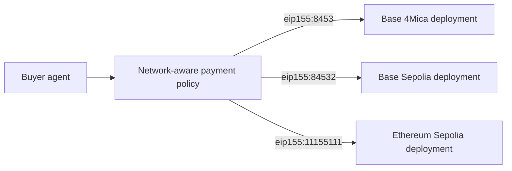
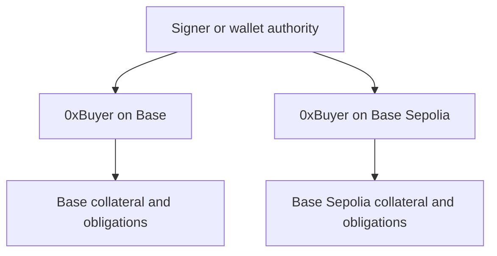
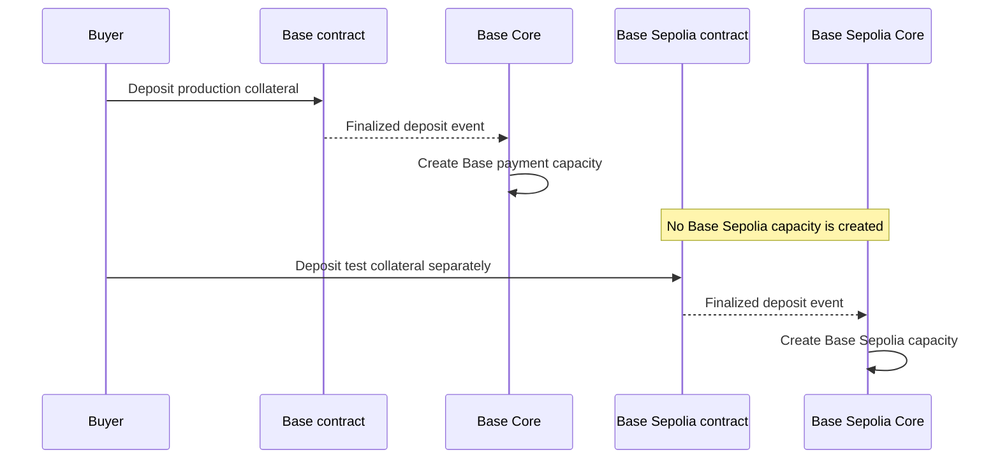
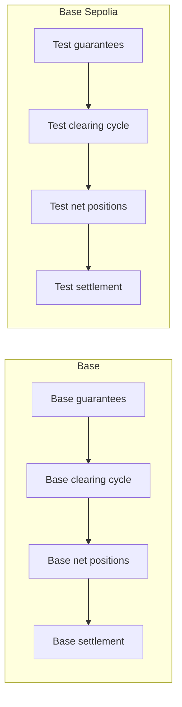
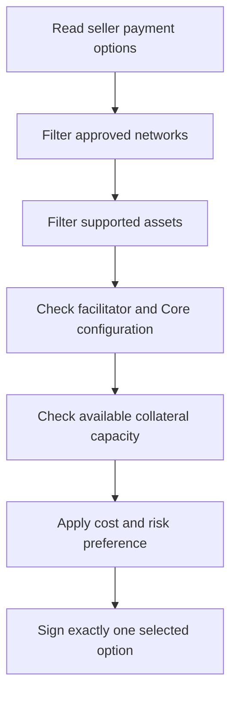

Cross-chain credit means an agent can use the same 4Mica payment pattern across
multiple supported blockchain networks while each network preserves its own
collateral, assets, contracts, guarantees, clearing cycles, and settlement
state.

The interface is portable. The economic positions are network-specific.

An agent can understand one recurring flow:

1. receive x402 payment requirements
2. identify the requested network and asset
3. select the matching wallet, signer, and 4Mica scheme
4. sign a collateral-backed guarantee
5. let the seller settle it through the matching facilitator and Core
   deployment
6. reconcile the resulting obligation on that network

This makes multi-network payments easier to add without pretending that every
chain is one shared ledger.

<Warning>
A deposit on one network does not automatically create credit capacity on
another. 4Mica does not treat Base collateral, Base Sepolia collateral, and
Ethereum Sepolia collateral as one interchangeable balance.
</Warning>

## What “cross-chain” means in 4Mica

The phrase can describe several very different systems. Keeping them separate
prevents dangerous assumptions.

| Model | Meaning | 4Mica concept |
| --- | --- | --- |
| Multi-network payment interface | The same client and server pattern works on several networks | Yes |
| Network-specific credit | Each deployment issues guarantees against collateral on its own network | Yes |
| Seller offers several networks | The buyer chooses one supported payment option | Yes, where configured |
| Shared wallet address | One EVM address may be used on several networks | Possible, but state remains separate |
| Automatic asset bridging | A payment moves tokens from one chain to another | Not implied |
| Global collateral pool | One deposit backs guarantees everywhere | Not implied |
| Cross-network netting | Debits on one chain cancel credits on another | Not implied |
| Remote collateral recognition | Core on one chain trusts collateral held on another | Requires an explicit mechanism; do not assume it |

The safest mental model is **many compatible 4Mica environments**, not one
invisible global chain.

## Why network portability matters

Agents may encounter sellers on different networks. One service may prefer Base
for production payments, another may expose a test route on Base Sepolia, and a
third may use Ethereum Sepolia for compatibility testing.

Without a common payment interface, every network can become a separate product
integration with different identifiers, payloads, retry behavior, and
settlement logic.

4Mica and x402 reduce that fragmentation:

- x402 advertises price and payment choices over HTTP
- <Tooltip headline="CAIP-2" tip="Chain Agnostic Improvement Proposal 2: a standard format for identifying blockchain networks, such as eip155:8453 for Base.">CAIP-2</Tooltip> identifies the network unambiguously
- the `4mica-credit` scheme describes the guarantee model
- SDKs can register a scheme implementation for each enabled network
- facilitators expose supported scheme and network combinations
- each Core deployment publishes its active contract and signing parameters

The business flow remains recognizable even though the underlying deployment
changes.



## Network identity with CAIP-2

4Mica uses CAIP-2 identifiers in x402 payment requirements and facilitator
capability discovery.

For EVM networks, the format is:

```text
eip155:<chain-id>
```

Examples include:

| Network | CAIP-2 identifier | Intended use |
| --- | --- | --- |
| Base | `eip155:8453` | Production |
| Base Sepolia | `eip155:84532` | Development and integration testing |
| Ethereum Sepolia | `eip155:11155111` | Ethereum testnet compatibility |

The identifier does more than label the chain. It helps bind together:

- the seller's payment requirements
- the buyer's scheme selection
- the wallet's collateral position
- the facilitator endpoint and supported capabilities
- the Core deployment
- the contract address
- the settlement asset
- V2 validation configuration

Applications should store the complete CAIP-2 value rather than only a chain
name such as “Base.” Names can be ambiguous across test and production
environments.

See [supported networks](/getting-started/supported-networks) for the current
documented deployment list.

## The network is part of the payment choice

An x402 seller publishes one or more accepted payment options. Each option can
identify a scheme, network, asset, amount, and recipient.

Conceptually:

```json
{
  "accepts": [
    {
      "scheme": "4mica-credit",
      "network": "eip155:8453",
      "maxAmountRequired": "1000000",
      "asset": "0xBaseAsset",
      "payTo": "0xSeller"
    },
    {
      "scheme": "4mica-credit",
      "network": "eip155:84532",
      "maxAmountRequired": "1000000",
      "asset": "0xBaseSepoliaAsset",
      "payTo": "0xSeller"
    }
  ]
}
```

The buyer selects an option it can satisfy. Selection should consider more than
whether the SDK recognizes the network.

The buyer also needs:

- collateral on that exact network
- the required asset enabled by that deployment
- available capacity after collateral ratios and locked exposure
- native gas for any on-chain actions it may need
- a trusted facilitator and Core configuration
- permission under its own network and spending policy

If no offered option is compatible, the buyer should not sign a guarantee with
substituted fields. It should reject the purchase or ask the seller for another
supported option.

Read [HTTP 402](./http-402) for how payment options are advertised.

## One address, separate economic positions

EVM wallets can derive the same hexadecimal address on several networks from
the same key. That visual similarity can be useful, but it can also create the
illusion of a shared account.

For example, `0xBuyer` on Base and `0xBuyer` on Base Sepolia may be controlled
by the same signer. They still have separate:

- native gas balances
- <Tooltip headline="ERC-20" tip="Ethereum's standard interface for fungible tokens. It defines common functions for balances, transfers, approvals, and allowances so wallets and applications can interact with tokens consistently.">ERC-20</Tooltip> balances
- token approvals
- 4Mica deposits
- available and locked collateral
- guarantees
- clearing positions
- withdrawals
- transaction histories



The shared signer can simplify identity and policy, but it does not merge state.

Every wallet record should therefore use a composite identity:

```text
wallet position = network + wallet address + asset
```

Using only the address can lead an application to display the wrong balance,
approve the wrong token, or assume capacity that does not exist.

See [wallet](./wallet#wallet-state-is-network-specific) for the wider wallet
model.

## Collateral stays network-specific

Collateral becomes useful only after it is deposited into the correct 4Mica
deployment, finalized on that network, and recognized by the corresponding Core
service.



A Base Core deployment cannot safely assume that collateral exists on another
network merely because the same wallet address appears there. It needs a
trustworthy local or explicitly connected source of collateral state.

This isolation protects sellers from:

- chain reorganization assumptions leaking across networks
- stale remote balances
- bridge or message-delivery failures
- the same collateral being promised independently on several chains
- incompatible asset valuations and contract rules

Read [deposits and withdrawals](./deposits-and-withdrawals) for the collateral
lifecycle and [collateral ratios](./collateral-ratios) for capacity calculation.

## Assets are network-specific too

Token symbols are not globally unique identities.

USDC on one network can have a different contract address, issuer path, bridge
history, liquidity profile, decimal configuration, or risk profile from an
asset called USDC on another network.

The payment asset should be identified by:

```text
network + token contract address
```

The amount must also use that token's decimals on that deployment.

| Check | Why it matters |
| --- | --- |
| CAIP-2 network | Prevents interpreting the token on the wrong chain |
| Contract address | Distinguishes assets with the same symbol |
| Decimals | Prevents severe overpayment or underpayment |
| Core support | Confirms the asset can back or settle guarantees |
| Liquidity and risk | Affects collateral quality and withdrawal assumptions |
| Yield strategy | May differ across deployments and markets |

Use [`GET /core/tokens`](/api-reference/operator/tokens) against the selected
deployment instead of copying a token address from another network.

<Warning>
Never identify a payment asset by ticker alone. “USDC” without a network and
contract address is incomplete payment information.
</Warning>

## Guarantees belong to one deployment

A guarantee is accepted in the context of a particular Core deployment. The
active chain, contract, signing domain, accepted versions, asset set, and
operator configuration determine whether it is valid.

The network boundary appears in several places:

- the seller advertises a CAIP-2 network
- the buyer registers a matching scheme
- the facilitator settles against the matching Core service
- Core publishes its `chain_id` and contract address
- the asset address is interpreted on that chain
- the certificate belongs to that deployment's signing context
- the guarantee enters that deployment's cycle and settlement state

A valid guarantee for one deployment should not be assumed valid on another.
Even if the payer, recipient, amount, and asset symbol look similar, the
network and signing environment differ.

Use [`GET /core/public-params`](/api-reference/operator/public-params) to
discover the active chain, contract, EIP-712 values, accepted guarantee
versions, and validation configuration.

## Settlement and netting do not automatically cross chains

Payable guarantees enter clearing cycles within their active deployment.
Debtor and creditor positions are calculated from that cycle's eligible
guarantees and settled through that network's contracts.



Suppose the same organization is:

- owed \$100 on Base; and
- required to pay \$80 on another network.

Those positions do not automatically become one \$20 net credit. They remain
separate obligations unless an explicit system performs cross-network
accounting and safely moves or recognizes value between the deployments.

This separation matters because each network can have different:

- cycle timing
- contract state
- gas conditions
- finality assumptions
- supported assets
- collateral ratios
- defaults
- emergency controls

Read [bilateral netting cycles](./bilateral-netting-cycles) and
[settlements](./settlements) for the deployment-local clearing model.

## Cross-chain credit is not a bridge

A bridge moves or represents assets or messages between networks. A
multi-network 4Mica integration lets applications use a consistent credit
payment model on each network.

These are separate capabilities.

| 4Mica multi-network flow | Bridge flow |
| --- | --- |
| Selects a network before signing | Moves or represents value across networks |
| Uses collateral already recognized by that deployment | Locks, burns, mints, or releases assets |
| Issues a network-specific guarantee | Produces cross-network asset or message state |
| Settles within the selected deployment | Depends on source and destination chain coordination |
| Does not inherently move collateral between chains | Exists specifically to connect chains |

If an application uses a bridge to rebalance collateral, that bridge is an
additional system with its own contracts, relayers, validators, proofs,
liquidity, fees, delays, and failure modes.

4Mica payment acceptance should wait until bridged assets have arrived,
finalized, been deposited into the destination deployment, and been recognized
as available capacity. A submitted bridge transaction is not collateral.

## Rebalancing across networks

A multi-network buyer may eventually hold too much collateral on one network
and too little on another.

Rebalancing is an operational treasury process, not an automatic property of a
guarantee.

A conservative sequence is:

<Steps>
  <Step title="Measure each position">
    Read total collateral, locked exposure, available capacity, pending
    guarantees, settlement obligations, and withdrawals separately for every
    network and asset.
  </Step>
  <Step title="Forecast demand">
    Estimate which sellers and workflows will require each network during the
    next operating period.
  </Step>
  <Step title="Protect existing obligations">
    Do not remove collateral needed for pending validation, clearing, settlement,
    default coverage, or withdrawal constraints.
  </Step>
  <Step title="Withdraw eligible collateral">
    Follow the source deployment's request-and-finalize process. Wait for the
    authoritative withdrawal result.
  </Step>
  <Step title="Transfer or bridge deliberately">
    Use a reviewed transfer path, account for fees and finality, and preserve
    transaction evidence.
  </Step>
  <Step title="Deposit on the destination">
    Approve the correct destination asset and contract, deposit, and wait for
    finality and Core synchronization.
  </Step>
  <Step title="Enable new spending">
    Allow the agent to sign on the destination only after available capacity is
    authoritative.
  </Step>
</Steps>

This can take longer than an HTTP request. Keep an operational buffer on each
active network rather than relying on emergency bridging for every traffic
spike.

## Buyer-side network selection

The buyer should treat network selection as a policy decision, not merely a
technical lookup.

Useful selection criteria include:

| Criterion | Question |
| --- | --- |
| Seller support | Does the seller advertise this exact scheme and network? |
| Available collateral | Can the wallet back the payment on this deployment? |
| Asset policy | Is the requested contract address approved? |
| Spending policy | Is this network enabled for the agent or task? |
| Gas readiness | Can the wallet perform required on-chain actions? |
| Facilitator support | Does the configured facilitator accept this payment kind? |
| Deployment trust | Are the Core and contract addresses trusted? |
| Settlement operations | Can the buyer monitor and pay net debit positions here? |
| Risk and cost | Are network, asset, bridge, and operational risks acceptable? |

A simple selection order can be:



The client should never rewrite the seller's selected option silently. If the
seller advertised Base, changing the payload to Base Sepolia does not create an
equivalent payment.

## Seller-side network support

A seller can support one network or offer several alternatives. Supporting
several networks can increase buyer compatibility, but it multiplies
operational state.

For each enabled network, the seller needs to understand:

- facilitator URL and supported payment kinds
- Core and contract configuration
- accepted assets and decimals
- seller `payTo` address
- guarantee versions
- settlement and claim procedures
- gas funding
- monitoring and incident response
- accounting and reconciliation

<Columns cols={2}>
  <Card title="Single-network seller" icon="location-dot">
    Simpler configuration, accounting, liquidity, monitoring, and support. The
    seller may exclude buyers whose collateral is elsewhere.
  </Card>
  <Card title="Multi-network seller" icon="globe">
    More payment choice and reach, but separate settlement positions,
    infrastructure, gas, and reconciliation for every deployment.
  </Card>
</Columns>

Start with the network where the seller can operate settlement reliably.
Adding a network should be a deliberate operational launch, not only another
entry in an `accepts` array.

## Facilitator routing

The seller's middleware uses the payment option's network to select a compatible
facilitator and Core path.

Before advertising an option, call
[`GET /supported`](/api-reference/facilitator/supported) and confirm that the
facilitator exposes the expected:

- scheme
- CAIP-2 network
- x402 version
- relevant extensions or capabilities

During settlement, verify that:

- the payment payload network matches the requirements
- the selected facilitator is configured for that environment
- the returned `networkId` is expected
- the certificate comes from the intended Core path
- logs preserve the network alongside the guarantee identity

A facilitator can simplify routing, but the seller remains responsible for
passing the requirements associated with the actual protected route.

Read [facilitator](./facilitator) for the complete trust boundary.

## V2 validation and network alignment

V2 guarantees add another network-sensitive field:
`validation_chain_id`.

The validation chain must align with the active Core deployment. Core rejects a
V2 policy whose `validation_chain_id` does not match its own chain ID.

This prevents a result from a similarly addressed registry on another network
from satisfying the guarantee accidentally.

For V2, confirm all of the following together:

| Value | Source |
| --- | --- |
| x402 `network` | Seller payment requirements |
| Core `chain_id` | `GET /core/public-params` |
| `validation_chain_id` | Signed validation policy |
| Registry address | Deployment's trusted registry allowlist |
| Validator and job fields | Signed V2 requirements |

Do not assume that a registry trusted on one deployment is trusted on another.

See [configurable SLAs](./configurable-slas) for the validation model.

## Same asset symbol does not mean same value path

Even when two networks both advertise a token called USDC, the resulting
positions remain distinct.

Consider:

```text
100 USDC on Base
100 USDC on Base Sepolia
```

These are not a combined 200 USDC production balance. Testnet assets generally
do not represent production value, and each contract address has meaning only
inside its own network.

Even across production networks, nominally equivalent tokens can differ in:

- issuer and redemption path
- native versus bridged representation
- liquidity and market depth
- freeze or compliance controls
- oracle support
- lending-market support
- collateral factor
- bridge dependency

Applications should not aggregate them into one spendable amount without
showing the conversion and risk assumptions explicitly.

## Production and test environments

Test networks exist to validate behavior, not to mirror production economics.

| Test environment proves | Test environment does not prove |
| --- | --- |
| Payment headers and signing work | Production assets have the same liquidity |
| Deposits synchronize correctly | Production finality and congestion are identical |
| Guarantees can be issued | Production collateral factors are identical |
| Settlement automation runs | Production gas costs are known |
| Withdrawal logic is understood | Production treasury controls are sufficient |
| Multi-network routing is correct | Test tokens have real economic value |

Use different configuration, credentials, collateral records, alerts, and
dashboards for test and production. A production agent should not fall back to
a test deployment when production settlement fails.

<Warning>
Network fallback must never change the economic meaning of a purchase silently.
A testnet guarantee is not a substitute for a failed mainnet payment.
</Warning>

## Multi-network accounting

Accounting records should preserve the full payment context.

A useful primary key or reconciliation tuple includes:

```text
network
+ Core deployment
+ asset address
+ guarantee or request identity
```

For every network, track:

- total, locked, and available collateral
- pending deposits and withdrawals
- payable and validation-pending guarantees
- cycle membership
- net debit and credit positions
- settlement and default outcomes
- gas expenditure
- yield-bearing positions where configured
- bridge or transfer activity used for treasury rebalancing

Do not add token base-unit amounts from assets with different decimals. Convert
only for reporting, preserve the original integer amount, and record the price
or valuation source used.

### Portfolio view versus protocol truth

An application can present a combined fiat-equivalent portfolio view, but that
view is analytical rather than protocol-native.

For example:

```text
displayed portfolio value
= Base position valued in USD
+ another network position valued in USD
```

That total does not mean either deployment can use the other's collateral. The
underlying positions remain independently constrained.

## Benefits

<Columns cols={2}>
  <Card title="Portable payment experience" icon="arrows-rotate">
    Agents can reuse the same x402 negotiation and guarantee concepts across
    supported deployments.
  </Card>
  <Card title="Seller choice" icon="store">
    Sellers can select networks that fit their users, assets, cost profile, and
    operational needs.
  </Card>
  <Card title="Buyer routing" icon="route">
    Buyers can choose among advertised options according to collateral,
    permissions, and risk policy.
  </Card>
  <Card title="Failure isolation" icon="shield-halved">
    A problem in one deployment does not need to merge automatically into every
    other collateral and settlement environment.
  </Card>
  <Card title="Incremental expansion" icon="layer-group">
    Applications can add another configured network without redesigning the
    HTTP payment experience.
  </Card>
  <Card title="Explicit settlement context" icon="receipt">
    Every guarantee and obligation remains tied to a discoverable network,
    asset, and contract environment.
  </Card>
</Columns>

## Costs and tradeoffs

Multi-network support is not free abstraction.

| Tradeoff | Operational consequence |
| --- | --- |
| Fragmented collateral | Capital may sit unused on one network while another lacks capacity |
| Separate gas balances | Every active network needs transaction funding |
| More configurations | Contract, Core, facilitator, token, and signer settings multiply |
| More settlement positions | Debits and credits must be handled per deployment |
| Different finality | Deposit and settlement timing can vary |
| Asset variation | Same-symbol tokens can have different risk and liquidity |
| Rebalancing complexity | Moving capital may require withdrawal, transfer, bridge, and redeposit |
| Larger monitoring surface | Outages and mismatches must be isolated by network |
| Accounting complexity | Balances cannot be combined naively |
| More incident paths | Pauses, congestion, depegs, and bridge problems can affect networks differently |

The benefit is reach and portability. The cost is managing several real
economic environments rather than pretending they are one.

## Risk model

### Wrong-network signing

An agent may sign a payment using the wrong scheme or network configuration.
Prevent this by comparing the seller's CAIP-2 value with the selected Core
deployment and signer policy before signing.

### Wrong-contract deposits

Sending or approving an asset to a contract from another deployment can fail,
create no usable capacity, or result in loss. Discover addresses from trusted
configuration for the exact network.

### Double-counted collateral

A portfolio service may display the same wallet address across several
networks and accidentally treat separate positions as one reusable balance.
Capacity decisions must come from the selected Core deployment.

### Asset confusion

Ticker-based routing can select the wrong token contract or a bridged
representation with different risk. Bind policy to network and address.

### Bridge risk

If treasury operations bridge assets, they add smart-contract, validator,
relayer, liquidity, finality, and destination-asset risk. Do not enable spending
until the destination deposit is finalized and recognized.

### Finality and reorganization risk

Networks can have different finality assumptions. A deposit visible in a block
explorer may not yet be trusted by Core. Applications should use authoritative
capacity rather than a submitted transaction.

### Configuration drift

One network may update accepted guarantee versions, token support, registries,
or contract addresses while another does not. Query each deployment rather than
using one global configuration snapshot.

### Operational concentration

Using one signer, RPC provider, facilitator, or bridge for every network can
turn multi-network support into one hidden point of failure. Decide deliberately
which components should be shared and which should be isolated.

Read [risk management](./risk-management) and [security](./security) for the
broader controls.

## Designing network-aware policy

Buyer policy should answer:

- Which networks may this agent use?
- Which network is preferred when several are offered?
- Which assets and contract addresses are accepted on each network?
- How much may be spent per network, task, seller, and time period?
- Which Core and facilitator deployments are trusted?
- May the same signer be used across environments?
- When is human approval required?
- May the treasury bridge or transfer collateral automatically?
- What minimum capacity buffer must remain on each network?
- What happens when the preferred network is unavailable?

Avoid permissive rules such as “accept any EVM network.” Chain IDs, contract
addresses, and asset policies should be explicit.

Seller policy should answer:

- Which networks can the team settle and monitor reliably?
- Which assets are accepted on each?
- Is the `payTo` wallet correct for every environment?
- Can the facilitator process the advertised option?
- Are settlement and claim operations funded with gas?
- Are prices intentionally equivalent across networks?
- How are quotes expired when network conditions change?
- How are unsupported or paused deployments removed from the 402 response?

## Adding another network safely

<Steps>
  <Step title="Review deployment support">
    Confirm that the network has the required 4Mica Core, contracts,
    facilitator capability, assets, and operational support.
  </Step>
  <Step title="Verify authoritative configuration">
    Read public parameters, tokens, contract addresses, chain ID, accepted
    versions, and trusted validation registries from the target deployment.
  </Step>
  <Step title="Create isolated environment settings">
    Configure RPCs, facilitator URLs, wallet policy, token addresses, gas,
    logging, and alerts without overwriting an existing network.
  </Step>
  <Step title="Fund and deposit minimally">
    Use a dedicated test or limited-production amount. Wait for finality and
    confirm available capacity.
  </Step>
  <Step title="Test the complete lifecycle">
    Exercise HTTP 402, signing, verification, settlement, V1 or V2 behavior,
    clearing, default handling where practical, and withdrawal.
  </Step>
  <Step title="Test failure isolation">
    Confirm that an outage, insufficient capacity, or bad configuration on the
    new network does not redirect or corrupt another environment.
  </Step>
  <Step title="Enable limited traffic">
    Add the network to buyer or seller routing gradually and monitor errors by
    network, asset, and guarantee version.
  </Step>
</Steps>

Adding one line of configuration may enable routing, but production readiness
requires the whole economic lifecycle.

## Monitoring

Multi-network monitoring should make differences visible rather than flattening
them.

| Signal | Group by |
| --- | --- |
| Deposit finality and synchronization | Network, wallet, asset |
| Available and locked capacity | Core deployment, wallet, asset |
| Guarantee issuance failures | Network, version, reason |
| Facilitator latency and errors | Facilitator, network, scheme |
| V2 pending validation | Network, registry, validator |
| Cycle and settlement deadlines | Network, cycle |
| Net debit and credit positions | Network, wallet, asset |
| Defaults and collateral use | Network, guarantee or cycle |
| Withdrawal progress | Network, wallet, asset |
| RPC and gas health | Network |
| Bridge or transfer progress | Source, destination, asset |

Alerts should include the network in their title and identifiers. “Low
collateral” without a network is not actionable in a multi-network system.

## Frequently asked questions

<AccordionGroup>
  <Accordion title="Can Base collateral pay a Base Sepolia seller?">
    No. A deposit creates capacity only in the deployment that recognizes it.
    The buyer needs eligible collateral on the network advertised by the
    seller.
  </Accordion>
  <Accordion title="Does using the same wallet address merge balances?">
    No. The signer may control the same address on several EVM networks, but
    balances, approvals, deposits, guarantees, and settlement positions remain
    separate.
  </Accordion>
  <Accordion title="Does 4Mica bridge my collateral automatically?">
    Do not assume so. Multi-network payment compatibility is distinct from
    bridging. Any transfer between networks needs an explicit, supported
    treasury path.
  </Accordion>
  <Accordion title="Can sellers advertise several networks?">
    Yes, where their middleware and facilitator support them. Each accepted
    option should include the exact network, asset, amount, and recipient, and
    the seller must operate settlement on every advertised deployment.
  </Accordion>
  <Accordion title="Can one guarantee settle on another network?">
    A guarantee belongs to its selected Core and signing environment. It should
    not be treated as portable settlement authority on another deployment.
  </Accordion>
  <Accordion title="Can positions be netted across networks?">
    Not automatically. Clearing and settlement are deployment-specific. A
    separate cross-network accounting and value-transfer mechanism would be
    required to combine positions safely.
  </Accordion>
  <Accordion title="Is USDC the same asset everywhere?">
    The symbol may be the same, but the network, contract address, issuer or
    bridge path, liquidity, and risk can differ. Identify it by network and
    address.
  </Accordion>
  <Accordion title="What happens if the chosen network is unavailable?">
    Do not silently rewrite or replay the payment on another network. The buyer
    may select another option explicitly advertised by the seller, with a new
    policy decision and correctly signed guarantee.
  </Accordion>
  <Accordion title="Can V2 validation happen on a different chain?">
    The current V2 policy requires `validation_chain_id` to match the active
    Core chain ID. Use the registry trusted by that deployment.
  </Accordion>
  <Accordion title="Should I support every available network?">
    Usually not at first. Support networks whose collateral, facilitator,
    settlement, monitoring, gas, and incident processes your team can operate
    reliably.
  </Accordion>
  <Accordion title="How should I show a combined balance?">
    You may show a fiat-equivalent portfolio view, but label each underlying
    network and asset. Never imply that the combined value is immediately
    spendable by one deployment.
  </Accordion>
</AccordionGroup>
