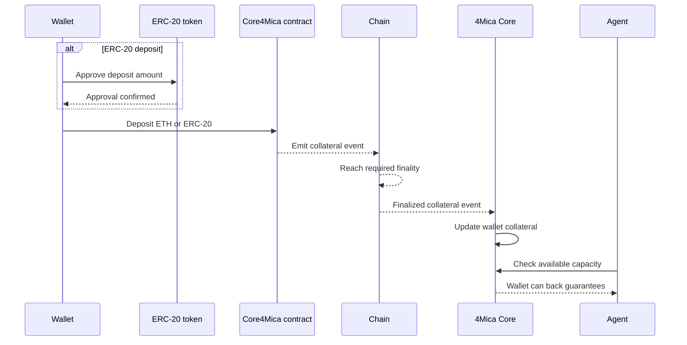
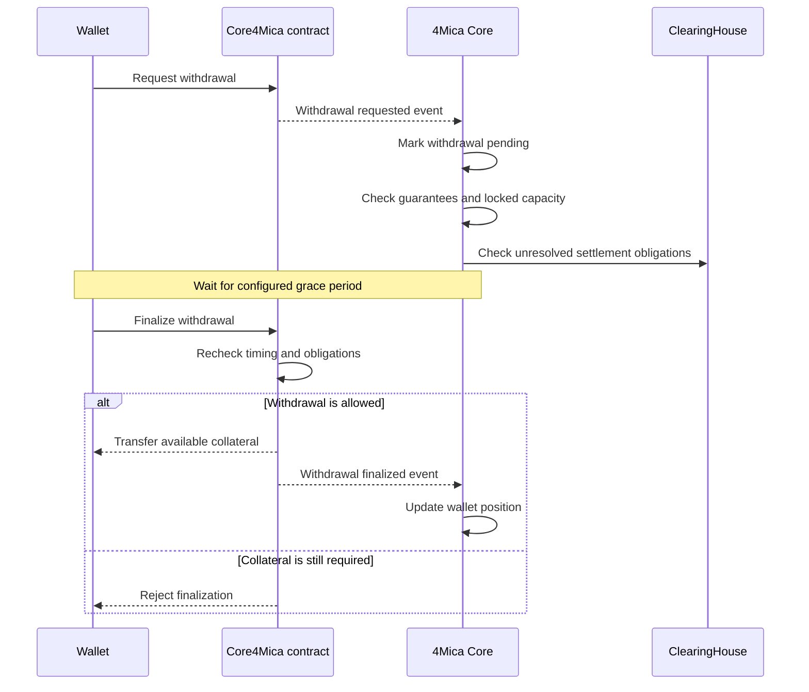

A deposit gives a wallet the economic capacity to make 4Mica payments.
Instead of pre-funding a separate balance with every API or agent, the payer
deposits collateral once and uses it to back signed guarantees across compatible
payment flows.

A withdrawal reverses that process. It removes collateral after the protocol
has had enough time to account for guarantees, clearing cycles, settlement, and
defaults. Withdrawal is deliberately not instant: collateral that secures an
open obligation cannot safely leave at the same moment.

Together, deposits and withdrawals define the boundary between money the wallet
owns and collateral the protocol can rely on.

## Why collateral exists

In a direct payment, the buyer transfers funds before the seller serves the
resource. In a 4Mica credit payment, the buyer signs a guarantee and settlement
happens later.

The seller needs evidence that the deferred obligation is real. Collateral
provides that evidence.

When Core accepts a guarantee, it verifies that the payer has enough eligible
collateral and locks the required capacity. If the resulting net obligation is
paid through clearing, the collateral becomes available again. If the debtor
misses finality, locked collateral can cover the default according to protocol
rules.

Collateral therefore serves three purposes:

- **Payment capacity:** it limits how much value a wallet can guarantee.
- **Seller protection:** it backs accepted obligations before final settlement.
- **Protocol discipline:** it prevents a payer from promising the same economic
  capacity to unlimited recipients.

Collateral is not a subscription balance or a prepaid account held by each
seller. It is shared payment capacity governed by the active network,
supported assets, collateral policy, and the wallet's existing obligations.

## Depositing is the registration step

A payer does not need to create an account with every seller. Depositing
collateral registers the wallet economically with 4Mica.

The wallet address becomes the payer identity that Core uses to:

- observe deposited collateral;
- validate signed guarantees;
- lock capacity for accepted obligations;
- calculate clearing positions;
- account for settlement and default;
- authorize the eventual withdrawal of remaining collateral.

The wallet still needs a secure signer and spending policy. A deposit proves
capacity; it does not prove that every payment the wallet could sign is useful
or authorized.

Read [agent identity](./agent-identity) for the distinction between a wallet,
signer, policy, and agent metadata.

## Choose the network first

Collateral is network-specific. A deposit on one network does not automatically
back a payment advertised on another network.

Before depositing, choose the network your buyer client and target sellers will
use:

| Environment | Network ID | Use |
| --- | --- | --- |
| Base | `eip155:8453` | Production |
| Base Sepolia | `eip155:84532` | Development and integration testing |
| Ethereum Sepolia | `eip155:11155111` | Ethereum testnet compatibility |

Start on Base Sepolia with a dedicated test wallet and a small amount. Move to
Base only after signing policy, monitoring, settlement, and withdrawal handling
have been tested.

See [supported networks](/getting-started/supported-networks) for current API
URLs and network guidance.

## Choose a supported asset

4Mica can accept native ETH and deployment-configured <Tooltip headline="ERC-20" tip="Ethereum's standard interface for fungible tokens. It defines common functions for balances, transfers, approvals, and allowances so wallets and applications can interact with tokens consistently.">ERC-20</Tooltip> assets.

The asset must be supported by the active Core deployment and match the asset
advertised by the seller's payment requirements. Common stablecoin deployments
enable USDC or USDT, but integrations should discover current configuration
rather than hard-code assumptions.

Use [`GET /core/tokens`](/api-reference/operator/tokens) to discover:

- token symbol;
- contract address;
- decimal precision;
- the chain where the token is enabled.

<Warning>
Token symbols are not unique identifiers. Verify the network and contract
address before approving or depositing an ERC-20.
</Warning>

### ETH and ERC-20 deposits

The two deposit paths differ:

| Asset | Before deposit | Deposit amount |
| --- | --- | --- |
| Native ETH | No token approval | Wei |
| ERC-20 | Approve the Core4Mica contract | Token base units |

For example, a token with six decimals represents one unit as `1_000_000`.
Never pass a human-formatted decimal value to an SDK method that expects base
units.

## Deposit lifecycle

A deposit moves through several layers before an agent should spend against it.

The practical steps are:

1. **Discover configuration.** Confirm the network, Core deployment, token
   address, decimals, and wallet.
2. **Fund gas.** The wallet needs the network's native asset to submit the
   approval and deposit transactions.
3. **Approve the token.** ERC-20 deposits require an allowance. ETH deposits do
   not.
4. **Submit the deposit.** Send the intended amount to the Core4Mica deposit
   flow.
5. **Wait for finality.** A transaction being included in a block does not
   always mean Core can rely on it yet.
6. **Wait for synchronization.** Core observes the finalized event and updates
   the wallet position.
7. **Verify capacity.** Confirm the collateral appears before allowing the
   agent to sign paid requests.

<Note>
Finality and synchronization time vary by network and deployment. Do not
hard-code a fixed delay or assume a transaction receipt means the collateral is
immediately spendable.
</Note>

## Approval safety for ERC-20 deposits

An ERC-20 approval authorizes a contract to transfer tokens up to the approved
amount. Treat approval as a separate security decision from depositing.

Good approval policy includes:

- verify the Core4Mica contract address from trusted deployment configuration;
- approve only the asset and amount you intend to deposit;
- avoid unlimited allowances for automated or experimental wallets;
- record the approval transaction and deposit transaction separately;
- review or revoke unused allowances when retiring a wallet;
- never approve a token solely because its symbol looks familiar.

If an approval succeeds but the deposit fails, the allowance may remain. Your
application should surface that state instead of silently retrying with a larger
approval.

## Understanding collateral state

A single headline balance is not enough to decide whether an agent can spend or
withdraw.

Think about a collateral position in these categories:

| State | Meaning |
| --- | --- |
| Total collateral | Finalized collateral attributed to the wallet for an asset. |
| Locked collateral | Capacity reserved for guarantees or unresolved obligations. |
| Available capacity | Collateral that may back new guarantees under current policy. |
| Pending deposit | Submitted on-chain but not yet finalized or synchronized. |
| Pending withdrawal | Requested for exit but not yet finalized. |

The exact credit capacity may be lower than `total - locked`. Deployments can
apply collateral ratios, asset risk parameters, or operational limits.

See [collateral ratios](./collateral-ratios) for the relationship between
deposited value and guarantee capacity.

## How guarantees affect collateral

Depositing does not transfer value to a seller. It creates capacity.

That capacity changes as guarantees move through their lifecycle:

1. The payer signs a guarantee for a specific recipient, amount, asset, request
   ID, and version.
2. Core verifies the signature, policy fields, accepted version, and collateral.
3. Core locks enough capacity to support the accepted obligation.
4. A V1 guarantee becomes payable. A V2 guarantee remains pending until its
   validation lifecycle resolves.
5. Payable guarantees enter a clearing cycle and contribute to net positions.
6. Settlement, cancellation, dispute resolution, or default determines when
   collateral is released or used.

This is why a wallet can have collateral but still fail to issue a new
guarantee. Its usable capacity may already be locked, the asset may not match,
the network may be wrong, or policy may limit further exposure.

Read [transaction lifecycle](./transaction-lifecycle) for the complete V1 and
V2 state model.

## How much collateral should you deposit?

Deposit enough for expected peak exposure, not only average spend.

Estimate:

- the maximum amount one task can authorize;
- how many tasks can run concurrently;
- how many guarantees may remain unresolved across cycles;
- whether V2 validation can keep collateral locked longer;
- the collateral ratio for the selected asset;
- a buffer for retries, price changes, and delayed settlement;
- the cost and operational delay of adding more collateral.

Do not solve every capacity problem by placing a large treasury balance in one
automated wallet. A safer model uses dedicated wallets, scoped signers, task
budgets, and limited collateral per operational role.

For buyer controls, see
[budgets and spending limits](/buyer/budgets-and-spending-limits).

## Yield on deposited collateral

Supported stablecoin deposits can remain productive when the deployment routes
them through a configured yield strategy.

Yield does not remove risk:

- rates are variable;
- not every asset or deployment uses the same strategy;
- underlying protocol and smart-contract risk still apply;
- available collateral can be constrained by guarantees and settlement;
- yield should not be treated as guaranteed payment income.

Verify current deployment configuration before depositing production funds.
See [earning yield](./earning-yield).

## Withdrawal lifecycle

Withdrawal uses a request-and-finalize process rather than an immediate
transfer.

The steps are:

1. **Stop new exposure.** Pause the agent or disable signing before requesting a
   full exit.
2. **Review obligations.** Check pending guarantees, payable guarantees,
   clearing positions, disputes, defaults, and any active withdrawal.
3. **Choose the amount and asset.** A withdrawal is scoped to collateral
   available on the selected network.
4. **Request withdrawal.** This starts the deployment's configured timelock.
5. **Wait for the grace period.** During this time, late events and obligations
   can be accounted for.
6. **Finalize withdrawal.** Submit the final transaction after the waiting
   period.
7. **Verify completion.** Confirm the finalized transaction and refresh the
   wallet's collateral position.

Use the
[`withdrawal.requested`](/webhooks/events/withdrawal-requested) and
[`withdrawal.finalized`](/webhooks/events/withdrawal-finalized) events to update
application state asynchronously.

## Why withdrawals are delayed

An instant withdrawal would create a race:

1. A payer signs a guarantee backed by collateral.
2. The seller accepts the guarantee and delivers work.
3. The payer withdraws the collateral before Core, clearing, or the contract
   accounts for the obligation.

The withdrawal delay gives the protocol time to observe finalized chain events,
resolve guarantees, close clearing phases, and protect valid recipients.

The delay is not a fixed universal number. It is a deployment parameter. Read
current contract or operator configuration instead of copying a duration from
an example.

## What can block a withdrawal?

A requested withdrawal may not finalize when:

- the grace period has not ended;
- collateral is locked by unresolved guarantees;
- a clearing cycle still contains the wallet's payable obligations;
- a net debit position has not reached settlement or finality;
- a V2 guarantee remains pending validation or dispute;
- the requested amount exceeds currently withdrawable collateral;
- the wallet, asset, contract, or network does not match the request;
- the finalization transaction lacks gas or fails on-chain;
- Core has not synchronized a recent lifecycle event.

Do not repeatedly submit finalization transactions without diagnosing the
reason. Preserve transaction hashes, wallet and asset addresses, guarantee IDs,
cycle IDs, and timestamps for support.

## Partial and full withdrawals

A partial withdrawal removes only capacity the protocol no longer needs.
Remaining collateral can continue backing new guarantees if signing stays
enabled.

A full withdrawal should be treated as wallet offboarding:

- stop the agent from creating new paid requests;
- revoke or disable delegated signers;
- wait for pending guarantees and settlement obligations to resolve;
- request and finalize each relevant asset withdrawal;
- revoke unused ERC-20 allowances;
- archive payment, withdrawal, and policy records;
- keep enough native asset for final transactions until offboarding completes.

Withdrawing funds does not erase signatures, payment records, delivery evidence,
or settled obligations.

## Deposits and withdrawals are not transfers between networks

Collateral is tied to a network deployment. Withdrawing from Base Sepolia and
depositing on Base are two separate operations.

4Mica does not make a deposit on one chain automatically available on another.
If your application supports multiple networks, track each position separately:

- wallet address;
- network ID;
- asset contract;
- total and locked collateral;
- pending deposits and withdrawals;
- guarantees and clearing obligations.

See [cross-chain credit](./cross-chain-credit) for the broader network model.

## Failure handling

### Deposit submitted but balance is missing

Check the transaction status, network, destination contract, token address,
amount units, and chain finality. Then confirm that Core has synchronized the
event.

Do not submit another deposit automatically unless you know the first
transaction failed.

### ERC-20 approval fails

Confirm the wallet has gas, the token contract is correct, the balance is
sufficient, and the token supports the expected approval behavior.

Some tokens require changing an existing allowance to zero before setting a new
value. Handle token-specific behavior intentionally.

### Guarantee fails after deposit

A visible deposit does not guarantee every payment will be accepted. Check:

- available rather than total collateral;
- matching network and asset;
- payment amount and token decimals;
- guarantee version and validation policy;
- signer and payer address;
- request identity reuse;
- wallet or application spending policy.

Use [error handling](/buyer/error-handling) for buyer-facing failure states.

### Withdrawal cannot finalize

Check the configured waiting period, locked collateral, open guarantee states,
cycle position, requested amount, wallet, asset, network, and gas balance.

If local state conflicts with protocol state, reconcile from the authoritative
API and chain before retrying.

## Security and operational guidance

- Use dedicated operational wallets instead of personal or treasury wallets.
- Keep signing keys in hardware-backed, MPC, or managed key systems in
  production.
- Separate the key that signs guarantees from the authority that manages large
  collateral movements where possible.
- Require stronger approval for deposits, withdrawals, and policy changes than
  for small routine payments.
- Alert on unexpected approvals, deposits, withdrawal requests, failed
  finalizations, and rapid collateral depletion.
- Keep transaction hashes, guarantee IDs, cycle IDs, asset addresses, and
  policy versions searchable.
- Reconcile webhook events with on-chain and API state.
- Never expose private keys, seed phrases, or unrestricted credentials in logs
  or support messages.

Read [no custodial risk](./no-custodial-risk) and [security](./security) for the
protocol trust boundaries.

## Production checklist

Before relying on collateral in production, confirm:

| Area | What to verify |
| --- | --- |
| Wallet | A dedicated wallet and secure signer are configured. |
| Network | Deposits and payment requirements use the same <Tooltip headline="CAIP-2" tip="Chain Agnostic Improvement Proposal 2: a standard format for identifying blockchain networks, such as eip155:8453 for Base.">CAIP-2</Tooltip> network. |
| Asset | Token address and decimals come from trusted deployment data. |
| Gas | The wallet can submit approvals, deposits, and withdrawals. |
| Approval | ERC-20 allowance is limited and points to the correct contract. |
| Finality | Your application waits for authoritative collateral state. |
| Capacity | Peak concurrent exposure fits within available collateral and policy. |
| Monitoring | Deposits, locks, settlement, defaults, and withdrawals are observable. |
| Emergency stop | You can pause signing and revoke delegated authority quickly. |
| Withdrawal | The team understands request, grace-period, and finalization behavior. |
| Recovery | Failed and out-of-order events can be reconciled safely. |
