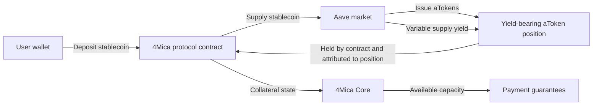
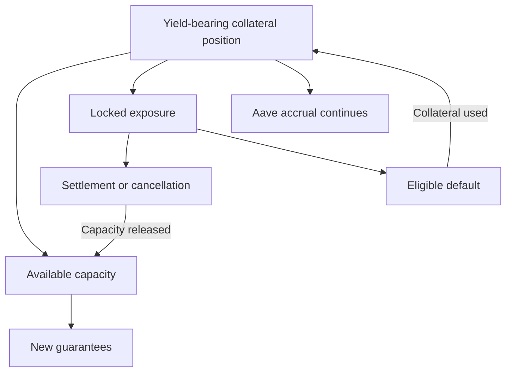
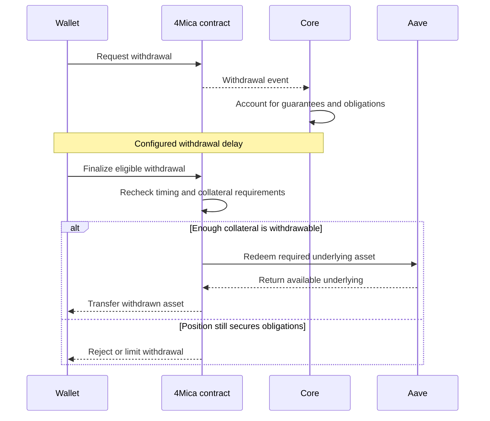

Collateral normally creates a tradeoff: capital must remain available to secure
payments, but capital sitting idle earns nothing.

4Mica reduces that tradeoff by routing configured stablecoin collateral through
Aave. The deposited asset can accrue lending yield while it continues to back
the payer's credit capacity and accepted payment guarantees.

This makes one collateral position useful in two ways:

1. it secures deferred x402 payment obligations;
2. it can earn variable yield while it remains deposited.

The yield belongs economically to the collateral position rather than to the
seller receiving payments. It can improve the payer's cost of keeping capital
available, but it is not a guaranteed return, an automatic payment rebate, or a
substitute for settlement.

<Warning>
Yield always introduces risk. Aave integration adds smart-contract, liquidity,
asset, market, governance, and network dependencies. A higher displayed rate
does not make the collateral safer or more withdrawable.
</Warning>

## Why productive collateral matters

4Mica separates request-time payment acceptance from final settlement.

At request time, a payer signs a guarantee and Core locks collateral capacity.
The seller can rely on the accepted guarantee while payable obligations are
later netted and settled. Collateral protects the interval between those two
moments.

Without a yield strategy, that collateral would remain economically idle even
when it was not being consumed by a default. This creates a carrying cost for
buyers that keep enough capacity available for frequent or high-volume agent
payments.

Yield can partially compensate for that carrying cost.

| Traditional prepaid balance | Yield-bearing 4Mica collateral |
| --- | --- |
| Capital is placed with one provider | One position can support compatible 4Mica payments |
| Balance usually earns nothing | Configured stablecoins can accrue Aave supply yield |
| Provider controls an internal ledger | Protocol contracts account for collateral on-chain |
| Value serves only as prepaid spend | Value can support guarantees and remain productive |
| Exit depends on provider policy | Withdrawal follows contract rules and open obligations |

The important word is **partially**. Yield may offset some economic cost over
time, but rates vary and principal remains exposed to the risks of the asset,
Aave market, 4Mica contracts, and payment obligations.

## How the Aave integration works

For a supported yield-enabled stablecoin, the collateral path is conceptually:



The user deposits through the configured 4Mica contract. The contract supplies
the stablecoin to the appropriate Aave market and receives an aToken position.
The aToken represents the supplied principal plus accrued interest according to
Aave's accounting.

The protocol contract holds that position while 4Mica attributes collateral
and obligations to the payer wallet. Core recognizes the finalized collateral
state and uses it to determine whether new guarantees can be accepted.

The funds are not sent to a 4Mica operating account and replaced with a private
company balance. The collateral and Aave position remain part of an on-chain
contract path. Read [no custodial risk](./no-custodial-risk#where-aave-fits) for
the ownership and trust model.

<Note>
The exact path is deployment- and asset-specific. Not every supported asset
necessarily uses Aave, and native ETH should not be assumed to follow the same
stablecoin strategy. Verify the active deployment before depositing.
</Note>

## Where the yield comes from

Aave is a lending market. Suppliers provide assets to a pool, and borrowers pay
interest when they borrow from that pool. A portion of that borrowing activity
becomes supply yield for depositors, subject to Aave's market design and active
parameters.

The supply rate changes with market conditions, especially:

- how much liquidity has been supplied;
- how much of that liquidity is borrowed;
- the market's interest-rate curve;
- reserve and protocol parameters;
- borrower demand;
- asset-specific risk settings;
- governance decisions.

This is why the rate is variable. A current annual percentage yield is an
annualized view of recent or current conditions, not a promise that the same
rate will continue for a year.

### How aTokens represent accrual

Aave issues an interest-bearing token for supplied assets. Depending on the
market implementation, the position's balance or exchange accounting reflects
interest as it accrues.

For conceptual purposes:

```text
current collateral position
= supplied principal
+ accrued lending yield
- losses, withdrawals, defaults, or other authorized uses
```

This equation is a mental model, not a substitute for the contract's exact
accounting. Applications should read authoritative protocol state rather than
calculating a balance from a displayed APY.

## Yield and payment capacity

Yield and credit capacity are related but not identical.

| Concept | What it answers |
| --- | --- |
| Deposited collateral | How much eligible value is attributed to the payer? |
| Accrued yield | How has the underlying yield-bearing position grown? |
| Credit capacity | How much guarantee exposure may the position support? |
| Locked exposure | How much capacity is reserved for unresolved obligations? |
| Withdrawable collateral | How much may leave after contract and lifecycle checks? |

A higher yield rate does not automatically increase payment capacity at the
same rate or at the same moment. Core may use finalized, synchronized collateral
state, asset-specific collateral factors, and deployment policy when calculating
capacity.

The usable amount remains bounded by:

```text
credit capacity = eligible collateral value × collateral factor

available capacity = credit capacity - locked exposure
```

For example, suppose a wallet has a yield-bearing collateral position valued at
\$1,010 and the deployment applies a 90% collateral factor. Before other limits,
the position could support up to \$909 of guarantee capacity. If \$600 is
already locked, only \$309 remains available.

This example shows the relationship, not a fixed production rule. Exact
valuation, accrual recognition, collateral factors, rounding, and synchronization
depend on the active contracts and operator configuration.

See [collateral ratios](./collateral-ratios) for the full capacity model.

## Yield while collateral is locked

Collateral can remain in the yield-bearing strategy while capacity is reserved
for guarantees. “Locked” means the payer cannot reuse or withdraw that capacity
as though no obligation existed. It does not necessarily mean the underlying
asset stops participating in Aave.



This is one of the main benefits of the design. A payer does not need to choose
between earning on all collateral and securing every active payment.

There is still an important limit: if an obligation defaults and collateral is
used to cover the eligible claim, the payer no longer benefits economically
from the portion that was consumed. Yield does not protect principal from a
valid payment obligation.

## Yield and settlement are separate

Yield accrual does not settle invoices or clear guarantees by itself.

Payable guarantees enter bilateral netting cycles. If the payer is a net
debtor, it must pay the resulting net debit during the applicable settlement
window. If it does not, eligible locked collateral can cover the default.

The fact that collateral earned yield does not change these responsibilities:

- guarantees still need sufficient capacity when issued;
- net debit positions still need to be monitored;
- settlement deadlines still apply;
- default coverage may consume collateral;
- unresolved V2 guarantees can keep capacity locked;
- withdrawals remain subject to obligations.

Yield makes the collateral productive. It does not erase the debt the
collateral secures.

Read [bilateral netting cycles](./bilateral-netting-cycles) and
[settlements](./settlements) for the payment lifecycle.

## Yield and withdrawals

Withdrawing yield-bearing collateral requires more than redeeming an investment
position. The protocol must also protect recipients who rely on existing
guarantees.

The general path is:



The exact implementation can differ by deployment, but three constraints are
important:

1. **Obligation constraint:** collateral needed for guarantees, validation,
   settlement, or default coverage cannot leave safely.
2. **Timing constraint:** the configured request-and-finalize process must
   complete.
3. **Liquidity constraint:** the external Aave market must have enough
   withdrawable underlying liquidity for redemption.

An aToken position can have accounting value while immediate underlying
liquidity is constrained. This distinction matters during market stress.

See [deposits and withdrawals](./deposits-and-withdrawals) for withdrawal
states, blockers, and operational guidance.

## Economic benefits

Yield-bearing collateral has several advantages when used carefully.

<Columns cols={2}>
  <Card title="Lower carrying cost" icon="chart-line">
    Variable yield can reduce the economic cost of keeping collateral available
    for future payments.
  </Card>
  <Card title="Better capital use" icon="coins">
    The same deposited position can earn while supporting many compatible
    payment guarantees.
  </Card>
  <Card title="Useful for continuous agents" icon="robot">
    Agents with ongoing payment demand can maintain capacity without leaving a
    completely idle prepaid balance.
  </Card>
  <Card title="On-chain transparency" icon="magnifying-glass-chart">
    The Aave market and protocol contract position can be observed independently
    instead of relying only on a private account statement.
  </Card>
  <Card title="Shared payment capacity" icon="arrows-split-up-and-left">
    One collateral position can support purchases from multiple compatible
    sellers rather than separate balances at each service.
  </Card>
  <Card title="Potential cost offset" icon="scale-balanced">
    Over time, earned yield may offset some gas, infrastructure, or capital
    costs associated with operating the payment position.
  </Card>
</Columns>

These benefits are most meaningful for capital that genuinely needs to remain
deposited. Depositing more than the payment system needs merely to chase yield
increases exposure without necessarily improving the agent's operations.

## Tradeoffs and disadvantages

The design also has real costs.

| Tradeoff | Why it matters |
| --- | --- |
| Variable return | The rate can fall quickly and may spend long periods near zero |
| More smart-contract dependencies | The collateral path depends on both 4Mica and Aave contracts |
| External liquidity dependence | Redemption may be constrained when an Aave market lacks available liquidity |
| Stablecoin risk | A stablecoin can depeg, freeze, fail, or lose market confidence |
| Longer exit path | Open obligations and withdrawal rules can delay access even when the Aave position is liquid |
| Accounting complexity | Principal, accrued yield, capacity, locks, and withdrawals are different values |
| Network costs | Approvals, deposits, withdrawals, settlement, and claims can require gas |
| Governance exposure | Parameter or upgrade decisions can change market behavior |
| Tax and reporting complexity | Yield and token movements may create reporting obligations |
| Opportunity cost | Another strategy may produce a different risk-adjusted return |

Yield is therefore not “free money.” It is compensation generated by a lending
market with its own borrowers, utilization, contracts, governance, and risks.

## Risk categories

### Aave smart-contract risk

A bug, exploit, unsafe upgrade, oracle failure, or unexpected interaction in
the Aave market could reduce availability or value.

Aave's history, audits, and adoption can inform risk assessment, but they do
not eliminate contract risk. Users should size deposits based on tolerable
loss, not only protocol reputation.

### 4Mica smart-contract risk

The integration contract controls how assets are supplied, attributed,
reserved, redeemed, and used for protocol obligations. Incorrect accounting,
permissions, upgrades, or emergency behavior can affect the position even if
Aave itself operates correctly.

Verify the intended network and contract addresses before approving tokens or
depositing. Read [security](./security) for the broader contract boundary.

### Stablecoin risk

Stablecoins are designed to track a reference value, but their price and
redemption quality can change.

Relevant risks include:

- loss of the intended peg;
- issuer or reserve problems;
- address freezing or blacklisting;
- bridge or wrapped-asset risk;
- low market liquidity;
- oracle divergence;
- incompatible token behavior.

A quoted APY should never be evaluated separately from the asset that earns it.
A lower rate on a stronger asset may be preferable to a higher rate on an asset
with greater depeg or liquidity risk.

### Liquidity risk

Aave borrowers use part of the supplied pool. If utilization becomes very high,
there may not be enough idle underlying liquidity for every supplier to
withdraw immediately.

Interest rates may rise to encourage repayment or new supply, but a high rate
during stress can be a warning signal rather than a gift. The displayed value
of the aToken position and the amount immediately redeemable can temporarily
differ in practice.

### Interest-rate risk

Supply APY changes continuously. Forecasts based on a current rate can be badly
wrong when borrower demand or liquidity changes.

Do not fund fixed operating promises from an assumed future yield rate. Treat
yield as variable upside, not committed revenue.

### Governance and parameter risk

Aave and 4Mica can have governance, operator, or upgrade mechanisms that affect
markets, supported assets, risk parameters, integrations, and emergency
controls.

Users should understand:

- which contracts can be upgraded;
- who can pause relevant actions;
- how supported markets are selected;
- whether asset parameters can change;
- how migrations or deprecations are communicated.

### Blockchain and infrastructure risk

Chain congestion, reorganization, RPC failure, unavailable indexers, or lack of
gas can delay deposits, state synchronization, settlement, and withdrawals.

An on-chain position is independently verifiable, but using it still depends on
the network being available and transactions being included.

### Payment-obligation risk

Collateral is not only an investment position. It secures signed payment
guarantees.

If the payer owes a valid net debit and does not settle by the deadline,
collateral can be used for default coverage. This is expected protocol behavior,
not a yield loss or Aave failure.

Applications must distinguish:

| Balance reduction | Likely category |
| --- | --- |
| Withdrawal finalized | User-directed collateral exit |
| Eligible default covered | Collateral fulfilled a payment obligation |
| Stablecoin value falls | Asset market risk |
| Redemption is delayed | Liquidity, timing, or protocol-state constraint |
| Accrual is lower than expected | Variable interest-rate outcome |

## APY, APR, and realized return

Rate displays are easy to misread.

**APR** usually annualizes a simple rate without assuming compounding.
**APY** usually annualizes a rate with an assumption about compounding.
Interfaces and protocols may calculate or display them differently.

Neither number is the user's realized return.

A simplified estimate is:

```text
estimated gross yield
≈ average principal × average annualized rate × time held
```

For example, if a collateral position averaged \$10,000 for six months and the
average annualized rate during that period were 4%, a rough simple estimate
would be \$200 before considering compounding, fees, gas, taxes, principal
changes, defaults, depegs, or deployment-specific accounting.

This is only an illustration. The current displayed rate may differ from the
average rate actually earned throughout the holding period.

The more useful measure is realized return:

```text
realized net result
= value withdrawn
+ value still deposited
- value deposited
- transaction and operational costs
- collateral consumed by valid obligations
```

Payment spending should usually be reported separately from investment
performance. Otherwise, a valid payment default or settlement expense can be
mistaken for poor yield performance.

## Does yield pay for payments?

Yield can economically offset payment costs, but it does not automatically pay
each seller or erase each guarantee.

Suppose an organization keeps \$50,000 of collateral deposited for a year and
earns \$1,500 of realized yield. If its payment operations cost \$4,000 over the
same period, the yield offset 37.5% of those costs economically.

The payment lifecycle still recorded and settled the full \$4,000. The
\$1,500 did not retroactively reduce signed amounts or seller claims.

This distinction matters for accounting:

- seller payments are operating expenses or purchases;
- yield is income or return on collateral;
- defaults are payment-obligation outcomes;
- gas and infrastructure are operational costs;
- changes in token value are asset gains or losses.

Applications should present these values separately before offering a combined
“net cost” view.

## Choosing how much to keep deposited

The optimal collateral amount balances payment reliability, yield opportunity,
and risk exposure.

Keeping too little can cause:

- insufficient capacity during traffic spikes;
- rejected guarantees;
- frequent deposit transactions;
- operational interruptions while waiting for finality;
- low resilience when V2 validation or settlement locks capacity longer.

Keeping too much can cause:

- unnecessary smart-contract and stablecoin exposure;
- larger losses if a signer or protocol path is compromised;
- more capital subject to withdrawal timing;
- misleading pressure to pursue a small yield advantage;
- concentration in one network, asset, or strategy.

A practical target begins with payment needs:

```text
target collateral
= peak expected locked exposure
÷ collateral factor
+ operational buffer
```

Then decide whether the resulting yield is attractive **after** accepting the
associated risks. Do not begin with a desired yield amount and reverse-engineer
an oversized payment deposit.

## Asset and deployment selection

Before depositing for yield, verify:

<Steps>
  <Step title="Choose the payment network">
    Collateral on one network does not automatically back guarantees on another.
    Confirm the network accepted by target sellers.
  </Step>
  <Step title="Discover supported assets">
    Use [`GET /core/tokens`](/api-reference/operator/tokens) to confirm the token
    address and decimals for the active Core deployment.
  </Step>
  <Step title="Confirm the yield strategy">
    Determine whether the selected asset is routed through Aave and which Aave
    market and contract addresses apply.
  </Step>
  <Step title="Review collateral policy">
    Understand the asset's collateral factor, payment-capacity rules, and
    withdrawal process.
  </Step>
  <Step title="Assess the external market">
    Review current utilization, supply rate, available liquidity, asset health,
    and relevant governance or incident notices.
  </Step>
  <Step title="Start with limited exposure">
    Test deposit, capacity recognition, guarantee issuance, settlement, and
    withdrawal before committing production treasury size.
  </Step>
</Steps>

Token symbols are not sufficient identifiers. Verify the network and contract
address from trusted deployment information.

## Monitoring a yield-bearing position

A useful dashboard should separate protocol state from investment estimates.

| Metric | What it tells you |
| --- | --- |
| Principal deposited | Original capital supplied through the collateral flow |
| Current collateral position | Authoritative amount currently attributed to the wallet |
| Estimated accrued yield | Difference attributable to lending accrual, subject to accounting method |
| Current supply APY or APR | Present market rate, not a historical guarantee |
| Aave utilization | How much supplied liquidity is currently borrowed |
| Available Aave liquidity | Whether underlying redemption may be constrained |
| Collateral factor | How much of the position can support guarantees |
| Locked exposure | Capacity reserved for unresolved obligations |
| Available capacity | Remaining room for new guarantees |
| Pending withdrawal | Collateral in the exit process |
| Defaults and remuneration | Collateral consumed by payment obligations |

Record the source and timestamp of every displayed rate. Historical reporting
should use actual position changes, not today's APY applied backward.

Alerts can cover:

- material stablecoin depeg;
- sudden utilization or rate changes;
- low available redemption liquidity;
- contract pause or market freeze;
- unsupported or deprecated collateral asset;
- rapid growth in locked exposure;
- settlement deadlines approaching;
- unexpected withdrawal request;
- yield accrual diverging from the authoritative position;
- failed redemption or withdrawal finalization.

## Security and operational practices

Yield does not change the basic need for wallet and protocol security.

- Use a dedicated operational wallet instead of a personal wallet.
- Verify every token approval target and limit allowance where practical.
- Keep large collateral movements behind stronger approval than routine payment
  signing.
- Separate the signer used for guarantees from treasury controls where possible.
- Keep enough native gas for settlement and withdrawal actions.
- Reconcile contract state, Core state, and application records.
- Test the full withdrawal path before relying on it during an incident.
- Size exposure by tolerable loss rather than expected APY.
- Avoid concentrating all operational collateral in one asset or deployment
  without understanding the tradeoff.
- Preserve transaction, guarantee, cycle, default, and withdrawal records.

Read [wallet](./wallet) and [security](./security) for signer and contract
controls.

## Pros and cons at a glance

| Pros | Cons |
| --- | --- |
| Collateral can remain economically productive | Principal is exposed to additional protocol dependencies |
| One position can back many compatible payments | Yield is variable and can fall to near zero |
| Accrual can lower long-term carrying cost | Stablecoins can depeg or freeze |
| Aave markets provide observable on-chain state | High utilization can constrain redemption liquidity |
| Locked collateral may continue earning | Open obligations can delay withdrawals |
| Useful for high-frequency agent payment capacity | Accounting is more complex than a simple prepaid balance |
| Payer retains the economic benefit of the position | Valid defaults can consume collateral regardless of yield |

The right conclusion is not that yield is always beneficial or always too
risky. It is beneficial when the capital already needs to secure payments, the
selected asset and protocols fit the user's risk tolerance, and the additional
return justifies the additional dependency.

## Frequently asked questions

<AccordionGroup>
  <Accordion title="Is the yield guaranteed?">
    No. Aave supply rates vary with market conditions, and principal is exposed
    to asset, smart-contract, liquidity, governance, and network risk.
  </Accordion>
  <Accordion title="Who receives the yield?">
    The yield is economically attributed to the payer's collateral position
    under the configured 4Mica contract flow. It is not the seller's revenue and
    should not be confused with settlement proceeds.
  </Accordion>
  <Accordion title="Does every 4Mica deposit earn yield?">
    Do not assume so. Yield depends on the asset, network, deployment, and active
    strategy. Confirm whether the selected collateral is routed through Aave
    before depositing.
  </Accordion>
  <Accordion title="Does native ETH earn Aave yield?">
    Not necessarily. The documented Aave path applies to configured stablecoin
    collateral. Treat native ETH and every other asset according to the active
    deployment rather than assuming an identical strategy.
  </Accordion>
  <Accordion title="Does locked collateral continue earning?">
    It can remain in the yield-bearing position while capacity is locked.
    Locking prevents reuse or withdrawal of the secured capacity; it does not
    inherently require the underlying stablecoin to leave Aave.
  </Accordion>
  <Accordion title="Can yield increase my payment capacity?">
    Accrued value may contribute to the recognized collateral position when the
    deployment's accounting and Core synchronization include it. Capacity still
    depends on collateral factors, locked exposure, valuation, and operator
    policy. Do not assume every moment of accrual becomes immediately spendable.
  </Accordion>
  <Accordion title="Can I withdraw only the earned yield?">
    That depends on the currently withdrawable collateral and contract
    accounting. Any withdrawal must satisfy the request-and-finalize process and
    leave enough collateral for existing obligations.
  </Accordion>
  <Accordion title="Can I withdraw whenever Aave has liquidity?">
    Aave liquidity is only one condition. 4Mica must also confirm that the
    collateral is not needed for guarantees, validation, clearing, settlement,
    defaults, or an active withdrawal process.
  </Accordion>
  <Accordion title="What happens to yield if I default?">
    An eligible default can consume locked collateral to pay the creditor. The
    remaining position, if any, continues according to protocol rules. Accrued
    yield does not shield collateral from a valid obligation.
  </Accordion>
  <Accordion title="Is a high APY always better?">
    No. A high rate can reflect strong borrowing demand, low liquidity, or
    increased market stress. Compare the rate with asset quality, utilization,
    available liquidity, contract risk, and your expected holding period.
  </Accordion>
  <Accordion title="Does 4Mica automatically reinvest the yield?">
    The Aave position accrues through its interest-bearing accounting while it
    remains supplied. Do not assume separate reward tokens, incentives, or
    unrelated assets are automatically claimed or compounded unless the active
    deployment explicitly supports them.
  </Accordion>
  <Accordion title="Is earning yield tax-free?">
    Tax treatment depends on jurisdiction, entity type, accounting method, and
    transaction history. 4Mica documentation cannot determine a user's tax
    obligations. Keep complete deposit, accrual, payment, default, and withdrawal
    records and obtain qualified advice where necessary.
  </Accordion>
</AccordionGroup>
