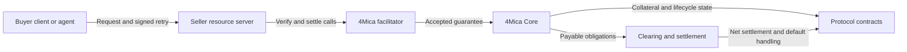
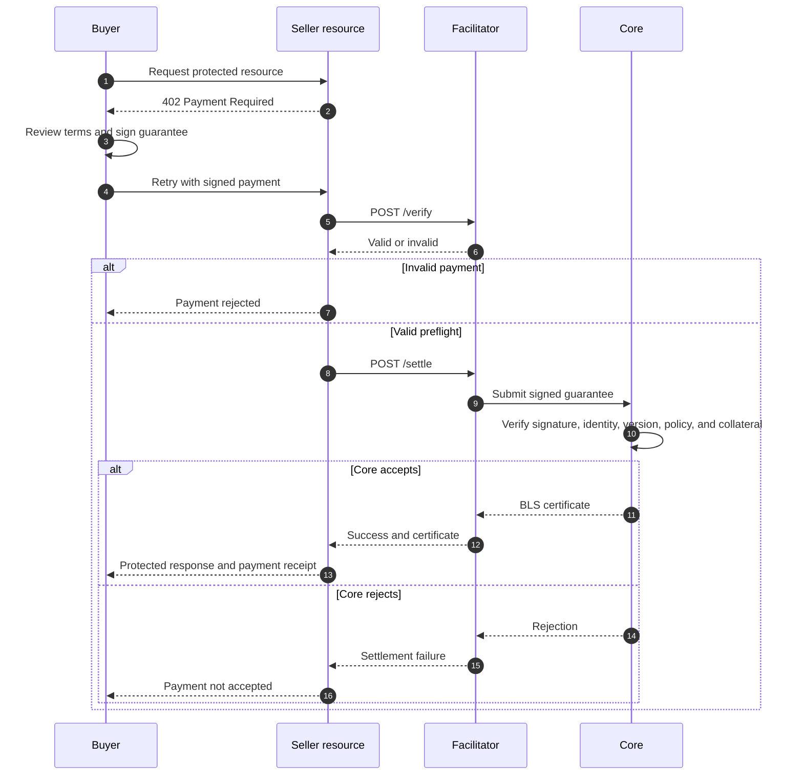

The facilitator is the server-side bridge between an x402-protected resource
and 4Mica Core. It understands x402 payment envelopes, compares signed payments
with the seller's advertised requirements, and submits accepted guarantees to
Core for protocol-level verification and certification.

It lets a seller add 4Mica payments without implementing every signing format,
compatibility check, and Core API call inside each protected route.

The facilitator does not replace the seller's API, hold the buyer's private
key, decide what the resource costs, or independently move a payment through
final clearing. It coordinates the synchronous payment-acceptance step while
Core, contracts, and the clearing system enforce the underlying obligation.

<Note>
Buyers normally call the seller's protected route, not the facilitator. The
seller's server-side middleware communicates with the facilitator after the
buyer retries the request with a signed payment.
</Note>

## Where the facilitator sits

An x402 payment involves several components with deliberately separate
responsibilities.



| Component | Primary responsibility |
| --- | --- |
| Buyer client | Reviews payment terms, creates a unique request ID, and signs the guarantee |
| Seller resource | Prices and protects the route, calls the facilitator, and delivers the paid response |
| Facilitator | Validates the x402 envelope and submits accepted guarantees to Core |
| 4Mica Core | Verifies the signed guarantee, checks policy and collateral, and issues a BLS certificate |
| Protocol contracts | Hold collateral and enforce deposits, withdrawals, remuneration, and default coverage |
| Clearing system | Nets payable guarantees and resolves debtor and creditor positions |

This separation keeps HTTP integration simple without weakening the protocol
boundary. The facilitator can make calls easier, but it cannot create a valid
guarantee without the payer's signature or bypass Core's collateral checks.

## Why a facilitator exists

Without a facilitator, every seller would need to implement the complete
payment adapter:

- decode multiple x402 envelope versions;
- interpret schemes and CAIP-2 network identifiers;
- compare signed claims with route-specific payment requirements;
- handle V1 and V2 guarantee fields;
- validate encoding and signing schemes;
- call the correct Core deployment;
- normalize success and error responses;
- return settlement evidence to middleware.

Those responsibilities are easy to implement inconsistently across languages,
frameworks, and seller applications. The facilitator provides one stable
server-side interface for them.

The seller still owns the commercial and product decisions. The facilitator
does not decide:

- which route requires payment;
- what the route costs;
- which assets or networks the seller advertises;
- which wallet receives the obligation;
- whether a buyer is allowed to use the service;
- what work counts as delivery;
- which refund, retry, or support policy applies.

The result is a clean division: the seller defines the sale, the payer
authorizes it, the facilitator adapts the HTTP payment, and Core decides whether
the guarantee can be accepted by the protocol.

## The facilitator API

The facilitator exposes four primary operations.

<Columns cols={2}>
  <Card
    title="Supported"
    icon="list-check"
    href="/api-reference/facilitator/supported"
  >
    Discover the x402 versions, schemes, networks, and capabilities accepted by
    the facilitator.
  </Card>
  <Card
    title="Verify"
    icon="shield-check"
    href="/api-reference/facilitator/verify"
  >
    Check a payment envelope against the advertised requirements without
    issuing a guarantee.
  </Card>
  <Card
    title="Settle"
    icon="receipt"
    href="/api-reference/facilitator/settle"
  >
    Revalidate the payment, submit the guarantee to Core, and return the BLS
    certificate.
  </Card>
  <Card
    title="Health"
    icon="heart-pulse"
    href="/api-reference/facilitator/health"
  >
    Check basic facilitator availability for monitoring and deployment probes.
  </Card>
</Columns>

These operations answer different questions. A healthy service may not support
the network a seller wants. A supported payment kind may still contain an
invalid payload. A locally valid payload may still be rejected by Core when the
seller attempts to settle it.

## End-to-end request flow

The facilitator participates only after the buyer receives payment requirements
and signs a payment.



The first HTTP 402 response and the buyer's signing logic do not pass through
the facilitator. The buyer communicates with the seller. This preserves the
seller's control over route behavior and keeps facilitator deployment details
out of the buyer-facing product contract.

For the complete exchange, see
[how x402 works](./how-x402-works) and the
[payment flow reference](/api-reference/payment-flow).

## Discovery with `GET /supported`

`GET /supported` reports which payment kinds the facilitator currently accepts.
A payment kind can include:

- the payment scheme, such as `4mica-credit`;
- the CAIP-2 network identifier;
- the x402 protocol version;
- scheme-specific capabilities or metadata;
- supported extensions or signer information where available.

A seller should use this information before advertising a payment option.
Otherwise, it may offer a scheme or network that its configured facilitator
cannot process.

Discovery is particularly important when:

- moving from a test network to production;
- enabling a new x402 version;
- changing facilitator deployments;
- supporting several networks from one service;
- rolling out new scheme capabilities gradually.

<Warning>
Do not infer support from the facilitator URL alone. Query its capabilities and
keep the seller's advertised requirements aligned with the actual deployment.
</Warning>

Network identifiers use CAIP-2 form, such as `eip155:8453`. Review
[supported networks](/getting-started/supported-networks) before configuring a
route.

## Preflight with `POST /verify`

`POST /verify` checks the decoded payment envelope against the original
`paymentRequirements`. It is a non-issuing preflight: it does not contact Core,
lock collateral, create a guarantee, or return a BLS certificate.

The check can detect inconsistencies such as:

- malformed x402 envelopes;
- unsupported or inconsistent versions;
- incorrect payment schemes;
- network mismatches;
- recipient addresses that differ from `payTo`;
- amounts that do not satisfy the advertised requirement;
- asset mismatches;
- missing signed claims;
- invalid request structure;
- incompatible V2 validation data.

The seller must submit the same requirements it advertised to the buyer. Those
requirements are the comparison point for the signed payload.

### What successful verification means

A successful response means the payment is structurally and semantically
consistent enough to attempt settlement. It is useful for rejecting obviously
bad payments before allocating expensive application resources.

It does **not** mean:

- Core has accepted the guarantee;
- the payer currently has sufficient available collateral;
- the request identity is unused;
- a BLS certificate exists;
- a V2 result has passed validation;
- the obligation is included in clearing;
- final settlement has completed.

`/verify` is therefore a risk-reduction step, not final payment acceptance.

<Warning>
Never serve a paid resource merely because `/verify` returned `isValid: true`.
Call `/settle` and require a successful Core-issued certificate before treating
the guarantee as accepted.
</Warning>

### When preflight is useful

Preflight is especially valuable when the seller must reserve scarce capacity,
start costly compute, contact paid downstream services, or perform validation
before preparing the response.

For a cheap, synchronous resource, the seller may call `/settle` directly
because settlement revalidates the payload. Skipping the separate preflight
reduces one network round trip, but it does not justify performing paid work
before settlement succeeds.

| Route type | Practical pattern |
| --- | --- |
| Cheap data lookup | Call `/settle` directly, then return the data |
| Expensive model request | Preflight, settle, then start model execution |
| Capacity-constrained job | Preflight before reservation, settle before committing resources |
| Long-running workflow | Preflight and settle before the first paid stage |
| V2 validation-gated work | Preflight policy fields, settle the guarantee, then follow the validation lifecycle |

## Acceptance with `POST /settle`

`POST /settle` is the acceptance step. The facilitator revalidates the payment
and submits the signed guarantee to Core.

Core then performs the authoritative checks, including:

- payer signature and signing scheme;
- signed payer, recipient, amount, asset, request ID, and timestamp;
- accepted guarantee version;
- duplicate guarantee identity;
- supported policy and deployment configuration;
- trusted validation registry and chain for V2;
- payer collateral and available capacity.

If every check succeeds, Core locks the necessary capacity and returns a BLS
certificate. The facilitator sends that certificate back to the seller in its
settlement response.

The certificate is evidence that Core accepted the signed guarantee. Persist it
with the application request and delivery record.

### Why `/settle` is not final on-chain settlement

The endpoint name refers to settlement in the x402 facilitator interface. In
the 4Mica credit model, a successful call accepts and certifies a deferred
payment guarantee; it does not necessarily transfer tokens to the seller during
that HTTP request.

After issuance:

- V1 normally becomes `FINALIZED_PAYABLE`;
- V2 normally begins in `PENDING_VALIDATION`;
- payable guarantees enter a clearing cycle;
- bilateral obligations are netted;
- net debtor and creditor positions settle later;
- locked collateral can cover an eligible default.

This separation is what allows fast request-time payment acceptance without an
individual on-chain transaction for every resource call.

See [transaction lifecycle](./transaction-lifecycle) and
[settlements](./settlements) for the asynchronous stages after facilitator
acceptance.

## Verify and settle compared

| Behavior | `/verify` | `/settle` |
| --- | --- | --- |
| Checks envelope structure | Yes | Yes |
| Compares payment with requirements | Yes | Yes |
| Contacts Core | No | Yes |
| Checks current collateral through issuance | No | Yes |
| Detects duplicate guarantee identity authoritatively | No | Yes |
| Locks payment capacity | No | Yes, after Core accepts |
| Issues BLS certificate | No | Yes |
| Enough to serve paid work | No | Yes, when successful |
| Completes final clearing | No | No |

This distinction is one of the most important integration concepts. Verification
answers whether a payment appears acceptable. Settlement asks Core to actually
accept it.

## Payment requirements are the seller's contract

The facilitator compares the buyer's signed claims with the seller-provided
payment requirements. Those requirements should remain stable between the
initial 402 response and the facilitator call.

Important values include:

| Requirement | Why it matters |
| --- | --- |
| `scheme` | Selects the payment mechanism |
| `network` | Identifies the intended chain |
| `amount` or `maxAmountRequired` | Bounds what the buyer authorizes |
| `payTo` | Identifies the seller wallet |
| `asset` | Identifies the settlement token |
| `extra` | Carries scheme-specific data, including V2 validation requirements |

If route configuration changes while an old payment is in flight, the seller
should apply a documented quote or expiration policy. It should not silently
reinterpret a signed payment under new terms.

The facilitator validates the payment terms it receives. It cannot know whether
the seller passed the correct requirements for the intended route. Route
binding, quote storage, and configuration consistency remain seller
responsibilities.

## V1 and V2 through the facilitator

The facilitator supports both guarantee models while leaving their lifecycle
semantics to Core.

| Topic | V1 | V2 |
| --- | --- | --- |
| Signed content | Base payment claims | Base claims and validation policy |
| State after Core acceptance | Usually `FINALIZED_PAYABLE` | `PENDING_VALIDATION` |
| Facilitator responsibility | Validate and submit | Validate policy envelope and submit |
| Outcome validation | Not required | Performed later through the trusted validation path |
| Certificate meaning | Accepted payable guarantee | Accepted collateralized guarantee awaiting validation |

A successful V2 `/settle` response does not prove that the job met its service
condition. It proves that Core accepted the signed guarantee and validation
policy.

The registry, validator, score, tag, subject, and job conditions resolve later.
Read [configurable SLAs](./configurable-slas) for that model.

## What the certificate proves

The BLS certificate returned after settlement binds the guarantee Core
accepted. It gives the seller cryptographic evidence associated with the
payment lifecycle.

It can establish that:

- Core accepted a guarantee with specific claims;
- the request has a protocol-recognized identity;
- the seller is the signed recipient;
- the amount and asset were part of the accepted request;
- the appropriate guarantee version was accepted;
- collateral capacity was checked and reserved at issuance;
- V2 validation terms were included where applicable.

The certificate does not prove:

- that the seller delivered the promised resource;
- that an AI output was useful or correct;
- that a V2 validation result has already passed;
- that the seller has already received final net settlement;
- that a refund or commercial dispute has been resolved.

Payment evidence and delivery evidence should remain linked but conceptually
separate. Sellers can follow
[proof and disputes](/seller/proof-and-disputes) for delivery records.

## Trust boundary

The facilitator is a trusted operational dependency, but its authority is
bounded by signatures and Core checks.

### What it can do

The facilitator can decode payment envelopes, compare them with requirements,
reject malformed requests, call Core, and return normalized results.

It also observes payment metadata submitted to it. Depending on the payload,
this can include payer and recipient addresses, amounts, assets, request IDs,
timestamps, route requirements, and V2 validation policy fields.

### What it cannot do

Without the payer's valid signature and sufficient protocol capacity, the
facilitator cannot create an accepted payment obligation.

It should not be able to:

- raise the amount after the payer signs;
- redirect the payment to another recipient;
- substitute another asset without invalidating authorization;
- invent a valid payer signature;
- reuse an accepted request identity as a new guarantee;
- withdraw payer collateral to an arbitrary wallet;
- make a V2 result pass without satisfying its signed policy;
- bypass Core's accepted-version or capacity checks.

Core independently verifies the submitted guarantee. A malicious or broken
facilitator can delay, reject, misroute, or fail to submit requests, but it
cannot silently rewrite signed claims into a different valid payment.

For the broader security model, read
[security](./security#facilitator-trust-boundary) and
[no custodial risk](./no-custodial-risk).

## Hosted and self-hosted deployments

A seller can use a hosted facilitator or an operator-managed deployment. In
both cases, the seller should keep the URL in server-side configuration rather
than embedding it into buyer-facing business logic.

Server-side configuration allows a seller to:

- select the correct deployment for each environment;
- change infrastructure without changing its public route;
- apply timeouts, retries, logging, and circuit breaking;
- keep internal operational details away from browser clients;
- verify that test and production traffic cannot cross accidentally.

Hosted 4Mica facilitator deployments commonly use:

```txt
https://x402.4mica.xyz/
```

The exact facilitator and Core endpoints can vary by network and environment.
Use [supported networks](/getting-started/supported-networks) and live discovery
instead of assuming that one URL or capability applies everywhere.

<Warning>
Never send production guarantees to a test deployment or advertise a production
network while settling against test infrastructure. Network, asset, contract,
and facilitator configuration must describe the same environment.
</Warning>

## Safe server-side handling

Facilitator calls belong in trusted backend code or payment middleware. A
browser should not be responsible for deciding whether its own payment is valid
before receiving protected data.

<Steps>
  <Step title="Advertise exact requirements">
    Return the route's current scheme, network, asset, amount, recipient, and
    optional V2 policy in the HTTP 402 response.
  </Step>
  <Step title="Receive the signed retry">
    Decode the payment header on the server and associate it with the original
    route, method, quote, and request context.
  </Step>
  <Step title="Preflight when useful">
    Call `/verify` before reserving costly resources. Treat a valid result only
    as permission to attempt settlement.
  </Step>
  <Step title="Accept through Core">
    Call `/settle`, require `success: true`, and require the expected
    certificate before running the paid handler.
  </Step>
  <Step title="Deliver once">
    Make request processing idempotent so retries cannot create duplicate
    expensive work or duplicate delivery.
  </Step>
  <Step title="Preserve evidence">
    Store the requirements, payment identity, certificate, delivery status, and
    later lifecycle result together.
  </Step>
</Steps>

Seller middleware can automate much of this sequence. See
[payment middleware](/seller/payment-middleware) for route-level integration.

## Failure handling

A seller should fail closed: if the facilitator cannot establish successful
Core acceptance, the paid handler should not run.

| Failure | Seller response |
| --- | --- |
| Malformed payment envelope | Reject the payment and return machine-readable requirements |
| Requirement mismatch | Do not settle; explain which payment term is invalid |
| Unsupported scheme or network | Return currently supported payment options |
| Facilitator timeout | Preserve the request identity and determine whether settlement completed before retrying |
| Core rejection | Do not serve; surface a stable payment failure |
| Duplicate guarantee | Look up the existing request outcome instead of creating new work blindly |
| Missing certificate | Treat settlement as incomplete |
| V2 pending validation | Follow the V2 delivery and validation policy rather than assuming final payment |
| Internal application failure after acceptance | Apply the seller's retry, credit, or refund policy |

### Ambiguous timeouts

The difficult case is a timeout after `/settle` was sent. The seller may not
know whether Core accepted the guarantee before the connection failed.

Blindly creating a new signed request can produce a second obligation. Blindly
repeating application work can create duplicate delivery. Preserve the original
`req_id`, make route handling idempotent, and reconcile the existing guarantee
before deciding whether the buyer must sign again.

<Tip>
Separate transport failure from payment rejection. A network timeout means the
result is unknown; an explicit Core rejection means the guarantee was not
accepted.
</Tip>

## Retries and idempotency

There are two different retry concerns:

1. retrying the facilitator call;
2. retrying the seller's paid application work.

The guarantee's unique request identity protects the protocol against creating
another accepted guarantee from the same signed identity. The seller still
needs application-level idempotency to prevent duplicate model runs, orders,
messages, downloads, or workflow side effects.

A useful idempotency record connects:

- `req_id` and guarantee identity;
- protected route and HTTP method;
- payer and recipient wallets;
- quoted amount, asset, and network;
- facilitator verification result;
- Core settlement result and certificate;
- application execution state;
- response or artifact reference.

When a buyer retries, return or resume the existing outcome when appropriate
instead of starting unrelated work.

## Availability and operational monitoring

The facilitator is on the synchronous path between a signed retry and the
seller's protected response. Its availability therefore affects whether new
payments can be accepted.

Monitor at least:

| Signal | Why it matters |
| --- | --- |
| `/health` status | Shows basic service and dependency availability |
| `/supported` response | Detects capability or deployment changes |
| Verification latency and error rate | Reveals malformed traffic or service degradation |
| Settlement latency and error rate | Reveals Core, collateral, or submission problems |
| Missing-certificate rate | Detects incomplete acceptance responses |
| Errors by network and scheme | Isolates configuration-specific failures |
| Duplicate identities | Reveals retries, replay attempts, or idempotency bugs |
| V1 and V2 acceptance rates | Helps distinguish policy and validation issues |

A healthy endpoint is not a guarantee that Core issuance will succeed. Health,
capability discovery, payment validation, and Core acceptance are separate
observations.

Use bounded timeouts and backoff. Avoid aggressive automatic retries that can
amplify an outage. Never turn a facilitator outage into free access to a paid
resource.

## Logging and privacy

Keep enough information to reconcile payment and delivery without logging
secrets or unnecessary customer content.

Recommended records include:

- request timestamp, route, and method;
- facilitator deployment and network;
- payment scheme and x402 version;
- payer, recipient, amount, and asset;
- request or guarantee identity;
- verification decision and stable error category;
- settlement decision and certificate reference;
- application delivery status;
- V2 policy identifier where applicable.

Do not log private keys, bearer credentials, raw authorization secrets, or
sensitive request bodies merely because they pass through payment middleware.
If payload content is needed for audit, prefer access-controlled storage and
content commitments.

## Common misconceptions

<AccordionGroup>
  <Accordion title="The facilitator is the payment recipient">
    No. The seller's `payTo` wallet is the recipient. The facilitator processes
    the seller's payment request and submits the signed guarantee to Core.
  </Accordion>
  <Accordion title="The buyer should call the facilitator directly">
    Usually no. The buyer calls the protected seller route, receives the HTTP
    402 requirements, signs them, and retries that route. Seller middleware
    makes facilitator calls from the backend.
  </Accordion>
  <Accordion title="A successful verify response means the seller was paid">
    No. Verification is a local preflight. It does not issue a guarantee or lock
    collateral. Successful `/settle` and the resulting BLS certificate establish
    Core acceptance.
  </Accordion>
  <Accordion title="A successful settle call transfers tokens immediately">
    Not necessarily. Under `4mica-credit`, it accepts a collateral-backed
    guarantee. Payable obligations are later netted and settled through the
    clearing lifecycle.
  </Accordion>
  <Accordion title="The facilitator controls payer funds">
    No. Payer authorization comes from wallet signatures, while collateral and
    protocol obligations are enforced by contracts and Core lifecycle rules.
  </Accordion>
  <Accordion title="The facilitator decides whether V2 work is good">
    No. It transports and validates the signed policy envelope. The selected
    validation registry and validator publish the outcome evidence, and the
    protocol compares that evidence with the signed V2 policy.
  </Accordion>
  <Accordion title="The facilitator replaces seller-side security">
    No. The seller must still secure routes, validate commercial context, rate
    limit abuse, preserve delivery evidence, handle idempotency, and protect
    credentials and customer data.
  </Accordion>
</AccordionGroup>

## Practical mental model

Think of the facilitator as a protocol-aware payment adapter:

> The seller says what must be paid. The buyer signs those terms. The
> facilitator checks and forwards the signed payment. Core decides whether the
> collateral-backed guarantee can be accepted.

That mental model keeps the boundaries clear:

- HTTP 402 belongs to the seller-buyer exchange;
- verification filters bad payment envelopes;
- settlement requests authoritative Core acceptance;
- the certificate records that acceptance;
- delivery remains the seller's responsibility;
- clearing and final settlement continue asynchronously.
