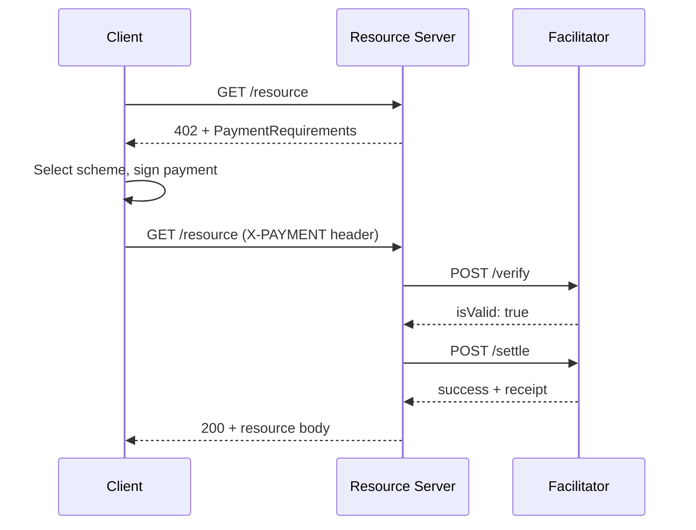
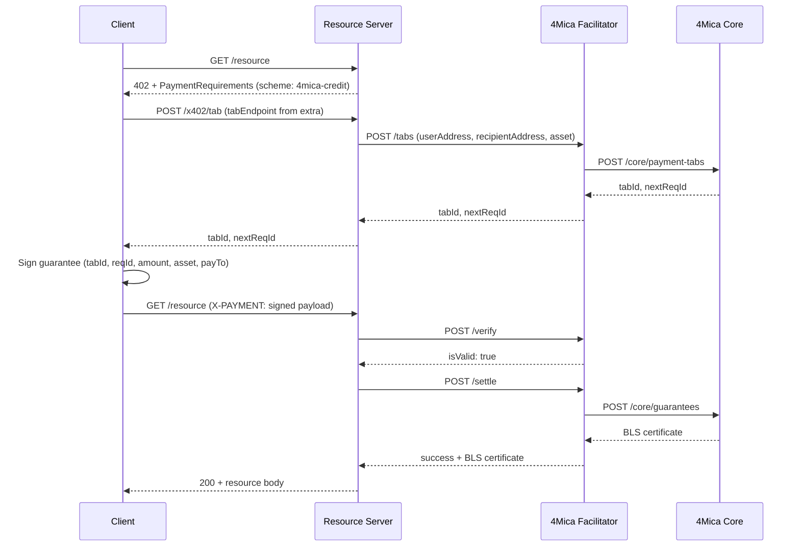

HTTP 402, "Payment Required," was reserved in HTTP/1.1 in 1997. No one implemented it. Internet commerce grew on top of card networks, and payment remained a separate layer on top of HTTP rather than part of the protocol itself.

x402 implements it. When a server gates a resource behind payment, it returns a 402 with a machine-readable payload describing the price, accepted assets, and which network to pay on. The client reads those terms, signs a payment, and retries the request with the signed payload attached. No human clicks checkout. No pre-existing account is required between client and server.

## Actors

Three roles participate in every x402 flow:

- **Client**: the agent or application requesting the protected resource. The client signs the payment and retries the request.
- **Resource server**: the server protecting the resource. It issues the 402, checks the payment, and returns the response only after the check passes.
- **Facilitator**: a trusted third party that validates payment payloads and submits settlements on the resource server's behalf. The resource server configures which facilitator to use. The client never contacts the facilitator directly.

## The 402 response

When the resource server requires payment, it returns a 402 status with a `PaymentRequirements` payload. In x402 version 1, this arrives as a JSON body. In version 2, it comes as a base64-encoded `payment-required` response header.

The payload contains an `accepts` array listing the payment options the server accepts. The client picks the option that matches its configured scheme and network, then constructs a signed payment from those terms.

```json
{
  "x402Version": 1,
  "error": "Payment required to access this resource",
  "accepts": [
    {
      "scheme": "4mica-credit",
      "network": "eip155:8453",
      "maxAmountRequired": "1000000",
      "asset": "0x833589fCD6eDb6E08f4c7C32D4f71b54bdA02913",
      "payTo": "0xRecipientAddress",
      "resource": "https://api.example.com/data",
      "description": "Access to premium market data",
      "mimeType": "application/json",
      "maxTimeoutSeconds": 300,
      "extra": {
        "tabEndpoint": "https://api.example.com/x402/tab"
      }
    }
  ]
}
```

### Payment requirements fields

| Field               | Type   | Description                                                                            |
| ------------------- | ------ | -------------------------------------------------------------------------------------- |
| `scheme`            | string | Payment scheme. `4mica-credit` for 4Mica guarantee flow; `exact` for direct transfer. |
| `network`           | string | CAIP-2 chain identifier. `eip155:8453` for Base mainnet.                               |
| `maxAmountRequired` | string | Maximum amount charged, in token base units.                                           |
| `asset`             | string | ERC-20 token contract address for the settlement asset.                                |
| `payTo`             | string | Recipient wallet address.                                                              |
| `resource`          | string | URL of the protected resource.                                                         |
| `description`       | string | Human-readable description of what the resource provides.                              |
| `mimeType`          | string | MIME type of the response the client receives after paying.                            |
| `maxTimeoutSeconds` | number | Maximum seconds allowed between the client signing and settlement completing.          |
| `extra`             | object | Scheme-specific data. For `4mica-credit`, must include `tabEndpoint`.                 |

The server decides which schemes, networks, and prices to advertise. The client decides which options it can fulfill. The `accepts` array lists options; neither side is locked into a single payment method.

## The general flow



If the client has payment requirements cached from a previous call to this resource, it can skip the initial 402 exchange and attach the signed payment to the first request directly.

## The 4Mica credit flow

When the scheme is `4mica-credit`, the payment is a signed guarantee backed by collateral held in 4Mica Core, not a direct on-chain token transfer. The flow adds a tab discovery step before the client signs.



### The tab

A tab is a scoped payment relationship between a payer and a recipient for a specific asset and guarantee version. Core creates the tab and returns a `tabId` and `nextReqId`. The client uses `nextReqId` as the `reqId` for its first signed guarantee and increments it on every subsequent request under the same tab.

Each signed guarantee carries a unique `reqId`. Submitting a `reqId` the facilitator has already processed causes the request to fail, so every signed claim is tied to exactly one request and cannot be replayed.

The `extra.tabEndpoint` in the 402 response points to a URL on the resource server, not on the facilitator. The client calls it with its wallet address and payment requirements; the resource server proxies the call to the facilitator. This keeps the facilitator off the client's network path and gives the server operator control over which clients can open tabs.

Multiple requests to the same resource server reuse the same tab by incrementing `reqId`. Opening a new tab on every request is unnecessary.

### The guarantee

The guarantee is a signed claim: the payer commits to a specific amount, recipient, asset, and request identifier. The resource server submits that claim to the facilitator at `/settle`. The facilitator passes it to Core, which locks the corresponding collateral and returns a BLS certificate.

The BLS certificate is the settlement receipt. The resource server holds it and can call `remunerate` on-chain to collect the locked collateral if the payer does not repay the tab before its TTL expires.

### Why not settle on-chain per request

The standard `exact` scheme settles every request with an individual on-chain transaction. That works at low volume. At the request rates agents generate, per-request chain writes exhaust block space and add settlement latency to every call.

The `4mica-credit` scheme separates authorization from settlement. The guarantee is an off-chain cryptographic commitment that signs and verifies in milliseconds, with no chain write required per request. Obligations accumulate across all participants and net in a clearing cycle. Only the net amounts settle on-chain.

## Payment headers

| Header              | Direction       | Contents                                                                    |
| ------------------- | --------------- | --------------------------------------------------------------------------- |
| `payment-required`  | Server → Client | Base64-encoded JSON with `x402Version`, `error`, and `accepts` array (v2). |
| `X-PAYMENT`         | Client → Server | Base64-encoded `PaymentPayload` with signed guarantee (v1).                |
| `PAYMENT-SIGNATURE` | Client → Server | Signed payment for v2 flows.                                               |
| `payment-response`  | Server → Client | Base64-encoded settlement receipt on a successful 200 response.            |

## Verify vs settle

`POST /verify` checks the payment payload without issuing a guarantee or contacting Core. Use it as a preflight before doing expensive work. If it fails, return a new 402 with the reason rather than a 400.

`POST /settle` validates and submits the guarantee to Core. The facilitator returns the BLS certificate on success. Call this once you are ready to accept the guarantee as payment.

For inexpensive resources, skip `/verify` and call `/settle` directly. For compute-heavy or high-value responses, verify first to avoid doing work for a payment that fails.

## Builder guidance

As a resource server:

- Return the 402 response before doing any work. Never serve content before the payment is verified.
- Expose a tab endpoint at the URL you put in `extra.tabEndpoint`. That endpoint calls `POST /tabs` on the facilitator and returns `tabId` and `nextReqId` to the client. Keep the facilitator URL in your server-side config, not in the 402 payload.
- Set `maxAmountRequired` in token base units: for USDC (6 decimals), $1.00 is `"1000000"`.
- Set `maxTimeoutSeconds` to the time you are willing to wait between the client signing and your `/settle` call. 300 seconds is a reasonable starting point.
- Persist the BLS certificate from `/settle`. You need it to call `remunerate` on-chain if the payer does not repay the tab before TTL.

As a client:

- Cache the tab per `(user, recipient, asset, guaranteeVersion)` and reuse it across requests. Each tab call costs a round trip.
- Increment `reqId` from `nextReqId` on each request under the same tab. Never reuse a `reqId`.
- If the server returns a new 402 on the retry, read `invalidReason` before signing again.

See [Transaction lifecycle](./transaction-lifecycle) for how guarantees move through Core and into clearing cycles.
