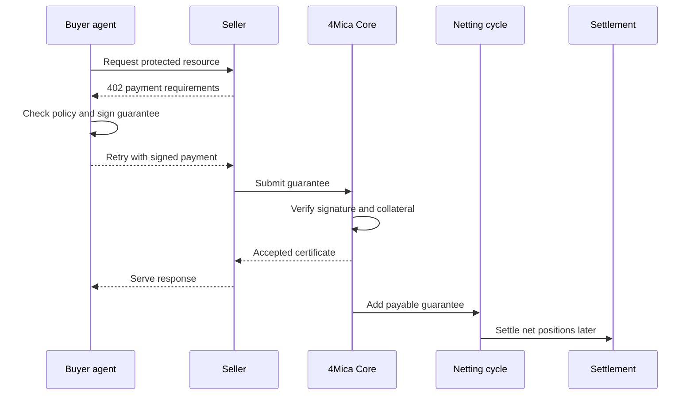
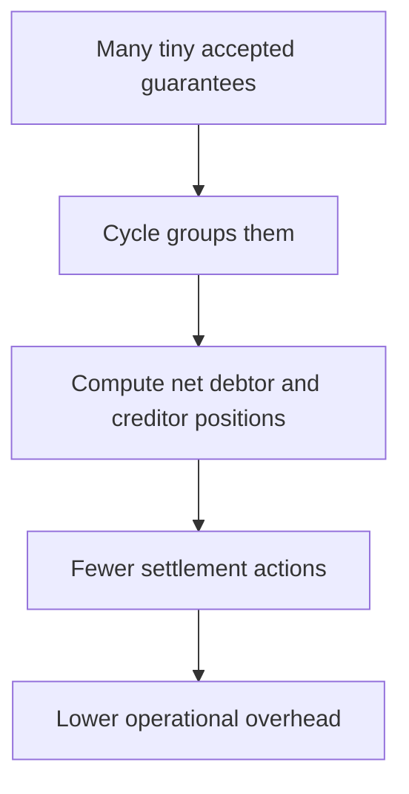

Micropayments only work when the payment system costs less than the payment is
worth.

That sounds obvious, but it is the reason most internet micropayment attempts
have struggled. A tiny payment can be economically rational for a buyer and
seller, but the payment rail often adds more cost, latency, operational work,
or user friction than the payment itself.

Agent traffic makes this problem unavoidable. One task can involve hundreds of
small paid requests: a data lookup, a model call, a verification step, a file
conversion, a quote, an agent-to-agent handoff. Each request may be worth only
fractions of a cent, a few cents, or a small usage-based fee. The payment layer
has to make that feel like a normal API call.

4Mica makes this practical by separating payment authorization from final
settlement. Each request can be authorized with an off-chain signed guarantee,
while settlement happens later through collateral-backed netting cycles.

## The micropayment problem

Micropayments are not hard because the amounts are small. They are hard because
small amounts leave very little room for overhead.

If a resource costs one cent, the payment rail cannot require a long checkout
flow, a card authorization fee, a manual invoice, or an on-chain transaction for
that request. The user experience and the economics both break.

At agent scale, the problem compounds:

| Constraint | Why it breaks at scale |
| --- | --- |
| Per-request fees | A fixed fee can exceed the value of the request. |
| Per-request chain writes | Block space and finality latency become bottlenecks. |
| Per-seller accounts | Agents may discover many services during one task. |
| Prepaid balances | Funds get fragmented across sellers and sit idle. |
| Human approval | Agents cannot stop for checkout on every paid call. |
| Manual reconciliation | Thousands of small records need machine-readable proof. |

The payment system needs to be cheap enough for tiny amounts, fast enough for
software, and reliable enough for sellers to serve before final settlement.

## Why direct settlement does not scale

A direct stablecoin transfer is simple: the buyer sends tokens, the seller
waits for confirmation, and the request completes after payment is final.

That is useful for occasional payments. It is not the right shape for
high-volume agent traffic.


The problem is not stablecoins themselves. Stablecoins are excellent settlement
assets. The problem is making the blockchain the bottleneck for every small
HTTP interaction.

For a high-frequency agent, per-request settlement creates:

- latency before each protected response;
- gas cost or network cost on every call;
- more failed-request handling when transactions are delayed;
- more operational records to reconcile;
- more pressure on block space;
- more capital sitting in pending transactions.

The better model is to keep the request path lightweight and settle aggregated
obligations later.

## 4Mica's approach

4Mica turns each paid request into a signed guarantee instead of an immediate
token transfer.

The guarantee says, in effect:

> This wallet authorizes this amount, for this recipient, asset, request, and
> version, backed by collateral recognized by Core.

Core verifies the signed fields and the payer's available capacity. If the
guarantee is accepted, Core locks capacity and returns payment evidence. The
seller can serve the resource. Later, payable guarantees enter clearing cycles
and settle as net positions.



This design keeps the request path API-native. The buyer does not need to wait
for a blockchain transfer per call, and the seller does not need to run a
private prepaid balance for every buyer.

## Authorization and settlement are different jobs

Micropayments become easier when authorization and settlement are not forced to
happen at the same instant.

| Job | What it needs | 4Mica mechanism |
| --- | --- | --- |
| Authorization | Fast, cheap proof that the payer agreed to a specific request. | Off-chain wallet signature over structured guarantee fields. |
| Acceptance | Confidence that the payment is backed and not a replay. | Core verifies signature, request identity, version, and collateral. |
| Settlement | Durable movement of value after obligations are known. | Netting cycles, debtor payments, creditor claims, and collateral coverage. |

This separation is the central trick. Authorization happens at machine speed.
Settlement happens in batches, after the system knows the net result.

Read [how x402 works](./how-x402-works) for the HTTP negotiation flow and
[transaction lifecycle](./transaction-lifecycle) for how guarantees move through
Core.

## Why netting matters for small payments

Netting is what keeps many tiny obligations from becoming many tiny settlement
transactions.

Imagine an agent buys five small services and also sells two outputs during the
same cycle. Without netting, every payment needs its own settlement. With
netting, opposite-direction obligations can offset, and only the remaining net
position needs to move.

```text
Outgoing payable guarantees: 40
Incoming payable guarantees: 27
Net debit: 13
```

The buyer and sellers still have individual records for every request. Netting
changes settlement movement, not payment history.



See [bilateral netting cycles](./bilateral-netting-cycles) and
[settlements](./settlements) for the detailed clearing and finality model.

## Why collateral matters

If sellers serve before final settlement, they need protection. Otherwise a
signed promise would be too weak for real commerce.

Collateral gives the guarantee economic weight. Before Core accepts a
guarantee, it checks whether the payer has enough available capacity. Once
accepted, capacity is locked so the same collateral cannot be reused
indefinitely across many sellers.

That locked capacity protects the settlement delay:

| Moment | Collateral role |
| --- | --- |
| Before payment | Deposited collateral creates payment capacity. |
| When Core accepts | Capacity is locked for the guarantee. |
| During cycle | Locked capacity backs the unresolved obligation. |
| After normal settlement | Capacity can unlock according to protocol rules. |
| After eligible default | Locked collateral can cover the creditor claim. |

This is why micropayments at scale are not just “small payments.” They are a
credit and settlement system designed around small, frequent obligations.

Read [collateral ratios](./collateral-ratios) for how deposited value turns
into safe payment capacity.

## The role of x402

x402 gives the payment flow a standard HTTP shape.

Instead of requiring a user to visit checkout, a protected resource can reply
with a `402 Payment Required` response that includes machine-readable payment
terms. The buyer reads the terms, applies policy, signs the payment, and retries
the request.

For micropayments, this matters because the payment negotiation must be as
programmable as the service being purchased.

| x402 piece | Why it matters for micropayments |
| --- | --- |
| `402 Payment Required` | The resource can advertise a price at request time. |
| Payment requirements | The buyer can inspect amount, asset, network, recipient, and scheme. |
| Signed payment payload | The buyer can authorize without a browser checkout. |
| Facilitator verification | The seller can outsource payment validation and settlement submission. |
| Payment response | The seller can return evidence alongside the protected response. |

x402 is the interface. 4Mica's collateral-backed guarantee flow is the payment
scheme that makes high-volume small payments efficient.

## What counts as “small”

Micropayment does not always mean sub-cent. In agent systems, “micro” is more
about the relationship between payment value and payment overhead.

A payment is micro in practice when:

- it is too small for card-style fixed fees
- it happens too frequently for manual billing
- it is not worth a separate account setup
- it should be authorized by software policy
- it benefits from batching or net settlement

That can include fractions of a cent for data, a few cents for a model call, or
small usage-based fees for compute, content, validation, search, monitoring, or
agent-to-agent work.

The goal is not to make every resource cheap. The goal is to make pricing
granular. Sellers can charge for the actual unit of value instead of forcing
buyers into monthly plans, prepaid credits, or broad subscriptions.

## Many tiny decisions need policy

Micropayments should not mean uncontrolled spending.

When payments become easy enough for software to make automatically, buyer
policy becomes more important. The wallet signer should not approve every small
request just because the amount is low. Many low-value payments can add up
quickly, and malicious sellers can exploit weak limits.

Buyer policy should answer:

<AccordionGroup>
  <Accordion title="Which sellers are allowed?">
    The buyer may allow known services automatically, require approval for new
    sellers, or block sellers that lack reputation or expected metadata.
  </Accordion>
  <Accordion title="Which routes or tasks can spend?">
    A research task, monitoring task, and production workflow may need different
    per-request and daily limits.
  </Accordion>
  <Accordion title="How much can one request cost?">
    Per-request caps prevent one unexpectedly expensive resource from consuming
    too much capacity.
  </Accordion>
  <Accordion title="How much can a task spend overall?">
    Aggregate budgets matter more than individual micropayment size.
  </Accordion>
  <Accordion title="Which assets and networks are allowed?">
    The buyer should only sign guarantees for assets and networks it intends to
    use.
  </Accordion>
</AccordionGroup>

See [wallet](./wallet) for the relationship between agent, signer, policy, and
collateral.

## Throughput, latency, and finality

At scale, three clocks matter:

| Clock | What the user experiences |
| --- | --- |
| Request latency | How long the buyer waits for the protected response. |
| Verification latency | How long payment acceptance takes before the seller serves. |
| Settlement finality | How long before the economic result is paid, claimed, or covered. |

4Mica optimizes the first two for software interaction. The buyer signs
off-chain, the seller verifies and settles through the facilitator, and Core
accepts or rejects the guarantee without requiring a per-request blockchain
transfer.

Final settlement is intentionally asynchronous. Payable guarantees move into
cycles, net positions are computed, and debtors pay or default coverage applies.

This model is useful because most agents care that the request can proceed now,
while finance and accounting systems care that final value is resolved
reliably.

## What can go wrong at scale

Most micropayment failures are not dramatic. They are small mismatches repeated
many times.

<AccordionGroup>
  <Accordion title="The buyer signs too freely">
    Small requests can accumulate into large spend. Use per-request, per-seller,
    per-task, and time-window limits.
  </Accordion>
  <Accordion title="The seller prices unclearly">
    If payment requirements do not describe the resource well, agents cannot
    make good buying decisions.
  </Accordion>
  <Accordion title="Collateral capacity is exhausted">
    A wallet may still own collateral but have too much locked exposure to
    accept more guarantees.
  </Accordion>
  <Accordion title="Settlement monitoring is missing">
    A buyer with net debits must pay during the payment window. A seller should
    know whether credits were claimed or default-covered.
  </Accordion>
  <Accordion title="Records are incomplete">
    Without request IDs, guarantee IDs, and settlement outcomes, high-volume
    payment support becomes guesswork.
  </Accordion>
</AccordionGroup>

The architecture removes unnecessary payment friction. It does not remove the
need for policy, monitoring, and clear pricing.
