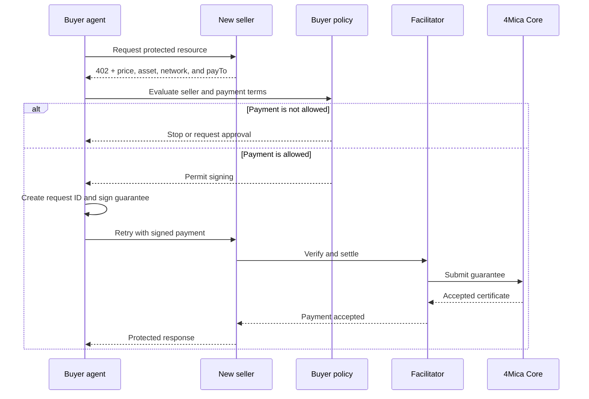
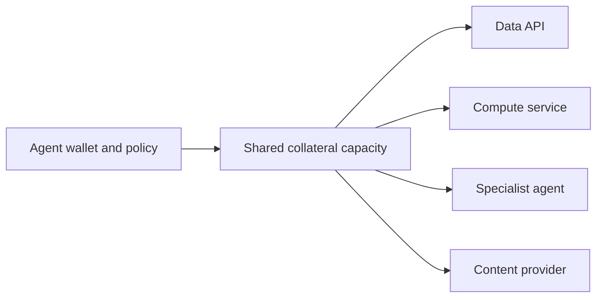

An agent should be able to discover a useful service and pay for it during the
same HTTP interaction.

It should not need a person to create an account, verify an email address,
choose a password, enter billing details, generate an API key, fund a private
balance, and wait for approval before making the first paid request.

4Mica removes that **per-seller payment onboarding**. A wallet provides the
payer identity, x402 communicates the seller's terms, and collateral-backed
guarantees provide payment capacity. The buyer and seller can establish a
payment relationship at request time instead of negotiating one in advance.

<Note>
“No account setup” describes the payment path. A seller may still require an
account, credential, identity check, subscription, or allowlist for product,
security, legal, or compliance reasons.
</Note>

## The account problem

Most API commerce begins before the first API call. A buyer normally has to
visit a website, create an organization, invite users, add a card, accept a
plan, prepay credits, and copy a long-lived credential into its application.

That workflow is manageable when a person chooses a few long-term vendors. It
does not fit an agent that may discover several unfamiliar services while
completing one task.

Imagine a research agent that needs weather data, maps, market prices, document
processing, and a specialist model. If every provider requires a separate
account and balance, the agent cannot choose services dynamically. Someone must
predict every provider in advance and maintain all of those commercial
relationships.

The resulting overhead grows with every seller:

| Traditional requirement | Why it limits agents |
| --- | --- |
| Signup and email verification | Assumes a person is present before access begins |
| Username and password | Creates credentials that must be stored and rotated per service |
| API-key issuance | Requires advance registration and seller-specific secret management |
| Card or bank details | Depends on a human-oriented billing workflow |
| Prepaid service credits | Fragments funds across private balances |
| Manual approval | Prevents immediate discovery and use |
| Monthly invoicing | Requires a negotiated billing relationship and reconciliation |

4Mica does not eliminate the seller's ability to identify or control buyers. It
removes the assumption that every payment must begin with a seller-managed
account.

## What replaces the account

A traditional account combines several different functions: identity,
authentication, authorization, billing, payment capacity, and history.

In an open payment flow, those functions do not have to live in one seller
database.

<Columns cols={2}>
  <Card title="Wallet" icon="wallet">
    Provides a stable economic address and cryptographic authority for the
    payer.
  </Card>
  <Card title="Payment policy" icon="list-checks">
    Decides which sellers, prices, assets, networks, and tasks the agent may
    authorize.
  </Card>
  <Card title="Collateral" icon="landmark">
    Gives the wallet reusable capacity to back guarantees across compatible
    sellers.
  </Card>
  <Card title="x402 requirements" icon="file-json">
    Let each seller publish machine-readable payment terms in the HTTP
    response.
  </Card>
  <Card title="Signed guarantee" icon="signature">
    Proves that the payer authorized a specific amount for a specific recipient
    and request.
  </Card>
  <Card title="Payment record" icon="receipt-text">
    Connects the request, guarantee, seller, amount, and settlement outcome
    without relying on a private prepaid ledger.
  </Card>
</Columns>

The wallet address becomes the root payment identity, but it is not a complete
user profile. It does not automatically reveal a legal name, email address,
organization, role, or the purpose of a request. Sellers that need this context
can request credentials or metadata separately.

## How the first request works

The payment negotiation happens inside HTTP rather than through a signup form.

The seller's HTTP 402 response describes what it accepts, including the amount,
network, asset, recipient address, and payment scheme. The buyer compares those
terms with its own capabilities and policy.

If the terms are acceptable, the buyer signs a guarantee and retries. The
seller verifies and settles that guarantee before returning the paid resource.
Neither side needs to wait for a new billing account to be created.

## Payment discovery instead of billing negotiation

Traditional integrations usually exchange billing information out of band. A
sales page, developer dashboard, contract, or email tells the buyer how much a
service costs and how to pay.

x402 lets the resource answer those questions directly.

| Question | Where the answer comes from |
| --- | --- |
| What is being sold? | Protected route and resource description |
| How much does it cost? | Amount in the payment requirements |
| Which asset is accepted? | Asset address and network |
| Who receives payment? | Seller's `payTo` address |
| Which payment method is supported? | Advertised x402 scheme |
| How long are the terms valid? | Timeout and application pricing policy |

This makes pricing discoverable by software. An agent can evaluate one seller,
reject the terms, and try another without opening and abandoning several
accounts along the way.

The seller can also offer more than one acceptable payment option. The buyer
chooses an option it supports; the seller does not need to predict the buyer's
wallet implementation.

## One payment identity across many sellers

A payer wallet can interact with many compatible services without becoming a
separate billing identity at each one.

The collateral is not copied into four seller balances. Each accepted guarantee
creates a specific obligation against the payer's capacity. Core tracks those
obligations, locks the required collateral, and later includes payable
guarantees in clearing and settlement.

This preserves capital flexibility. The buyer does not have to guess in advance
how much to pre-fund with each seller, and unused funds are not stranded in a
collection of service-specific credit systems.

It also reduces credential sprawl. The buyer can use controlled wallet signing
and payment policy instead of storing a different billing secret for every
service.

## No account does not mean no identity

Removing signup does not make the payer invisible.

The signed payment identifies the payer wallet and binds it to the recipient,
amount, asset, request ID, timestamp, and guarantee version. The seller can
connect that payment identity to request logs, delivery evidence, rate limits,
reputation, or an application-level profile.

The important distinction is between **payment identity** and **personal or
organizational identity**.

| Identity layer | What it can establish |
| --- | --- |
| Wallet address | Which economic identity authorized the payment |
| Signature | Whether that identity authorized these exact claims |
| Agent metadata | Which agent, version, operator, or task made the request |
| Application account | Seller-specific preferences, history, permissions, or content |
| Verified credential | Legal identity, organization, role, or compliance status |

A seller that only needs payment can accept the wallet and guarantee. A seller
that needs more context can require it without forcing every other service to
use the same account system.

## No account does not mean no setup

The buyer still needs a functioning payment identity before it can use paid
resources.

At a minimum, the buyer side needs:

1. a wallet or signing authority;
2. collateral on a supported network;
3. an x402 client configured for the network and 4Mica scheme;
4. policy that decides which payments may be signed;
5. enough native gas for required on-chain operations;
6. records that connect payments to agent tasks.

This setup happens once per wallet, environment, or operating boundary—not once
for every seller the agent may encounter.

The seller also needs to protect a route, publish payment requirements, choose
a facilitator, and verify accepted payments. “No account setup” removes the
bilateral onboarding step between buyer and seller; it does not remove either
side's responsibility to configure its own system.

<Warning>
Do not interpret accountless payment as permission for an agent to sign
anything it discovers. The buyer still needs seller restrictions, spending
limits, asset and network checks, task context, and approval rules.
</Warning>

## When a seller may still require an account

Payment is only one part of a product relationship. Some services need state
that cannot be represented by a payment guarantee alone.

<AccordionGroup>
  <Accordion
    title="Private data and saved state"
    description="The product must know which data or settings belong to the buyer."
  >
    Cloud storage, private documents, saved projects, message history, and
    personalized configuration usually need an application identity. A wallet
    can be used to authenticate that identity, but the seller may still maintain
    an account record.
  </Accordion>

  <Accordion
    title="Legal or compliance obligations"
    description="The seller must identify or screen the customer."
  >
    Regulated products may require legal identity, jurisdiction, tax
    information, sanctions screening, age verification, or contractual terms.
    A successful payment does not satisfy those requirements by itself.
  </Accordion>

  <Accordion
    title="Subscriptions and negotiated contracts"
    description="The relationship includes terms beyond one request."
  >
    Enterprise pricing, service-level agreements, reserved capacity, support
    commitments, and recurring subscriptions may require an organization record
    or signed contract. x402 can still handle usage payments within that
    relationship.
  </Accordion>

  <Accordion
    title="Abuse prevention and reputation"
    description="The seller needs stronger controls than a fresh wallet provides."
  >
    Sellers may require an allowlist, API credential, verified agent identity,
    deposit, or established reputation for expensive or abuse-prone operations.
    Wallet addresses are inexpensive to create, so they should not be treated as
    proof that every buyer is unique or trustworthy.
  </Accordion>

  <Accordion
    title="Product permissions"
    description="Different buyers receive different capabilities."
  >
    Teams, roles, private models, restricted datasets, and administrative
    actions may still rely on seller-managed authorization. Payment proves an
    obligation; it does not automatically grant every product permission.
  </Accordion>
</AccordionGroup>

These cases do not undermine the accountless payment model. They separate
payment onboarding from other forms of access control. A seller can require an
account only when its product actually needs one.

## API keys and wallet signatures

API keys and wallet signatures solve different problems.

An API key is a bearer credential issued by a particular seller. Whoever holds
it can usually act within that key's permissions until it expires or is
revoked. It is useful for identifying an application account, applying quotas,
and controlling private resources.

A wallet signature proves authorization by the wallet for a particular
structured action. In the 4Mica flow, the signed claims are bound to one payer,
recipient, amount, asset, and request identity.

| Property | Seller API key | Signed payment guarantee |
| --- | --- | --- |
| Issued by | Individual seller | Payer-controlled signer |
| Scope | Seller-defined account permissions | Exact signed payment claims |
| Reusable across sellers | No | The wallet and policy are reusable |
| Secret type | Bearer credential | Cryptographic signing authority |
| Main purpose | Access and application identity | Payment authorization |

A seller may use both. The API key can select an account or permission set,
while the payment guarantee authorizes a paid request. For public paid
resources, the guarantee may be enough on its own.

## What the seller learns

An accountless request should reveal only the information needed for the
service and payment.

The seller can normally observe the payer wallet, requested route, signed
amount, settlement asset, request identifier, timestamps, and technical request
metadata. Depending on the application, it may also receive agent identity,
task context, delivery requirements, or a separate credential.

It does not automatically receive a person's name, email, card number, bank
account, home address, or a global profile. That can reduce unnecessary data
collection, but it does not make the interaction private by default. Wallet and
blockchain activity may be public and linkable.

<Note>
Accountless is not the same as anonymous. Treat wallet addresses, IP addresses,
request metadata, and task logs as potentially identifying information.
</Note>

## What happens after the request

No account setup does not mean no record exists.

Both sides should be able to connect the HTTP request to its payment evidence.
The buyer records why the agent paid, which policy approved it, what result came
back, and how the obligation resolved. The seller records what was requested,
which guarantee paid for it, and what work was delivered.

The payment may continue through validation, clearing, settlement, or default
coverage after the protected HTTP response has already been returned. Those
protocol records replace the need for a seller-managed prepaid ledger, but they
do not replace application logs or delivery evidence.

## The resulting experience

For the buyer, a new service can behave like an open paid endpoint rather than
a new vendor onboarding project. The agent discovers the price, checks policy,
authorizes payment, and continues its task.

For the seller, the first paying customer does not need to arrive through a
signup funnel. The route publishes its terms and accepts compatible payment
evidence while retaining control over pricing, permissions, identity
requirements, and abuse prevention.

The result is not commerce without identity or rules. It is commerce where a
seller account is optional rather than the universal prerequisite for payment.
