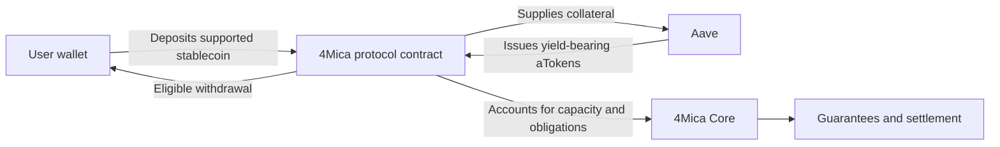
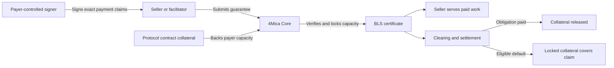

4Mica is non-custodial by design. Users do not send funds to a 4Mica
operating account and receive an internal balance that the company controls.
They authorize actions from their own wallets, while protocol contracts hold
collateral and apply the rules for guarantees, settlement, default coverage,
and withdrawal.

This changes the central trust question from:

> Will a company return the balance recorded in its private database?

to:

> Which actions did the wallet authorize, what do the contracts enforce, and
> which risks still exist around those rules?

That distinction matters. **Non-custodial does not mean risk-free, trustless,
or instantly withdrawable.** It means custody is not delegated to a centralized
balance provider. Authority, collateral, and obligations are separated and
made explicit.

## What custodial risk means

A custodial service takes possession or effective control of user funds. The
user normally sees an account balance, but the service controls the underlying
wallets, database, withdrawal process, and operational access.

If that service becomes insolvent, is compromised, freezes the account, or
records the balance incorrectly, the user may have only a claim against the
operator.

4Mica uses a different structure:

| Question | Custodial balance model | 4Mica model |
| --- | --- | --- |
| Who authorizes payment? | The provider updates its ledger | The payer's signer authorizes a structured guarantee |
| Where is collateral held? | In provider-controlled accounts or pooled wallets | In protocol-controlled contracts and, for configured stablecoins, Aave |
| What protects the seller? | The provider's promise to pay | An accepted guarantee backed by locked collateral |
| What defines withdrawal? | Provider policy and database approval | Contract rules, timing, and unresolved obligations |
| What proves an obligation? | A private ledger entry | Signed claims, Core state, certificates, and settlement records |

The protocol still has services, operators, configuration, and software. The
important difference is that a hosted service does not gain unrestricted
authority over a user's wallet merely because it helps process a payment.

## Where Aave fits

4Mica uses Aave under the hood for supported stablecoin collateral. When a user
deposits through the configured 4Mica contract, the collateral can be supplied
to Aave instead of sitting idle in a company-controlled wallet. Aave issues
yield-bearing aTokens to the protocol contract, and those assets continue to
represent the collateral attributed to the user.

This is non-custodial because 4Mica does not receive the deposit into an
operating wallet or replace it with a balance that only 4Mica's private
database recognizes. The movement into Aave and the resulting position are
enforced on-chain. Withdrawal follows the protocol contract's rules and remains
subject to collateral that is already securing guarantees or settlement
obligations.

<Note>
Aave is part of the smart-contract path, not a custodian acting on behalf of
4Mica. However, using Aave introduces a separate dependency on Aave's contracts,
markets, liquidity, governance, and the behavior of the deposited asset.
</Note>

The exact assets and yield strategy can vary by deployment. Integrations should
verify the active network, token, contract addresses, and configuration instead
of assuming every deposit is routed identically. See
[earning yield](./earning-yield) for the economic purpose of this integration.

## The separation of control

Non-custodial architecture is easier to understand when each kind of control is
kept separate.

<Columns cols={2}>
  <Card title="Wallet authority" icon="key-round">
    The payer controls the signer that authorizes guarantees, deposits,
    withdrawal requests, and other wallet actions.
  </Card>
  <Card title="Application policy" icon="list-checks">
    The buyer application decides which sellers, amounts, assets, networks, and
    tasks may reach the signer.
  </Card>
  <Card title="Protocol enforcement" icon="shield-check">
    Contracts and Core enforce collateral, accepted guarantee versions,
    settlement, default coverage, and withdrawal conditions.
  </Card>
  <Card title="Seller acceptance" icon="badge-check">
    The seller chooses which payment requirements, facilitator, network, asset,
    and guarantee policy it will accept.
  </Card>
</Columns>

No single layer should quietly substitute for the others. A valid signature
does not prove that an application made a wise purchase. A good application
policy does not replace sufficient collateral. A hosted facilitator can verify
and submit a payment, but it should not become the payer's unrestricted signer.

Read [wallet](./wallet) for the relationship between an agent, wallet, signer,
policy, and collateral.

## How value moves through 4Mica

The payer deposits a supported asset into the protocol's collateral flow.
Configured stablecoin collateral can be supplied to Aave while it backs payment
capacity. Core recognizes the finalized collateral position and uses it to
determine whether the wallet can back new guarantees.

When the payer signs a guarantee, the signature binds the obligation to a
specific payer, recipient, request, amount, asset, timestamp, and guarantee
version. Core verifies the signed claims and available collateral. If accepted,
Core locks the required capacity and issues a BLS certificate.

The seller can then rely on protocol-accepted evidence instead of trusting an
informal promise from the buyer.

The synchronous HTTP request can finish before final settlement. Payable
guarantees enter clearing cycles, where obligations are netted and only net
positions settle. If a debtor misses the applicable finality deadline, locked
collateral can cover the eligible default according to protocol rules.

See [transaction lifecycle](./transaction-lifecycle) for the complete V1 and V2
state model and [payment flow](/api-reference/payment-flow) for the end-to-end
sequence.

## What the signature protects

4Mica uses structured signing so the payer authorizes the contents of a
particular payment request rather than signing an ambiguous message.

Core verifies the payer's signature and the submitted fields; it does not
rewrite the amount, recipient, asset, or request identity after the payer signs.
A unique request ID also prevents the same signed guarantee identity from being
accepted twice.

This protects the integrity of the payment instruction. It does not decide
whether the seller is legitimate, whether the price is sensible, or whether
the delivered output is useful. Those decisions belong to buyer policy,
seller selection, and application-level evidence.

<Note>
For V2 guarantees, the payer also signs the validation policy. Core checks that
the selected validation registry is allowed by the active deployment, while
the registry supplies the outcome evidence required by that policy.
</Note>

## What hosted services can and cannot do

The facilitator and Core make the payment flow practical, but they do not all
have the same authority.

| Service action | Effect |
| --- | --- |
| Verify an x402 payment payload | Checks whether the proposed payment is structurally and cryptographically acceptable |
| Submit an accepted guarantee | Asks Core to verify the guarantee, lock collateral, and issue a certificate |
| Track lifecycle and clearing state | Makes asynchronous payment state observable |
| Change an already signed amount or recipient | Invalidates the payer's signature rather than creating valid authority |
| Sign an arbitrary payment for the payer | Impossible unless the service also controls the payer's signer |
| Withdraw collateral to an arbitrary address | Must satisfy the contract's authorization and withdrawal rules |

This is why key separation remains essential. If an application gives a hosted
service its unrestricted private key, the architecture may still use smart
contracts, but the user has recreated a custodial trust relationship at the
signer layer.

## Withdrawal is ownership with obligations

The payer retains a defined path to withdraw eligible collateral. That path is
not an unconditional ability to remove every deposited asset at any moment.

Collateral may be securing guarantees that a seller has already accepted. It
may also be needed for a clearing position, pending validation, dispute,
default, or withdrawal already in progress. Allowing it to leave immediately
would make the guarantee meaningless.

Withdrawal therefore uses a request-and-finalize process:

<Steps>
  <Step title="Stop creating new exposure">
    Pause the agent or disable payment signing if the intent is to exit the
    position completely.
  </Step>
  <Step title="Request withdrawal">
    The wallet requests a specific amount and asset through the protocol's
    withdrawal flow.
  </Step>
  <Step title="Allow obligations to resolve">
    The configured delay gives the protocol time to account for open
    guarantees, clearing positions, and other claims against collateral.
  </Step>
  <Step title="Finalize the eligible amount">
    After the delay, the contract rechecks authorization and obligations before
    transferring collateral that is available to leave.
  </Step>
</Steps>

<Warning>
A withdrawal delay is not evidence of centralized custody. It is an enforcement
mechanism that prevents collateral from disappearing while it still backs an
accepted obligation. The active contract and deployment parameters determine
the exact timing and conditions.
</Warning>

For asset approval, finality, locked capacity, withdrawal blockers, and recovery
guidance, read [deposits and withdrawals](./deposits-and-withdrawals).

## Protection from each side

### For payers

The payer does not need to maintain a prepaid balance with every seller. One
collateral position can support compatible payment flows, while the wallet
signs each guarantee under its own application policy.

The payer can inspect what was authorized because each obligation is connected
to signed claims and lifecycle records. Remaining collateral can be withdrawn
after the obligations it secures have cleared.

The payer must still protect the signer. A compromised key can authorize valid
but unwanted guarantees, and the protocol cannot infer that a cryptographically
valid signature was produced by malware.

### For sellers

The seller does not need to rely on the buyer's reputation alone. Before
serving paid work, the seller can verify and settle the signed payload through
the facilitator. Core accepts the guarantee only after checking the payer's
signature, policy fields, accepted version, and collateral.

An accepted guarantee provides a path through clearing and settlement. Eligible
defaults can be covered from collateral locked for protocol obligations.

The seller must still verify before delivering value, use the correct
facilitator and network configuration, preserve the certificate and request
records, and understand whether a V1 or V2 guarantee is appropriate.

## Non-custodial does not mean trustless

Trust is narrowed and distributed; it does not disappear. The useful question
is not whether any trust exists, but where it exists and what happens if that
component fails.

<AccordionGroup>
  <Accordion
    title="Signer and application risk"
    description="A valid signature may still represent an unwanted action."
  >
    A stolen key, exposed seed phrase, malicious dependency, prompt injection,
    or overly broad policy can authorize harmful guarantees. Isolate signing
    from agent reasoning, enforce seller and amount limits before signing, and
    build a fast revocation path.

    See [safety and permissions](/buyer/safety-and-permissions).
  </Accordion>

  <Accordion
    title="Smart-contract and upgrade risk"
    description="Protocol enforcement is only as reliable as its code and governance."
  >
    Contract bugs, incorrect permissions, unsafe upgrades, or emergency pause
    mechanisms can affect deposits, withdrawals, settlement, and claims.
    Verify deployment addresses, understand who can upgrade or pause the
    contracts, and limit production exposure accordingly.
  </Accordion>

  <Accordion
    title="Operator and configuration risk"
    description="Parameters determine which guarantees and validation paths are accepted."
  >
    Operators configure items such as accepted guarantee versions, trusted
    validation registries, supported assets, and timing. Incorrect or unexpected
    configuration can prevent issuance or change which paths are available.
    Discover current settings instead of hard-coding assumptions.

    See [public parameters](/api-reference/operator/public-params).
  </Accordion>

  <Accordion
    title="Blockchain, RPC, and finality risk"
    description="Chain conditions can delay observation and settlement."
  >
    Congestion, reorganization, unavailable RPC providers, insufficient gas, or
    delayed finality can affect deposits, settlement, claims, and withdrawals.
    Applications should distinguish a submitted transaction from a finalized
    and synchronized protocol state.
  </Accordion>

  <Accordion
    title="Validation risk"
    description="A V2 guarantee depends on the signed validation policy and its registry."
  >
    The registry, validator, score, tag, subject, and job identifiers define
    what evidence is accepted. A poor validation policy may approve the wrong
    outcome or make a legitimate outcome impossible to prove. Treat registry
    selection as a trust decision, not a decorative field.
  </Accordion>

  <Accordion
    title="Asset, liquidity, and yield risk"
    description="Collateral value and availability can change."
  >
    Tokens can depeg, liquidity can deteriorate, yield strategies can fail, and
    rates can vary. Where collateral is supplied to Aave, users also depend on
    Aave's smart contracts, markets, governance, and available liquidity.
    Earning yield does not guarantee principal or immediate liquidity. Confirm
    which strategy and risk parameters apply to the active deployment.

    See [earning yield](./earning-yield) and
    [collateral ratios](./collateral-ratios).
  </Accordion>
</AccordionGroup>

## A practical trust model

Before using a deployment, identify each trust boundary and its evidence.

| Boundary | Evidence to verify |
| --- | --- |
| Wallet authority | Signer ownership, key isolation, delegation, and revocation |
| Payment intent | Exact structured claims and application policy decision |
| Collateral | Correct contract, asset, network, finality, and available capacity |
| Guarantee acceptance | Core response, guarantee state, and BLS certificate |
| Validation | Signed V2 policy and trusted registry result |
| Settlement | Clearing position, payment window, finality, and default outcome |
| Exit | Withdrawal request, delay, remaining obligations, and final transaction |

This review should happen before production funds are deposited, then again when
contract addresses, operators, supported assets, validation registries, or
deployment parameters change.
