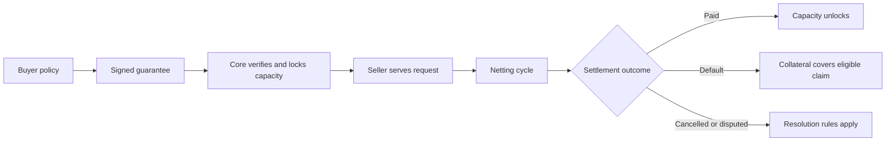
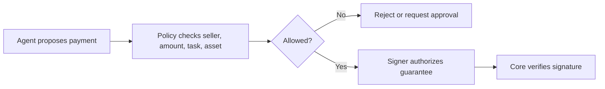
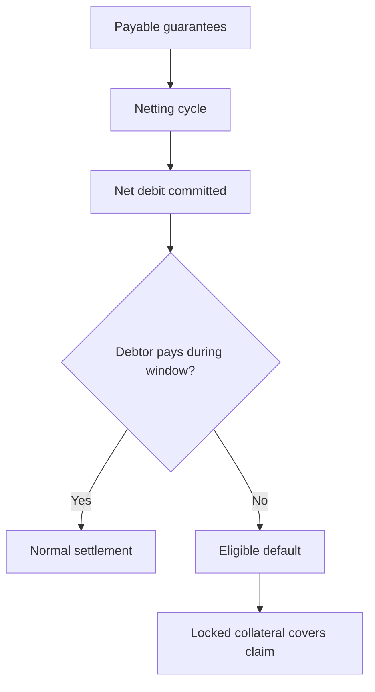

Risk management in 4Mica is about making exposure explicit.

4Mica lets agents pay at machine speed by accepting signed guarantees before
final settlement is complete. That creates a powerful user experience, but it
also introduces a real risk surface: buyers can sign too much, sellers can serve
before final settlement, collateral can be locked, validation can fail,
settlement windows can be missed, and integrations can mis-handle payment
evidence.

The goal is not to pretend those risks disappear. The goal is to identify where
each risk lives, which layer controls it, and what a user or builder should
monitor.

## The core tradeoff

4Mica separates request-time access from final settlement.

At request time, the buyer signs a guarantee, Core verifies it, and the seller
can serve. Later, payable guarantees enter netting cycles and settle as net
positions. Collateral protects the delay between those two moments.

This architecture improves speed and capital efficiency, but it means every
participant should understand the difference between:

| Concept | Risk question |
| --- | --- |
| Signature | Did the wallet authorize the exact obligation? |
| Policy | Should the agent have been allowed to authorize it? |
| Collateral | Is there enough capacity to back unresolved exposure? |
| Lifecycle state | Is the guarantee payable, pending, disputed, cancelled, settled, or default-covered? |
| Settlement | Did the net position resolve before the finality deadline? |

Risk management is the discipline of keeping those questions separate.

## Risk map

The full 4Mica process has several categories of risk.

| Risk category | Where it appears | Main control |
| --- | --- | --- |
| Buyer intent risk | Before signing | Seller verification, budgets, approval policy, task limits |
| Signer risk | When authorizing payment | Key isolation, scoped wallets, policy-gated signing |
| Payment integrity risk | During x402 payment creation | Structured signatures, unique request IDs, field verification |
| Seller delivery risk | After payment acceptance | Delivery records, completion criteria, validation, refund rules |
| Collateral risk | Deposit through withdrawal | Supported assets, collateral ratios, locked exposure monitoring |
| Settlement risk | Netting and finality | Payment-window monitoring, debtor automation, default coverage |
| Validation risk | V2 lifecycle | Trusted registries, clear SLA fields, evidence checks |
| Smart-contract risk | Collateral and settlement contracts | Audits, access controls, deployment verification, emergency controls |
| External protocol risk | Yield or collateral integrations | Asset limits, Aave/liquidity awareness, configuration checks |
| Operational risk | Integrations and infrastructure | Monitoring, idempotency, retries, incident response |
| Abuse risk | Paid and unpaid endpoints | Rate limits, cheap unpaid edge, reputation, fraud controls |

No single mechanism manages all of these. Collateral helps with settlement
risk; it does not decide buyer intent. Signatures protect payment fields; they
do not prove output quality. Validation can gate payment; it does not replace
key management.

## Buyer intent risk

Buyer intent risk is the risk that an agent signs a payment it should not have
signed.

The payment can be perfectly valid at the protocol level and still be a bad
purchase. The seller may be fake, the price may be too high, the route may not
match the task, the agent may be looping, or the request may leak sensitive
data.

Before signing, buyer policy should check:

<AccordionGroup>
  <Accordion title="Seller identity">
    Confirm the domain, route, reputation, and `payTo` address match the seller
    the agent intended to use.
  </Accordion>
  <Accordion title="Price and budget">
    Enforce per-request caps, task budgets, daily limits, and approval
    thresholds.
  </Accordion>
  <Accordion title="Asset and network">
    Allow only the settlement assets and networks expected for the wallet and
    environment.
  </Accordion>
  <Accordion title="Task relevance">
    Confirm the paid resource is necessary for the current user goal or
    workflow.
  </Accordion>
  <Accordion title="Data exposure">
    Decide what information the agent is allowed to send to the seller before
    making the paid request.
  </Accordion>
</AccordionGroup>

Read [trust and verification](/buyer/trust-and-verification) and
[safety and permissions](/buyer/safety-and-permissions) for buyer-side policy
design.

## Signer and wallet risk

Signer risk is the risk that a key authorizes payments outside the user's
intent.

This can happen because the key is stolen, copied into an unsafe environment,
shared too broadly, or attached to an agent with weak policy. It can also happen
without a key leak if the signing service blindly signs whatever the agent asks
for.

The safest pattern is:

Important controls include dedicated wallets, environment separation, scoped
signing services, key rotation, emergency pause, and least-privilege access to
signing infrastructure.

Read [wallet](./wallet) and [security](./security) for the wallet and signer
security model.

## Payment integrity risk

Payment integrity risk is the risk that a payment is malformed, replayed,
redirected, or interpreted differently by the buyer and seller.

4Mica reduces this risk with structured signed guarantees. The payer signs the
specific payer, recipient, request ID, amount, asset, timestamp, version, and
V2 validation policy where applicable. Core verifies the submitted fields
against the signature and rejects duplicate guarantee identities.

Integrations still need to handle the surrounding application behavior:

| Control | Why it matters |
| --- | --- |
| Unique request IDs | Prevents replay as a new guarantee. |
| Route binding | Prevents using a payment intended for one resource on another. |
| Idempotent delivery | Prevents retries from creating duplicate expensive work. |
| Timeout enforcement | Reduces usefulness of stale signed payloads. |
| Stored receipts | Provides audit and reconciliation evidence. |

See [how x402 works](./how-x402-works) and
[transaction lifecycle](./transaction-lifecycle) for the payment fields and
lifecycle states.

## Collateral and capacity risk

Collateral risk is the risk that available capacity is misunderstood.

A wallet may own deposited collateral but still be unable to spend or withdraw
because capacity is locked behind accepted guarantees, pending validation,
active cycles, settlement windows, or default handling. The raw deposit is not
the same as available payment capacity.

The key states are:

| State | Risk to watch |
| --- | --- |
| Pending deposit | The transaction may not be finalized or synchronized yet. |
| Total collateral | May be subject to asset support, ratios, and deployment policy. |
| Locked exposure | Reduces capacity for new guarantees and withdrawals. |
| Pending withdrawal | May reduce future available capacity. |
| Default coverage | Can consume locked collateral if settlement fails. |

Collateral ratios create a buffer between deposited value and guarantee
capacity. That buffer protects sellers, but it can surprise buyers who expect
every deposited unit to become spendable immediately.

Read [deposits and withdrawals](./deposits-and-withdrawals) and
[collateral ratios](./collateral-ratios) before relying on a wallet's capacity
for production traffic.

## Asset and yield risk

Supported collateral assets can carry different risks.

Stablecoins reduce price volatility compared with many crypto assets, but they
are not risk-free. A stablecoin can face issuer risk, liquidity risk, contract
risk, depeg risk, freeze or pause behavior, network congestion, or operational
issues around token decimals and addresses.

Where configured, 4Mica can use Aave under the hood for supported stablecoin
collateral. That can keep collateral productive, but it introduces an external
protocol dependency. Users should understand that Aave brings its own contract,
market, liquidity, governance, and asset risks.

<Warning>
Yield does not make collateral risk-free. More yield should not be interpreted
as more safe payment capacity.
</Warning>

Read [no custodial risk](./no-custodial-risk) for where Aave fits and
[earning yield](./earning-yield) for the purpose of yield-bearing collateral.

## Settlement and default risk

Settlement risk is the risk that a payable obligation does not resolve through
the normal payment path on time.

After guarantees enter a netting cycle, the system computes net debtor and
creditor positions. Net debtors need to pay during the payment window. If they
miss the finality deadline, eligible claims can move to default coverage from
locked collateral.

Default coverage protects sellers, but default is still a negative operational
outcome. It can reduce the payer's collateral, damage trust, and indicate that
payment automation or funding controls failed.

Buyers should monitor upcoming payment windows and maintain enough settlement
funds. Sellers should monitor whether credits become claimable, paid, or
default-covered.

Read [bilateral netting cycles](./bilateral-netting-cycles) and
[settlements](./settlements) for the cycle and finality model.

## Validation and SLA risk

V2 guarantees can make payment depend on validation. That is useful when the
buyer wants evidence that a job met agreed conditions before it becomes payable.

It also adds a new risk surface:

| Risk | Example |
| --- | --- |
| Wrong registry | The seller proposes a validation registry the deployment does not trust. |
| Ambiguous success criteria | The buyer and seller disagree on whether the job passed. |
| Bad subject hash | The validation evidence does not refer to the intended work. |
| Validator availability | The validator does not publish a result on time. |
| Score or tag mismatch | The result exists but does not satisfy the signed policy. |
| Pending collateral | Capacity remains locked while validation is unresolved. |

Good validation policies are specific before signing. They bind the registry,
validator, subject, job, score threshold, and required tag in a way Core and the
contracts can verify.

Read [configurable SLAs](./configurable-slas) and
[transaction lifecycle](./transaction-lifecycle) for V2 validation behavior.

## Seller delivery and quality risk

Seller risk is not only “will I get paid?” It is also “can I prove what I
delivered?”

A seller should keep delivery records that connect the paid request to the work
performed. This matters for support, disputes, refunds, abuse investigation,
and reconciliation.

Good seller controls include:

- return a 402 before expensive work;
- verify or settle payment before serving protected output;
- define completion criteria for each paid route;
- keep request, payment, delivery, and settlement records together;
- make retries idempotent;
- cap expensive jobs for unknown buyers;
- publish refund or failure policies where relevant.

Read [seller risk and abuse prevention](/seller/risk-and-abuse-prevention) and
[proof and disputes](/seller/proof-and-disputes) for route-level guidance.

## Smart-contract and deployment risk

4Mica reduces reliance on private ledgers, but smart contracts and deployment
configuration still matter.

Users and integrators should verify:

| Item | Why it matters |
| --- | --- |
| Network | A testnet deposit does not protect mainnet payments. |
| Contract address | Depositing to the wrong contract can lose funds or create no capacity. |
| Supported assets | Unsupported tokens do not create payment capacity. |
| Token decimals | Wrong units can underpay or overpay. |
| Validation registry allowlist | V2 payments depend on trusted registry configuration. |
| Accepted guarantee versions | Unsupported versions should not be signed or accepted. |
| Emergency controls | Pauses and access controls affect incident response. |

Use [`GET /core/public-params`](/api-reference/operator/public-params),
[`GET /core/tokens`](/api-reference/operator/tokens), and
[supported networks](/getting-started/supported-networks) as references for
active configuration.

## Facilitator and API risk

The facilitator helps sellers validate and submit payments, but it is still a
trust boundary.

Risks include facilitator downtime, stale configuration, misconfigured URLs,
incorrect assumptions about supported schemes, and sellers serving content after
only a weak or local check.

Sellers should:

- configure the intended facilitator URL per environment;
- verify payment requirements match the route being served;
- call `/verify` before expensive work when appropriate;
- call `/settle` before treating the payment as accepted;
- persist the returned certificate or receipt;
- handle facilitator errors without serving unpaid work.

Read [facilitator](./facilitator), [payment flow](/api-reference/payment-flow),
and the [Facilitator API](/api-reference/facilitator/verify) reference.

## Webhook and observability risk

Events are useful only if they are verified and processed safely.

Webhook risks include forged events, replayed deliveries, duplicate processing,
out-of-order events, missing retries, and accidental logging of secrets or
sensitive bodies.

Secure event handling should verify signatures over the raw body, check
timestamps, store event IDs, process idempotently, queue work after verification,
and reconcile against Core state when needed.

Read [webhook security](/webhooks/security), [webhook best practices](/webhooks/best-practices),
and [webhook FAQs](/webhooks/faqs).

## Abuse and economic risk

Agents move quickly. Small mistakes can become expensive when repeated many
times.

Common abuse patterns include:

<AccordionGroup>
  <Accordion title="Unpaid edge abuse">
    Attackers repeatedly hit protected routes to make quote generation,
    discovery, or pre-work expensive. Keep the unpaid 402 path cheap.
  </Accordion>
  <Accordion title="Invalid payment spam">
    Repeated bad signatures, wrong assets, stale payloads, or mismatched routes
    can waste validation resources. Rate limit and monitor failures.
  </Accordion>
  <Accordion title="Free-trial farming">
    Trial credits can be farmed across wallets, IPs, accounts, or agent
    identities unless they are narrowly scoped.
  </Accordion>
  <Accordion title="Agent spend loops">
    A buyer agent may repeatedly pay for low-value resources unless budgets,
    task limits, and stop conditions are enforced.
  </Accordion>
  <Accordion title="Refund or dispute abuse">
    Sellers need delivery evidence and published completion criteria before
    disputes happen.
  </Accordion>
</AccordionGroup>

Risk controls should match route cost. A tiny deterministic lookup and a
long-running compute job should not use the same limits.

## Operational risk

Operational risk is the everyday risk that systems fail in boring ways:
network outages, RPC issues, clock drift, queue delays, database bugs, stale
configuration, failed token approvals, retry storms, or missing logs.

Production integrations should monitor:

| Signal | Why it matters |
| --- | --- |
| Deposit synchronization | Confirms collateral became usable. |
| Available capacity | Shows whether agents can keep signing. |
| Accepted guarantees | Reveals current exposure. |
| Pending validation | Shows locked capacity that may not settle soon. |
| Cycle state | Indicates upcoming settlement obligations. |
| Net debits | Requires debtor payment automation. |
| Net credits | Indicates claimable seller value. |
| Defaults | Signals failed settlement behavior. |
| Webhook failures | Can leave application state stale. |
| Error rates | Shows integration or abuse problems early. |

If an integration cannot observe a lifecycle state, it should be conservative
about spending, serving expensive work, and withdrawing collateral.

## Risk ownership

Different parties own different risks.

| Party | Owns |
| --- | --- |
| Buyer | Seller verification, spend policy, signer security, task limits, settlement payment readiness |
| Seller | Pricing clarity, paid-route controls, delivery proof, abuse prevention, facilitator configuration |
| Operator | Core configuration, accepted versions, asset support, validation registry allowlists, service reliability |
| Protocol contracts | Collateral rules, withdrawal conditions, settlement/default enforcement |
| External protocols | Their own contract, market, liquidity, governance, and asset risks |

This division matters. If a buyer signs an allowed payment to a fake seller,
that is not the same failure as a bad signature or insufficient collateral. If
a seller serves before settlement acceptance, that is not the same failure as a
debtor default. Naming the layer makes the response clearer.

## Practical mitigation checklist

<Steps>
  <Step title="Start with low exposure">
    Use testnets, dedicated wallets, small deposits, and low per-request limits
    until the full lifecycle is observable.
  </Step>
  <Step title="Gate signing with policy">
    Check seller identity, route, amount, asset, network, task context, and
    budget before the signer is allowed to authorize a guarantee.
  </Step>
  <Step title="Keep unpaid work cheap">
    Return payment requirements before expensive compute, model calls, or
    downstream requests.
  </Step>
  <Step title="Monitor lifecycle state">
    Track accepted guarantees, pending validation, cycles, settlement windows,
    defaults, and withdrawal eligibility.
  </Step>
  <Step title="Plan incident response">
    Be able to pause signing, rotate keys, revoke credentials, preserve
    evidence, and withdraw only eligible collateral.
  </Step>
</Steps>
