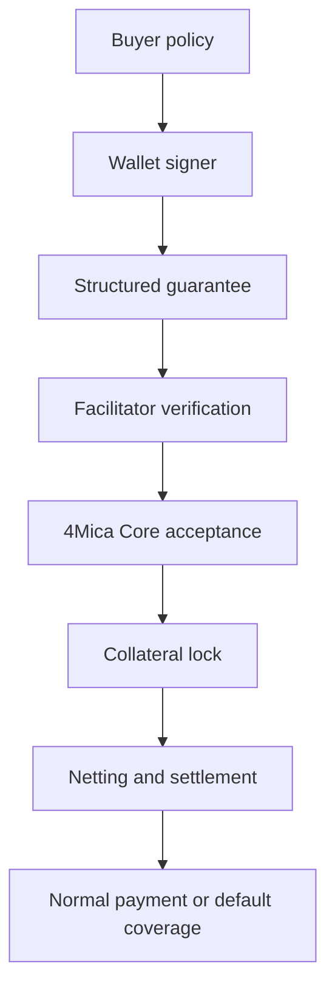
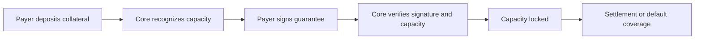

4Mica security is built around one principle: a payment should only be accepted
when a wallet authorized the exact obligation, Core verified it, collateral can
back it, and settlement rules can enforce the outcome.

That is different from trusting a hosted payment service to keep an internal
balance correct. In 4Mica, the important security questions are explicit:

> Who signed this payment, what did they sign, what collateral backs it, which
> service verified it, and what happens if settlement does not complete?

This page explains the security model, the trust boundaries, and the practical
things users and builders need to protect.

## What 4Mica secures

4Mica focuses on payment integrity and collateral-backed settlement.

<Columns cols={2}>
  <Card title="Authorization" icon="signature">
    The payer signs structured payment claims. Core verifies that the signature
    matches the submitted fields.
  </Card>
  <Card title="Replay resistance" icon="refresh-cw-off">
    Each guarantee uses a unique request identity so the same signed payment
    cannot be accepted repeatedly as new spend.
  </Card>
  <Card title="Collateral enforcement" icon="shield-check">
    Core checks available capacity before accepting a guarantee and locks
    exposure for unresolved obligations.
  </Card>
  <Card title="Settlement finality" icon="check-check">
    Payable guarantees move through clearing, settlement, and default coverage
    instead of depending on informal promises.
  </Card>
</Columns>

The protocol is not trying to decide whether an agent made a good purchase,
whether a seller's output is useful, or whether a task should have been
allowed. Those decisions belong to application policy, reputation, validation,
and user controls.

## The security layers

4Mica security is layered. No single component should be treated as the whole
system.

Each layer answers a different question:

| Layer | Security question |
| --- | --- |
| Buyer policy | Should this agent be allowed to sign this payment? |
| Wallet signer | Did the payer authorize this exact request? |
| Payment requirements | Did the seller publish clear amount, asset, network, and recipient terms? |
| Facilitator | Is the x402 payload structurally valid and ready to submit? |
| Core | Is the signature valid, version accepted, request unique, and collateral sufficient? |
| Contracts | Can collateral, settlement, withdrawal, and default rules be enforced? |
| Monitoring | Did the lifecycle resolve as expected? |

A secure integration keeps these responsibilities separate. For example, Core
can verify a signature and collateral, but it cannot know whether your agent
should have trusted that seller for this task.

## Wallet and signer security

The wallet is the root payment identity. The signer is the authority that can
approve guarantees and other wallet actions.

Protecting the signer is necessary, but not sufficient. A perfectly protected
key can still authorize bad payments if the application sends it unsafe signing
requests.

Good signer security includes:

- use dedicated wallets for agents instead of reusing a personal or treasury
  wallet
- separate production, staging, and test wallets
- place policy checks before the signing service
- limit who or what can request signatures
- keep private keys in a secure wallet, HSM, managed key service, or isolated
  signing service
- avoid exporting private keys into application logs, CI jobs, notebooks, or
  local scripts
- rotate signers when access changes or compromise is suspected
- maintain an emergency stop path that disables signing quickly

<Warning>
Never give a hosted facilitator or resource server unrestricted access to the
payer's private key. If a third party can sign arbitrary payments for the
wallet, you have recreated custodial risk at the signer layer.
</Warning>

Read [wallet](./wallet) for the relationship between agent, wallet, signer,
policy, and collateral.

## What the payer signs

4Mica uses structured signing so the payer authorizes specific payment fields,
not an ambiguous human-readable string.

A guarantee binds values such as:

| Field | Why it matters |
| --- | --- |
| Payer wallet | Identifies who authorized the obligation. |
| Recipient wallet | Prevents the payment from being redirected after signing. |
| Request ID | Makes the guarantee unique and replay-resistant. |
| Amount | Prevents the seller or facilitator from raising the price after signing. |
| Asset address | Prevents substitution of an unexpected token. |
| Timestamp | Helps bound freshness and lifecycle timing. |
| Guarantee version | Determines which lifecycle rules apply. |
| Validation policy | For V2, defines the outcome evidence required before payment. |

Core verifies the submitted fields against the signature. If someone changes
the amount, recipient, asset, request ID, or signed validation policy, the
signature no longer authorizes that payment.

This protects payment integrity. It does not prove that the seller is
trustworthy or that the price is fair. Buyer policy must still make that
decision before signing.

## Replay and duplicate protection

Micropayments create many signed payloads. Replay protection is therefore
essential.

Every guarantee needs a unique request identity before the payer signs. Core
derives or checks the guarantee identity from the signed values and rejects
duplicate identities. This prevents a valid signed payload from being submitted
again as a separate new payment.

Integrations should also protect against application-level replay:

| Control | Purpose |
| --- | --- |
| Unique `req_id` per payment | Prevents duplicate protocol guarantees. |
| Idempotent request handling | Prevents duplicate delivery when clients retry. |
| Short validity windows | Reduces usefulness of stale signed payloads. |
| Route and price binding | Prevents a payment meant for one resource from being reused elsewhere. |
| Stored payment records | Lets you detect repeated payloads or suspicious retries. |

Replay protection is both protocol-level and application-level. Core can reject
duplicate guarantee identities, but the seller still needs safe retry and
delivery behavior around its own resource.

## Collateral security

Collateral makes accepted guarantees economically meaningful.

Before Core accepts a guarantee, it checks whether the payer has enough
available capacity under the active collateral rules. After acceptance, capacity
is locked so the same collateral cannot back unlimited unresolved obligations.

This protects sellers during the delay between request-time acceptance and
final settlement. If the debtor fails to pay an eligible net position by the
deadline, locked collateral can cover the claim according to protocol rules.

Collateral security also has limits:

- collateral can be locked while obligations remain unresolved
- withdrawal may be delayed by open guarantees, settlement, validation, or
  default exposure
- supported assets and collateral ratios can vary by deployment
- yield integrations such as Aave introduce smart-contract, liquidity,
  governance, and asset risks
- collateral capacity is not the same as a buyer's application budget

Read [collateral ratios](./collateral-ratios), [settlements](./settlements),
and [no custodial risk](./no-custodial-risk) for the collateral and ownership
model.

## Contract and protocol security

4Mica uses contracts and protocol rules to enforce collateral, withdrawals,
settlement, and default coverage.

Critical contract flows should be designed around:

| Control | Why it matters |
| --- | --- |
| Access control | Limits who can update sensitive configuration or execute privileged actions. |
| Pausing or emergency controls | Gives operators a way to stop high-risk flows during an incident. |
| Reentrancy protection | Reduces risk when contracts transfer value or call external contracts. |
| Allowlisted validation registries | Prevents arbitrary V2 validators from becoming payment authorities. |
| Asset allowlists | Limits collateral to assets the deployment intends to support. |
| Withdrawal checks | Prevents collateral from leaving while it secures obligations. |
| Event emission | Gives Core, webhooks, and observers an auditable lifecycle trail. |

Contracts reduce reliance on private ledgers, but they introduce smart-contract
risk. Users should still understand which deployment, network, contract
addresses, supported assets, and external protocols they rely on.

Use [`GET /core/public-params`](/api-reference/operator/public-params) and
[`GET /core/tokens`](/api-reference/operator/tokens) to discover active
configuration instead of hard-coding assumptions.

## Facilitator trust boundary

The facilitator makes x402 practical for sellers. It verifies payment payloads
and submits accepted guarantees to Core.

A facilitator can:

- check whether a payment payload is structurally valid
- verify that fields match the payment requirements
- submit a guarantee to Core for acceptance
- return a certificate or settlement response
- help the seller avoid implementing all protocol calls directly

A facilitator should not be able to:

- change a signed amount or recipient without invalidating the signature
- create a valid payment without the payer's signer
- withdraw the payer's collateral to an arbitrary address
- decide that a V2 guarantee is payable without satisfying lifecycle rules

Sellers should configure trusted facilitator URLs and treat facilitator
responses as payment evidence only after verification succeeds. Buyers should
still verify the seller's payment requirements before signing.

## Buyer security responsibilities

4Mica verifies payment mechanics. The buyer must verify intent.

Before signing, the buyer should check:

<AccordionGroup>
  <Accordion title="Seller identity">
    Confirm the domain, route, reputation, and `payTo` address match the seller
    the agent intended to use.
  </Accordion>
  <Accordion title="Amount and unit">
    Confirm the price is within per-request, per-task, and time-window budgets.
  </Accordion>
  <Accordion title="Asset and network">
    Sign only for assets and networks the wallet policy allows.
  </Accordion>
  <Accordion title="Task context">
    Confirm the paid resource is actually needed for the current task.
  </Accordion>
  <Accordion title="Validation policy">
    For V2, confirm the validation registry, validator, score, tag, and subject
    match the buyer's intended conditions.
  </Accordion>
  <Accordion title="Freshness and duplicate handling">
    Use unique request IDs and reject stale or suspicious retries.
  </Accordion>
</AccordionGroup>

See [trust and verification](/buyer/trust-and-verification) and
[safety and permissions](/buyer/safety-and-permissions) for buyer-side controls.

## Seller security responsibilities

The seller must keep unpaid traffic cheap and only serve paid work after a valid
payment decision.

Before serving protected content, the seller should:

- return payment requirements before doing expensive work
- verify that the payment payload matches the route, amount, asset, network,
  and `payTo`
- call the facilitator verify or settle path according to the route's risk
- persist the certificate or receipt
- make delivery idempotent so retries do not produce unintended duplicate work
- rate limit unpaid and invalid requests
- log payment and delivery records without leaking secrets

<Warning>
Do not run the expensive part of the task just to decide whether payment is
required. The unpaid edge should stay cheap.
</Warning>

See [seller risk and abuse prevention](/seller/risk-and-abuse-prevention) for
route-level abuse controls.

## Webhook and event security

Webhooks and events are useful for lifecycle updates, but they should be treated
as untrusted until verified.

Secure webhook handling means:

| Requirement | Reason |
| --- | --- |
| Verify the raw body | JSON parsing can change bytes and break signature verification. |
| Check signature and timestamp | Confirms the event came from the configured sender and is fresh. |
| Store event IDs | Prevents replayed or retried events from applying twice. |
| Use HTTPS | Protects delivery in transit. |
| Keep secrets out of logs | Prevents accidental credential disclosure. |
| Queue after verification | Keeps webhook responses fast and processing reliable. |

Never trust a wallet address, amount, event type, or transaction hash from a
webhook before verification succeeds.

Read [webhook security](/webhooks/security) for event verification details.

## What 4Mica does not secure for you

4Mica can make payment acceptance and settlement safer, but it does not remove
every risk around autonomous software.

It does not automatically decide:

- whether a seller is legitimate
- whether an agent should buy a resource
- whether a price is reasonable
- whether a model output or data result is correct
- whether a user gave the agent enough authority
- whether private application data should be sent to a seller
- whether a smart contract or external protocol has zero risk
- whether a production key was stored safely by your organization

That separation is healthy. Payment infrastructure should enforce payment
rules. Application policy should decide intent, access, data sharing, and
business risk.

## Incident response

Every production integration should have a stop path before something goes
wrong.

<Steps>
  <Step title="Pause new signing">
    Disable the agent, signer, or policy path that can create new guarantees.
  </Step>
  <Step title="Preserve evidence">
    Keep request IDs, guarantee IDs, certificates, wallet addresses, route
    names, timestamps, logs, and webhook event IDs.
  </Step>
  <Step title="Check open obligations">
    Review pending validation, active cycles, net debits, net credits,
    settlement windows, and withdrawal constraints.
  </Step>
  <Step title="Rotate credentials">
    Rotate compromised API keys, webhook secrets, signer access, and any
    service credentials involved.
  </Step>
  <Step title="Withdraw safely">
    Withdraw only collateral that is eligible after open obligations are
    resolved.
  </Step>
</Steps>

Fast shutdown should not depend on deleting the whole wallet or breaking every
service. Scope keys, agents, and policies so you can stop one unsafe path while
keeping the rest of the system understandable.

## Security checklist

Use this checklist before moving real value:

<AccordionGroup>
  <Accordion title="Wallets and keys">
    Use dedicated wallets, protect signers, separate environments, rotate keys
    when access changes, and avoid broad shared private keys.
  </Accordion>
  <Accordion title="Buyer policy">
    Enforce seller allowlists, price limits, task budgets, asset restrictions,
    network restrictions, and approval thresholds before signing.
  </Accordion>
  <Accordion title="Payment requirements">
    Check amount, asset, network, `payTo`, route, timeout, and scheme before a
    payer signs or a seller accepts.
  </Accordion>
  <Accordion title="Replay protection">
    Use unique request IDs, store processed guarantees, make delivery
    idempotent, and reject stale payloads.
  </Accordion>
  <Accordion title="Collateral and settlement">
    Monitor available capacity, locked exposure, cycles, payment windows,
    defaults, and withdrawal eligibility.
  </Accordion>
  <Accordion title="Webhooks and logs">
    Verify webhook signatures, deduplicate event IDs, avoid logging secrets,
    and keep enough records for reconciliation.
  </Accordion>
</AccordionGroup>
