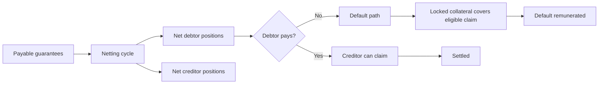
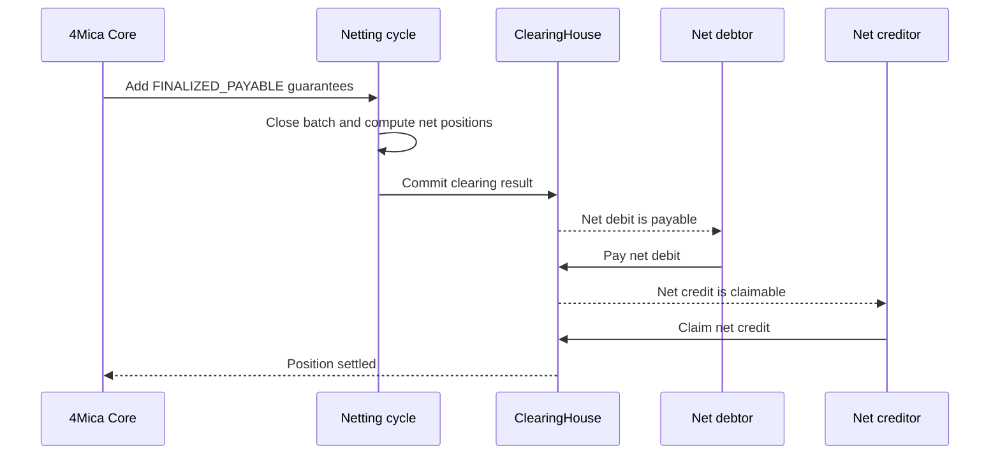
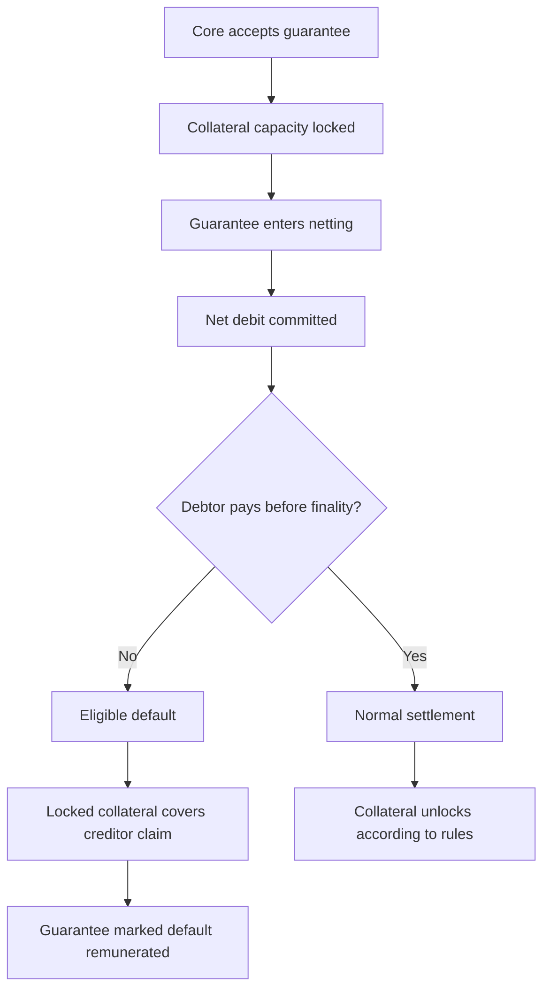
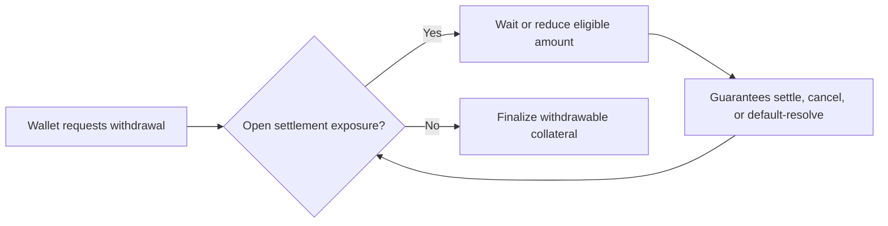

Settlement is the point where an accepted payment guarantee becomes an economic
outcome.

At request time, the buyer signs a guarantee and Core verifies that the wallet
has enough collateral-backed capacity. The seller can then serve the protected
resource. But the actual movement of value may happen later, after the
guarantee enters a netting cycle and the cycle computes who owes whom.

Settlement is the part of the lifecycle that answers:

> Was the payable obligation paid, claimed, cancelled, disputed, or covered
> from collateral?

It is where instant-feeling HTTP payments become durable accounting records.

## Settlement in one sentence

4Mica settles by collecting payable guarantees into clearing cycles, computing
net debtor and creditor positions, letting debtors pay their net debit, letting
creditors claim their net credit, and using locked collateral to cover eligible
defaults when a debtor misses the deadline.

The seller-facing payment can be accepted before the final settlement result is
known. That is why collateral and lifecycle state matter so much: they protect
the time between serving the request and receiving final value.

## What is being settled

The object being settled is not a vague invoice or an internal balance. It is a
set of accepted guarantees with specific signed fields.

Each guarantee binds a payer to a recipient, amount, asset, request ID,
timestamp, and guarantee version. V2 guarantees also bind the validation policy
that determines when the payment can become payable.

Settlement only applies after the guarantee is eligible:

| Guarantee state | Settlement meaning |
| --- | --- |
| `FINALIZED_PAYABLE` | Ready to enter a clearing cycle and become part of net settlement. |
| `PENDING_VALIDATION` | Not yet payable; waits for the V2 validation lifecycle. |
| `DISPUTED` | Not payable while disputed. |
| `CANCELLED` | Removed from payment settlement; collateral follows protocol rules. |
| `NETTED` | Included in a committed clearing result. |
| `SETTLED` | Paid through the normal settlement path. |
| `DEFAULT_REMUNERATED` | Covered through the eligible default path. |

This state model prevents a seller, buyer, or facilitator from treating every
signed message as immediately payable. The signature is necessary, but Core
acceptance and lifecycle state decide what can settle.

Read [transaction lifecycle](./transaction-lifecycle) for the complete V1 and
V2 state model.

## Request time is not settlement time

In a traditional card-like flow, people often collapse “payment accepted” and
“money settled” into one idea. 4Mica keeps them separate.

| Stage | What it proves |
| --- | --- |
| Payment requirements | The seller has published what it will accept. |
| Signed guarantee | The payer authorized a specific payment instruction. |
| Core acceptance | Core verified the guarantee and locked capacity. |
| Cycle inclusion | The payable guarantee entered a clearing batch. |
| Net settlement | The final debtor and creditor positions were paid or covered. |

The synchronous HTTP request usually ends around Core acceptance. The seller
can serve the resource because the guarantee is now inside the protocol's
enforced lifecycle.

Settlement continues asynchronously. That is not a failure mode; it is the
design that lets many small requests avoid one on-chain transfer each.

## The normal settlement path

A payable guarantee enters a netting cycle. At the end of the cycle, Core and
the clearing system compute the net positions. Participants that owe more than
they are owed become net debtors. Participants that are owed more than they owe
become net creditors.

The important thing is that settlement happens on net positions, not on every
individual guarantee. A participant may have hundreds of payable guarantees in
a cycle but only one net debit or one net credit for the relevant asset and
settlement context.

See [bilateral netting cycles](./bilateral-netting-cycles) for how many
guarantees collapse into fewer settlement actions.

## Debtors and creditors

Settlement uses two practical roles:

| Role | Meaning | Responsibility |
| --- | --- | --- |
| Net debtor | Owes value after cycle netting | Pay the net debit during the payment window. |
| Net creditor | Is owed value after cycle netting | Claim the net credit once the position is payable. |

A participant can be a debtor in one asset or cycle and a creditor in another.
The role is not a permanent identity. It is the result of a particular clearing
calculation.

This matters for agents that both buy and sell. An agent might pay several
services, earn from another service, and end the cycle with a much smaller net
debit than its gross outgoing payments. Or it may become a net creditor even
though it also bought resources during the same cycle.

## Payment windows and finality

After the clearing result is committed, net debtors have a payment window. The
window gives debtors time to submit the required settlement payment before the
position becomes eligible for default handling.

Cycle timing is deployment-specific, but the lifecycle generally follows this
shape:

| Phase | Settlement impact |
| --- | --- |
| Cycle open | Payable guarantees can enter the active batch. |
| Cycle close | The batch is fixed; new payable guarantees wait for a later cycle. |
| Resolution cutoff | Net debtor and creditor positions are calculated. |
| Clearing commit | The result becomes available for settlement actions. |
| Payment window | Net debtors can pay their positions. |
| Finality deadline | Unpaid eligible positions can move to default coverage. |

<Note>
Do not hard-code settlement timing. Cycle length, payment windows, and finality
deadlines are deployment parameters. Integrations should observe cycle state
and operator configuration.
</Note>

The finality deadline exists so creditors are not left waiting indefinitely. It
turns an unpaid net debit into a state the protocol can resolve.

## What default coverage means

Default coverage is the fallback path when a debtor does not pay an eligible
net position on time.

It does not mean the original payment was informal or unsecured. It means Core
accepted the guarantee earlier, collateral capacity was locked, the guarantee
entered settlement, and the debtor failed to complete the normal payment path
before the deadline.

Default coverage is a protection mechanism, not the preferred operating path.
Healthy participants should monitor settlement windows and pay net debits on
time. Repeated default behavior can affect risk policy, collateral access, and
counterparty trust.

## Collateral during settlement

Collateral is what makes delayed settlement credible.

When Core accepts a guarantee, it locks enough capacity to back that obligation.
That capacity remains reserved while the guarantee waits for validation,
netting, payment, claim, cancellation, dispute resolution, or default coverage.

The collateral state changes with the settlement outcome:

| Outcome | Effect on collateral |
| --- | --- |
| Settled normally | Capacity can unlock according to protocol rules. |
| Default remunerated | Locked collateral is used to cover the eligible claim. |
| Cancelled | Reserved capacity can unlock if no claim remains. |
| Disputed | Capacity may remain locked while the dispute is unresolved. |
| Pending validation | Capacity remains locked, but the guarantee is not yet payable. |

This is why a wallet may have deposited collateral but still have limited
available capacity. Settlement obligations can keep capacity reserved after
the HTTP request has completed.

Read [collateral ratios](./collateral-ratios) for how locked exposure affects
available payment capacity.

## Settlement and withdrawals

Withdrawals are only safe when the remaining collateral can still support all
open obligations.

If a wallet has guarantees in an active cycle, a committed net debit, a pending
validation path, or a possible default claim, the protocol may need that
collateral. Allowing it to leave too early would weaken seller protection and
make accepted guarantees less meaningful.

A withdrawal delay is not the same as custody by a private account provider. It
is the protocol respecting obligations that the wallet already authorized.

See [deposits and withdrawals](./deposits-and-withdrawals) and
[no custodial risk](./no-custodial-risk) for the full ownership model.

## V1 and V2 settlement differences

V1 and V2 use the same net settlement path once they are payable. The difference
is how they become payable.

| Topic | V1 | V2 |
| --- | --- | --- |
| After Core accepts | Usually `FINALIZED_PAYABLE` immediately. | Starts as `PENDING_VALIDATION`. |
| Cycle eligibility | Can enter the active cycle if it is still open. | Waits until validation makes it `FINALIZED_PAYABLE`. |
| Validation dependency | No external validation condition. | Requires the signed validation policy to resolve. |
| Default path | Applies after net settlement deadline is missed. | Can use net settlement after payable, or a validation-specific remuneration path where supported. |

For sellers, this means a V2 guarantee may be accepted and collateralized but
not yet collectible through normal cycle settlement. For buyers, this means
collateral may be locked before the final payment obligation becomes payable.

## What the seller should track

The seller should keep enough payment state to connect a protected response to
its settlement outcome.

| Record | Why it matters |
| --- | --- |
| `req_id` or guarantee ID | Connects the HTTP request to the protocol lifecycle. |
| Payer wallet | Identifies who authorized payment. |
| Recipient wallet | Confirms the seller's `payTo` address. |
| Amount and asset | Defines what should be included in settlement. |
| Guarantee version | Shows whether V1 or V2 rules apply. |
| Core certificate | Proves Core accepted the guarantee. |
| Cycle ID | Identifies the clearing batch. |
| Settlement status | Shows whether the position settled, defaulted, cancelled, or remains pending. |

This record is useful for reconciliation, support, dispute handling, and audit.
The resource server should not rely only on a local “request succeeded” log.

## What the buyer should monitor

The buyer should treat settlement as an operational responsibility, not just a
background detail.

Important buyer-side signals include:

<AccordionGroup>
  <Accordion title="Accepted but unsettled guarantees">
    These reduce usable capacity and can become part of a future net debit.
  </Accordion>
  <Accordion title="Pending V2 validation">
    Collateral can remain locked even before the guarantee becomes payable.
  </Accordion>
  <Accordion title="Upcoming payment windows">
    A buyer with a net debit needs enough funds and automation to pay before
    the deadline.
  </Accordion>
  <Accordion title="Failed settlement attempts">
    Gas, allowance, network, or asset issues can prevent a debtor from paying
    on time if they are not detected early.
  </Accordion>
  <Accordion title="Capacity after settlement">
    Once obligations settle or unlock, the wallet may regain capacity for new
    guarantees or withdrawals.
  </Accordion>
</AccordionGroup>

Buyers should not confuse available collateral with available budget. Protocol
capacity and application spending policy are different controls.

## Settlement outcomes

A guarantee can end in several economic states:

| Outcome | Meaning |
| --- | --- |
| Settled | The guarantee was included in netting and the resulting position was paid through normal settlement. |
| Default remunerated | The debtor missed the finality deadline and the eligible claim was covered from locked collateral. |
| Cancelled | The guarantee did not proceed to payable settlement. |
| Disputed | The guarantee is not payable while the dispute remains unresolved. |
| Pending | The guarantee is still waiting on validation, cycle inclusion, payment, or claim. |
| Invalid | The payment was rejected before becoming an accepted guarantee. |

Only accepted guarantees enter the settlement lifecycle. Invalid payment
payloads should not be treated as receivables.

## Common questions

<AccordionGroup>
  <Accordion title="Does settlement happen during the HTTP request?">
    Usually no. The HTTP request can complete after Core accepts the guarantee.
    Net settlement, claims, and default handling continue asynchronously.
  </Accordion>
  <Accordion title="Who pays during settlement?">
    Net debtors pay their net debit positions. A participant's role depends on
    the cycle result, not on whether they were a buyer or seller in one request.
  </Accordion>
  <Accordion title="Does every guarantee produce a transfer?">
    No. Netting can offset obligations. Many guarantees can collapse into one
    net payment or even a zero net result.
  </Accordion>
  <Accordion title="Can a seller serve before final settlement?">
    Yes, if Core accepted the guarantee and the seller's own policy allows it.
    The accepted guarantee is backed by locked capacity while settlement
    completes.
  </Accordion>
  <Accordion title="What if the debtor never pays?">
    After the finality deadline, eligible unpaid positions can use default
    coverage from locked collateral according to protocol rules.
  </Accordion>
  <Accordion title="Can collateral be withdrawn before settlement?">
    Only if the remaining collateral can still cover all open obligations. In
    practice, settlement exposure can delay or reduce withdrawable collateral.
  </Accordion>
</AccordionGroup>
