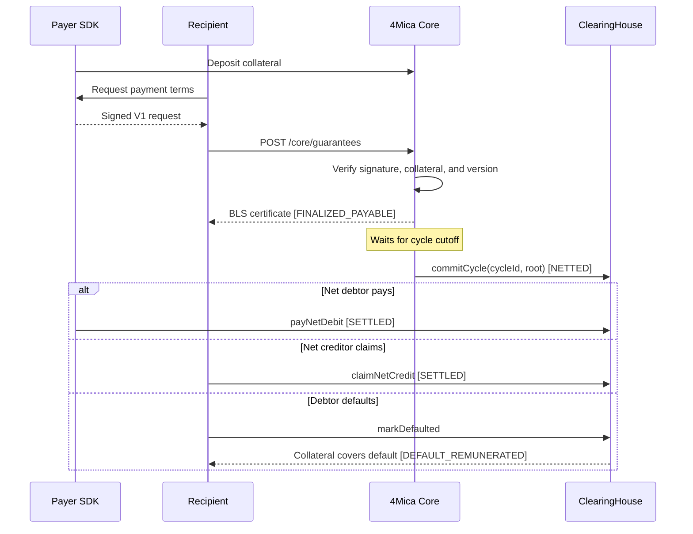
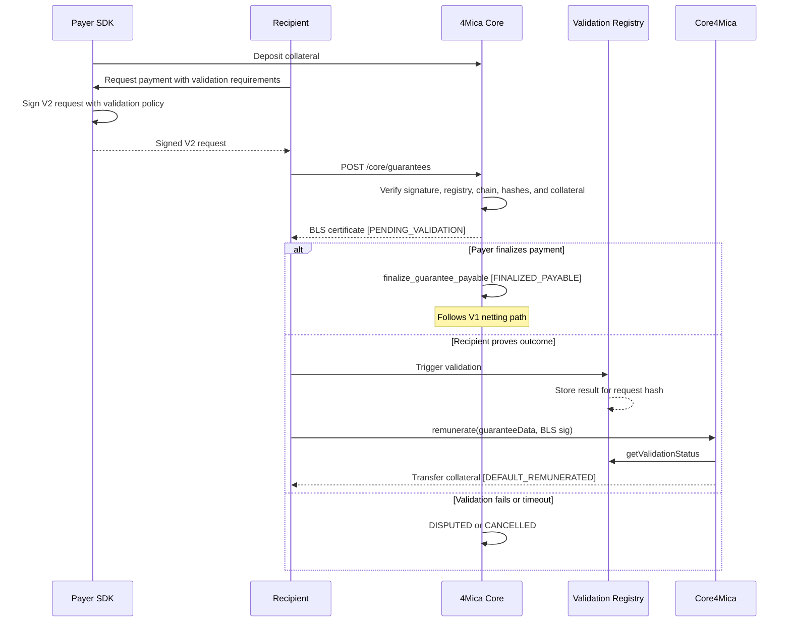

A 4Mica transaction is a **cryptographic guarantee**: a signed payment commitment backed by payer collateral.
The payer does not send an on-chain transfer for every request.
They sign a guarantee, the recipient submits it to 4Mica Core, and Core returns a BLS certificate after it verifies the request and locks collateral.
The <Tooltip headline="BLS certificate" tip="BLS stands for Boneh–Lynn–Shacham, a digital signature scheme that produces compact, publicly verifiable signatures. 4Mica Core signs the certificate after verifying the guarantee and locking the required collateral capacity.">BLS certificate</Tooltip> is the payment authorization.
After the recipient verifies it, they can provide the service knowing Core accepted the guarantee.

There are two types of guarantees:

- **V1** is payable as soon as Core issues it. Use it for agreed payments.
- **V2** is validation-gated. A verifier, such as an <Tooltip headline="ERC-8004" tip="An Ethereum standard for discovering, identifying, and evaluating autonomous agents through on-chain registries. 4Mica can use its validation registry as a trusted source of job-result evidence.">ERC-8004 validation registry</Tooltip>, must confirm the job before the recipient can use the validation path for payment.

With **V1**, the payer and recipient already accept the payment terms.
Core checks the payer signature, user status, accepted version, and collateral.
If the request passes, Core stores the guarantee as `FINALIZED_PAYABLE` so it can enter cycle netting.

With **V2**, the payer locks collateral without making the guarantee payable right away.
The signed request includes a validation policy.
Core checks that policy, stores the guarantee as `PENDING_VALIDATION`, and keeps it out of netting until the lifecycle changes.
The recipient can use the validation path only if the trusted registry publishes a result that matches the policy.

### Where `req_id` comes from

`req_id` must exist before the payer signs because it is part of the signed request.
The payer or SDK generates a unique request identifier before signing.
The cycle-native Core issuance path, `/core/guarantees`, does not generate `req_id`.
It verifies the signed value, derives the deterministic `guarantee_id` from it, and rejects another guarantee with the same identity.

## How V1 works

V1 fits known-party payments and x402 flows where you do not need external outcome validation.

### V1 signed request fields

The payer signs these fields before the recipient submits the request to Core.
Core verifies them, but it does not rewrite them.

| Field               | Type      | Set by                      | Description                        |
| ------------------- | --------- | --------------------------- | ---------------------------------- |
| `user_address`      | `address` | Payer / SDK                 | Payer wallet.                      |
| `recipient_address` | `address` | Recipient, then payer / SDK | Recipient wallet.                  |
| `req_id`            | `uint256` | Payer / SDK                 | Unique request identifier.         |
| `amount`            | `uint256` | Recipient, then payer / SDK | Token base units.                  |
| `asset_address`     | `address` | Recipient, then payer / SDK | Settlement asset. `0x0` means ETH. |
| `timestamp`         | `uint64`  | Payer / SDK                 | Request time.                      |

The submitted request also includes `signature` and `scheme`.
The SDK uses EIP-712 signing.

### V1 certificate fields

After Core accepts the request, it signs a BLS certificate over the issued guarantee.
The certificate adds fields that come from Core rather than from the payer.

| Field               | Type      | Set by                    | Description       |
| ------------------- | --------- | ------------------------- | ----------------- |
| `domain`            | `bytes32` | Core                      | Version domain.   |
| `cycle_id`          | `uint256` | Core                      | Owning cycle.     |
| `version`           | `uint64`  | Request, accepted by Core | `1`.              |
| `user_address`      | `address` | Request                   | Payer wallet.     |
| `recipient_address` | `address` | Request                   | Recipient wallet. |
| `req_id`            | `uint256` | Request                   | Request counter.  |
| `amount`            | `uint256` | Request                   | Payment amount.   |
| `asset_address`     | `address` | Request                   | Asset.            |
| `timestamp`         | `uint64`  | Request                   | Request time.     |

### V1 lifetime

| State                 | How it starts           | What happens next          |
| --------------------- | ----------------------- | -------------------------- |
| `FINALIZED_PAYABLE`   | Core issues V1.         | Waits for netting.         |
| `NETTED`              | Core commits the batch. | Debtor pays or defaults.   |
| `SETTLED`             | Clearing completes.     | Collateral unlocks.        |
| `DEFAULT_REMUNERATED` | Debtor misses finality. | Collateral covers default. |

V1 does not normally remain in `ISSUED`.
Core stores accepted V1 guarantees as `FINALIZED_PAYABLE` because no validation step is left.

## How V2 works

V2 is for payments that need validation before the recipient can collect.

The trust model has three parties:

1. **Recipient** proposes the validation requirements, including which registry to use, in the payment request.
2. **Payer** signs those requirements, agreeing to pay only if that specific registry confirms the outcome.
3. **Core** enforces the allowlist: before locking any collateral, Core checks that the proposed `validation_registry_address` is on the operator-configured allowlist. If it is not, the request is rejected immediately.

To find out which registries are approved on a given Core deployment, call `GET /core/public-params`. The response includes a `trusted_validation_registries` field listing all accepted registry addresses. This endpoint does not require authentication.

### V2 signed request fields

V2 signs all V1 request fields plus `validation_policy`.

| Field               | Type      | Set by                      | Description       |
| ------------------- | --------- | --------------------------- | ----------------- |
| `user_address`      | `address` | Payer / SDK                 | Payer wallet.     |
| `recipient_address` | `address` | Recipient, then payer / SDK | Recipient wallet. |
| `req_id`            | `uint256` | Payer / SDK                 | Unique request identifier. |
| `amount`            | `uint256` | Recipient, then payer / SDK | Token base units. |
| `asset_address`     | `address` | Recipient, then payer / SDK | Settlement asset. |
| `timestamp`         | `uint64`  | Payer / SDK                 | Request time.     |
| `validation_policy` | `object`  | Recipient + SDK             | Validation gate.  |

### V2 validation policy fields

| Field                         | Type      | Set by             | Description            |
| ----------------------------- | --------- | ------------------ | ---------------------- |
| `validation_registry_address` | `address` | Recipient / policy | Registry that must publish the validation result. Core rejects the guarantee if this address is not on its operator allowlist. |
| `validation_request_hash`     | `bytes32` | SDK                | Policy hash.           |
| `validation_chain_id`         | `uint64`  | Recipient / policy | Chain where the registry result must exist. Core rejects if this does not match its own chain ID. |
| `validator_address`           | `address` | Recipient / policy | Expected validator.    |
| `validator_agent_id`          | `uint256` | Recipient / policy | Expected agent ID.     |
| `min_validation_score`        | `uint8`   | Recipient / policy | Required score, 1-100. |
| `validation_subject_hash`     | `bytes32` | SDK                | Payment subject hash.  |
| `job_hash`                    | `bytes32` | Recipient / policy | Job identifier.        |
| `required_validation_tag`     | `string`  | Recipient / policy | Required result tag.   |

### V2 certificate and on-chain fields

Core issues the same certificate fields as V1 and sets `version` to `2`.
The encoded V2 certificate also includes the validation policy fields.

| Field                      | Type      | Set by                     | Description       |
| -------------------------- | --------- | -------------------------- | ----------------- |
| `domain`                   | `bytes32` | Core                       | V2 domain.        |
| `cycle_id`                 | `uint256` | Core                       | Owning cycle.     |
| `version`                  | `uint64`  | Request, accepted by Core  | `2`.              |
| `user_address`             | `address` | Request                    | Payer wallet.     |
| `recipient_address`        | `address` | Request                    | Recipient wallet. |
| `req_id`                   | `uint256` | Request                    | Request counter.  |
| `amount`                   | `uint256` | Request                    | Payment amount.   |
| `asset_address`            | `address` | Request                    | Asset.            |
| `timestamp`                | `uint64`  | Request                    | Request time.     |
| `validation_policy` fields | mixed     | Request, validated by Core | Validation gate.  |

### V2 lifetime

| State                 | How it starts                | What happens next          |
| --------------------- | ---------------------------- | -------------------------- |
| `PENDING_VALIDATION`  | Core issues V2.              | Waits for resolution.      |
| `FINALIZED_PAYABLE`   | Core marks payable.          | Follows V1 netting.        |
| `DISPUTED`            | Core marks disputed.         | Stays out of netting.      |
| `CANCELLED`           | Core cancels it.             | Collateral unlocks.        |
| `NETTED`              | Payable V2 enters netting.   | Debtor pays or defaults.   |
| `SETTLED`             | Clearing completes.          | Collateral unlocks.        |
| `DEFAULT_REMUNERATED` | Default path pays recipient. | Collateral covers default. |

The on-chain validation remuneration path does not use cycle netting.
If the registry result does not match the policy, `remunerate` reverts and no funds move.

## How settlement cycles affect both versions

Both V1 and V2 guarantees flow into a settlement cycle once they reach `FINALIZED_PAYABLE`.
The cycle batches those guarantees, computes net positions across all participants, and commits a Merkle clearing batch on chain.
Only the net amounts move. Individual guarantees are not settled one by one.

Each cycle runs through six phases:

| Phase             | Default timing          | What happens                                                                 |
| ----------------- | ----------------------- | ---------------------------------------------------------------------------- |
| Cycle open        | 0 – 24 h                | Core accepts `FINALIZED_PAYABLE` guarantees into the batch.                  |
| Cycle closes      | 24 h                    | No new guarantees enter. The batch is fixed.                                 |
| Resolution cutoff | +6 h after close        | Core builds net debtor and creditor positions from the batch.                |
| Clearing commit   | +15 min after cutoff    | Merkle root of net positions is committed on chain.                          |
| Payment window    | +2 h after commit       | Net debtors submit payment against their position.                           |
| Finality deadline | +2 h after payment open | Uncovered positions become defaulted and are covered from locked collateral. |

Timings are configurable per deployment.

V2 guarantees that remain `PENDING_VALIDATION`, `DISPUTED`, or `CANCELLED` when a cycle closes are excluded from netting.
They do not affect any net debit or credit position in that cycle.

## V1 and V2 comparison

| Behavior                         | V1                                   | V2                                               |
| -------------------------------- | ------------------------------------ | ------------------------------------------------ |
| Signed by payer                  | Base payment fields                  | Base payment fields plus validation policy       |
| Core status after issuance       | `FINALIZED_PAYABLE`                  | `PENDING_VALIDATION`                             |
| Validation registry              | No                                   | Yes                                              |
| Enters cycle netting immediately | Yes                                  | No                                               |
| Can enter cycle netting later    | Already payable                      | Yes, after `FINALIZED_PAYABLE`                   |
| On-chain remuneration path       | Uses the base guarantee decoder      | Uses the V2 validation decoder before payout     |
| Best fit                         | Known-party or pre-approved payments | Autonomous payments that need outcome validation |

## Builder guidance

Choose V1 when a signed request should become payable as soon as Core verifies it.
Choose V2 when the payer should lock collateral first and release value only after a trusted validator confirms the result.

When you build with V2:

- Call `GET /core/public-params` and check `trusted_validation_registries` before building your payment requirements. Core rejects any registry not on that list.
- Put all validation requirements in `paymentRequirements.extra` before the payer signs.
- Use the SDK to compute `validation_subject_hash` and `validation_request_hash`.
- Keep `validation_chain_id` aligned with the `chain_id` returned by `GET /core/public-params`.
- Set `min_validation_score` from 1 to 100.
- Make sure the validator publishes a result with the expected validator address, agent ID, score, and tag.
- Treat pending guarantees as locked collateral until the lifecycle finalizes, disputes, cancels, or remunerates.

See [Settlements](./settlements), [Bilateral netting cycles](./bilateral-netting-cycles), and [How x402 works](./how-x402-works) for related flows.
