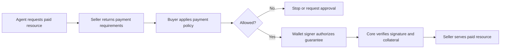

A wallet is the economic identity of an agent or application.

It gives software a public address, a way to authorize payments, and a
connection to collateral. In 4Mica, the wallet is how the protocol knows who is
paying, who should receive value, and which collateral belongs to each payer.

This does not mean the wallet is the agent. The agent decides what work to do.
The wallet gives that agent a controlled way to participate economically.

## Why an agent needs a wallet

Traditional internet payments assume a person has an account, opens a checkout
page, and approves a purchase. Agents make requests directly from software and
may use many services during one task.

They need a payment identity that works without a browser session or a separate
account with every seller.

A wallet provides that identity. It lets an agent:

- identify itself as a payer;
- sign a payment guarantee;
- connect that guarantee to collateral;
- pay different compatible services from one economic position;
- appear in payment and audit records;
- receive value when acting as a seller.

The wallet makes payment possible. It does not decide whether a payment is a
good idea. That decision still belongs to the agent's policy.

## A wallet is both an account and a signature

A traditional bank account mainly stores and transfers value. A wallet does
that, but it also proves authorization.

Every wallet has:

- a **public address** that other systems can see;
- a **signer** that authorizes actions for that address.

The address answers:

> Which economic actor is involved?

The signature answers:

> Did that actor authorize this specific action?

This combination is what makes a wallet useful for autonomous software. An
agent can prove authorization inside the same machine-readable flow it uses to
request a service.

## Wallet, agent, signer, and policy

These concepts work together, but they are not interchangeable.

| Concept | Question it answers |
| --- | --- |
| Agent | What software is performing the task? |
| Wallet | Which economic identity pays or receives value? |
| Signer | What cryptographic authority approves an action? |
| Policy | Under which conditions may the signer be used? |
| Collateral | How much deferred payment capacity backs the wallet? |

An agent can use a wallet without owning unrestricted control over it. For
example, an organization can place a signing service between the agent and the
wallet. The agent proposes a payment, policy checks it, and the signing service
authorizes only allowed requests.

That separation is important. It changes the model from:

> The agent has a key and can spend.

to:

> The agent may request payment, and a controlled system decides whether to
> sign.

See [agent identity](./agent-identity) for the broader relationship between
identity, delegation, reputation, and credit.

## Payer and recipient wallets

The same wallet technology appears on both sides of a payment.

### Payer wallet

The payer wallet:

- owns the collateral behind guarantees;
- identifies the buyer in signed claims;
- authorizes payments;
- contributes obligations to clearing cycles;
- pays net debit positions;
- withdraws collateral when obligations are clear.

### Recipient wallet

The recipient wallet is the seller's `payTo` address. It:

- identifies who should receive value;
- appears in payment requirements;
- becomes part of the payer's signed guarantee;
- receives settlement or default coverage;
- connects payment records to the seller.

A single organization can operate both payer and recipient wallets. An agent
may buy data from one service, transform it, and sell the result to another
agent.

## The wallet is the root of payment identity

4Mica connects several records to wallet addresses:

- collateral ownership;
- signed guarantees;
- payer and recipient relationships;
- clearing positions;
- settlement outcomes;
- withdrawals.

This makes the wallet address a stable reference across the payment lifecycle.
But an address alone does not tell the full identity story.

It does not automatically reveal:

- which agent used it;
- which person or organization authorized the agent;
- what the agent was allowed to buy;
- why the payment happened;
- whether the seller is trustworthy.

Applications must attach that context through policy, metadata, task records,
and identity systems.

## How a wallet gets payment capacity

Holding tokens in a wallet is not the same as having 4Mica payment capacity.

The payer deposits a supported asset into the protocol's collateral flow. Once
the deposit is finalized and recognized by Core, that collateral can back
payment guarantees.

The wallet's economic state can then be understood as:

| State | Meaning |
| --- | --- |
| Total collateral | Finalized collateral attributed to the wallet |
| Locked collateral | Capacity reserved for unresolved obligations |
| Available capacity | Capacity that may support new guarantees |
| Pending deposit | Funds not yet finalized or synchronized |
| Pending withdrawal | Collateral requested for exit |

Available capacity can also depend on collateral ratios and deployment policy.
It should not be treated as an application spending budget.

The complete collateral lifecycle is covered in
[deposits and withdrawals](./deposits-and-withdrawals).

## How a wallet authorizes payment

When an agent encounters a paid resource, the seller returns payment
requirements. These describe values such as the price, asset, network, and
recipient address.

Before payment, the buyer application should:

1. verify the seller and route;
2. check the amount against budget;
3. confirm the network and asset;
4. decide whether approval is required;
5. create a unique request identifier;
6. ask the signer to authorize the guarantee.

The wallet signs structured claims that bind the payment to a specific:

- payer;
- recipient;
- request;
- amount;
- asset;
- time;
- guarantee version;
- validation policy, for V2.

Core verifies the signature and collateral before accepting the guarantee.

Read [transaction lifecycle](./transaction-lifecycle) for the exact guarantee
fields and states.

## Wallet security is more than protecting a key

Keeping a private key secret is necessary, but it is not enough.

A secure key can still authorize harmful payments if the system asks it to sign
without checking:

- seller identity;
- route and task context;
- price;
- network;
- asset;
- spending limits;
- duplicate or suspicious requests.

Wallet security therefore has two layers:

1. **Key security** prevents unauthorized actors from using the signer.
2. **Policy security** prevents authorized software from signing an unwanted
   action.

This is especially important for agents because they operate quickly and
without a person reviewing every payment.

## Private keys and signers

A private key is one way to control a wallet. It is not the only way.

Common signer models include:

| Signer model | Typical use |
| --- | --- |
| Local private key | Disposable development wallet |
| Dedicated service key | Simple backend or low-risk agent |
| Hardware-backed signer | High-value actions with human involvement |
| MPC signer | Autonomous production systems with distributed control |
| Managed key service | Backend workloads that need policy, auditing, and recovery |

Production systems should avoid exposing raw private keys to application code
where possible. The agent should never receive a private key or seed phrase in
its prompt or tool context.

<Warning>
A seed phrase may control multiple accounts. Never store one in source code,
logs, model context, frontend bundles, or ordinary application environment
variables.
</Warning>

## Wallets and delegated authority

An organization may run many agents without giving each one unrestricted wallet
control.

Delegated authority can limit:

- which sellers an agent may pay;
- how much it may spend;
- which networks and assets it may use;
- how long its authority lasts;
- whether a human must approve the payment;
- which task or workload may request a signature.

This makes the signer a controlled capability rather than a shared secret.

Delegation should always have a matching revocation path. If one agent behaves
unexpectedly, its authority should be removable without taking every other
agent offline.

## One wallet or many wallets

Wallet boundaries are risk boundaries.

### One shared wallet

A shared wallet can use collateral efficiently because many agents draw from
one position. However, one agent's spending or failure can affect the capacity
available to all others.

Applications using a shared wallet need strong internal attribution and limits.

### One wallet per agent

Per-agent wallets provide clearer isolation, spending history, and revocation.
They also require more gas management, collateral allocation, and monitoring.

### Wallets by role

Many systems use separate wallets for:

- development and production;
- autonomous buying;
- seller revenue;
- treasury and collateral management;
- high-risk or high-value workflows.

The right model balances capital efficiency against the cost of a compromised
or misconfigured agent.

At minimum, never use the same wallet for development experiments and
production funds.

## Wallet state is network-specific

The same address can exist on several EVM networks, but balances and protocol
state do not move between them automatically.

A wallet may have:

- collateral on Base but not Base Sepolia;
- USDC on one network but a different token contract on another;
- enough collateral but not enough native gas;
- different guarantees and settlement obligations on each network.

Every wallet view should identify the network explicitly. Use CAIP-2 network
IDs rather than relying only on names.

See [supported networks](/getting-started/supported-networks).

## Buyer wallet policy

Collateral answers how much the protocol can trust the wallet to guarantee.
Application policy answers how much the agent should be allowed to spend.

Those limits are not the same.

A wallet might have `$1,000` of available capacity while one agent is allowed
to spend only:

- `$0.10` per request;
- `$5` per task;
- `$20` per day;
- only on approved data services;
- only on Base using USDC.

Keeping policy limits below total wallet capacity reduces the effect of a bad
decision, compromised workload, or pricing error.

See [budgets and spending limits](/buyer/budgets-and-spending-limits).

## Recipient wallet identity

For sellers, a stable public wallet address helps buyers detect impersonation.

The same `payTo` address should appear consistently in:

- payment requirements;
- API documentation;
- marketplace and registry profiles;
- support material;
- internal settlement records.

If a recipient address changes, publish the change clearly. A careful buyer
should reject an unexpected address until it can be verified.

See [trust and legitimacy](/seller/trust-and-legitimacy).

## Wallet lifecycle

A wallet moves through a lifecycle:

1. **Created:** the address and signer are provisioned.
2. **Funded:** the wallet receives gas and supported assets.
3. **Registered:** collateral is deposited and recognized by Core.
4. **Active:** the wallet signs or receives payments.
5. **Paused:** new signing is stopped while existing obligations continue.
6. **Rotated:** signer authority or the public address changes.
7. **Retired:** obligations resolve, collateral exits, and active authority is
   removed.

Pausing a wallet does not erase guarantees that were already accepted.
Withdrawing collateral also does not erase payment or audit records.

## Rotation and revocation

Signer rotation and wallet-address rotation solve different problems.

**Signer rotation** changes the authority that controls future actions while
keeping the public wallet identity.

**Address rotation** creates a new economic identity. It affects collateral,
allowlists, seller verification, payment requirements, and historical
reconciliation.

Prefer signer rotation when the wallet address can remain secure. If the public
address changes, preserve old records and publish the new address through a
trusted channel.

## If a wallet may be compromised

A wallet incident has two timelines:

- future actions that can still be stopped;
- existing obligations that may remain valid.

The immediate response should be:

1. pause the agent and signing path;
2. preserve logs and note the suspected exposure time;
3. identify guarantees and transactions after that time;
4. revoke or rotate signing authority;
5. inspect collateral, allowances, clearing positions, and withdrawals;
6. reconcile application, Core, and chain state;
7. resume only after policy and authority are restored.

Do not withdraw blindly during an incident. Available collateral and collateral
backing accepted obligations are not the same thing.

## What users should be able to see

A useful wallet view should answer:

- Which address and network am I using?
- Is this a payer, recipient, or both?
- Which signer or agent is authorized?
- What assets and gas are available?
- How much collateral is total, locked, and available?
- Which guarantees and settlement obligations remain open?
- Which payments were signed, and why?
- Is a withdrawal pending?
- Can signing be paused or revoked?

Visibility turns the wallet from a hidden technical dependency into a
manageable economic account.
